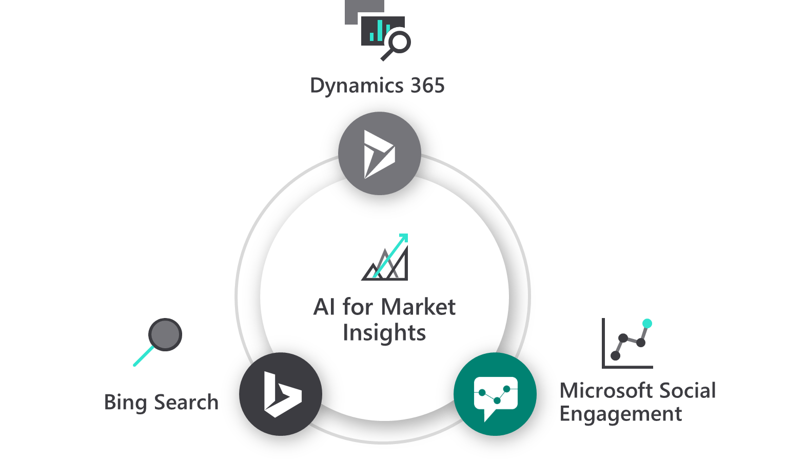

# Microsoft Social Engagement vs. Dynamics 365 Market Insights

## Key difference

Customers are indicating that they need a solution that provides social and web insights rather than limited social listening capabilities. To keep up with the evolving advancements of the industry, Dynamics 365 is investing in AI capabilities to combine insights from social media and Bing search. 
We recommend that Microsoft Social Engagement customers [try the public preview of Microsoft Dynamics 365 Market Insights](https://dynamics.microsoft.com/en-us/ai/market-insights/). Dynamics 365 Market Insights is an application that can help businesses gain insights and increase its market by monitoring external information sources, such as social media and trending search terms on the web. Unlike other solutions in the market, this application provides social and web insights, along with AI-powered sentiment and intent analysis features. This helps businesses understand their customers, build their brand, gain competitive advantage, and support their unique needs.

## Capability differences 

Capabilities will continue to evolve--please refer to the [Release Notes](https://dynamics.microsoft.com/business-applications/release/) for the latest insight into capabilities.

### Search insights 

Know what your customers are saying, seeking, and feeling by acquiring audience insights from Bing search. Access demographic and historical insights to align marketing and product development activities. Turn these insights into actions by developing targeted campaigns.

| Search Insights Capabilities  |  Market Insights |  Microsoft Social Engagement |
|---|---|---|
| Web age demographics       | Yes        | No |
| Web gender demographics    | Yes       | No |
| Web average search trends  | Yes       | No |
| Web volume search trends   | Yes       | No |
| Web search intent analysis | Yes       | No |
| Web search topic analysis  | Yes       | No |
| Web search theme analysis  | Yes       | No |
	

### Social insights
Listen to what customers and competitors are saying, and track how their sentiment changes over time through automatic sentiment analysis and conversation analytics. Leverage the power of artificial intelligence (AI) to detect intent within social posts and help you identify new leads or respond to service questions.

| Social Insights Capabilities  |  Market Insights |  Microsoft Social Engagement |
|---|---|---|
| Sentiment analysis       | Yes        | Yes |
| Intent analysis – purchase, complaint, info, and support | Yes | Yes |
| Social trends – volume and average                       | Yes | Yes |
| Location insights                                        | Yes | Yes |
| Trending phrases                                         | Yes | Yes |
| Topics and themes                                        | Yes | No |
| Predicted reach and virality                             | Yes | No |
| Mentions – location and people                           | Yes | No |

### Brand reputation
Use machine learning to tweak sentiment detection in a way that’s tailored to your organization. Identify, track, and engage with individual influencers and experts on social media so you never miss a post from an influencer.

| Brand Reputation Capabilities  |  Market Insights |  Microsoft Social Engagement |
|---|---|---|
| Social Center                        | Yes | Yes |
| Activity maps                        | Yes | Yes |
| Author insights                      | Yes | Yes |
| Publish responds to posts            | Yes | Yes |
| Top fans and critics                 | Yes | Yes |
| Positive and negative phrase insight | Yes | Yes |
| Phrase cloud                         | Yes | Yes |
	
### Social care 
Give service agents the information they need, and automate case routing, so they can spend more time addressing customer needs. Detect and create alerts based on sentiment and trends to proactively identify service issues.

| Social Care Capabilities  |  Market Insights |  Microsoft Social Engagement |
|---|---|---|
| Link posts to cases in Dynamics 365 for Customer Service  | No         | Yes |
| Post assignments                           | No         | Yes |
| Customizable alerts                        | No         | Yes |
| Author insights                            | No         | Yes |
| Top fans and critics                       | No         | Yes |

### Social Selling
Empower your sales people to sell more by leveraging social media. Sales teams can gather intelligence, source new leads, and build credibility. Source high-quality leads to identify and act on buying signals, and then create new leads based on social posts.	

| Social Selling Capabilities  |  Market Insights |  Microsoft Social Engagement |
|---|---|---|
| Link posts to leads in Dynamics 365 for Sales  | No         | Yes |
| Social Selling Assistant                         | No         | Yes |
	

## Next steps

Use Dynamics 365 Market Insights to capture AI-powered insights from social channels and Microsoft’s unique web and search data sources. Gather actionable insights on your brands, customers, competitors, and market. Gain a competitive edge by staying on top of market trends as they unfold. Respond faster based on what customers are saying, seeking, and feeling.

Engage with us in the [Market Insights Community forum](https://community.dynamics.com/365/aimarketinsights) or email us directly at [mseeol@microsoft.com](mailto:mseeol@microsoft.com) with any other questions or concerns.

[Try the public preview and prepare to transition.](https://dynamics.microsoft.com/ai/market-insights)    
Visit the [release notes](https://aka.ms/businessappsreleasenotes) for more information about capabilities.    

