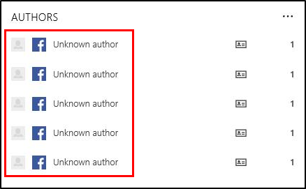
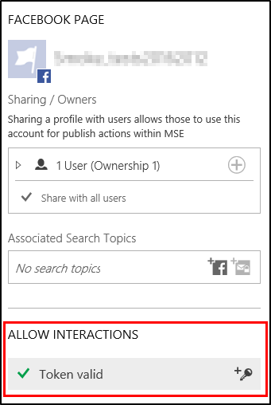
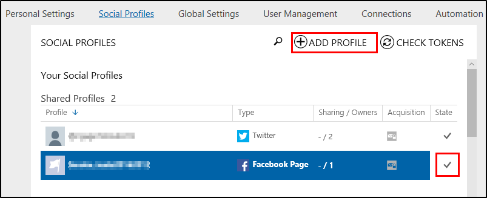
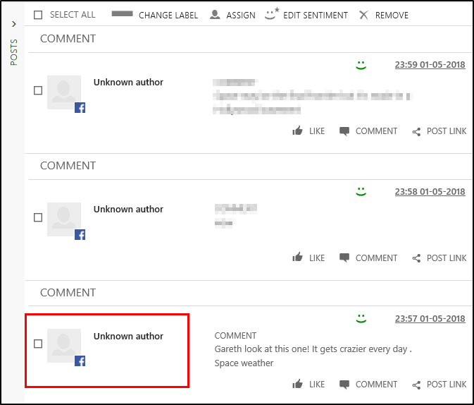

# Acquire data from Facebook pages

On Feb 6, 2018, [Facebook changes its API](https://developers.facebook.com/ads/blog/post/2017/11/07/marketing-api-v211/) and by default, author information is no longer shared. You can still get author information for posts on [!INCLUDE[tn-facebook](../includes/tn-facebook.md)] pages you own. This article describes how you can continue to receive author information for your [!INCLUDE[tn-facebook](../includes/tn-facebook.md)] pages.  

 
## How does it work prior to February 6, 2018?

Currently all you need is an [active acquisition token](manage-access-tokens.md#tokens-for-data-acquisition) on a social profile for a [!INCLUDE[tn-facebook](../includes/tn-facebook.md)] user to create search rules for [!INCLUDE[tn-facebook](../includes/tn-facebook.md)] pages and acquire data from [!INCLUDE[tn-facebook](../includes/tn-facebook.md)], including information about the author of the posts.

## How will it work starting February 6, 2018?

Your solution still needs an active [!INCLUDE[tn-facebook](../includes/tn-facebook.md)] user token to acquire any data from [!INCLUDE[tn-facebook](../includes/tn-facebook.md)]. In addition, you’ll also need an active [!INCLUDE[tn-facebook](../includes/tn-facebook.md)] page access token to pull the author information for posts on that page. All posts on pages that you haven’t added to [!INCLUDE[pn-social-engagement-short](../includes/pn-social-engagement-short.md)] will appear without author information starting February 6, 2018. However, the content of all posts and comments as well as enrichments, such as sentiment, are continuing to be available.

> [!TIP]
> We recommend you add the tokens for [!INCLUDE[tn-facebook](../includes/tn-facebook.md)] pages **prior to the change on February 6, 2018**. That way, every post on those pages is acquired with author information when the switch happens. You’ll also need to reauthenticate the tokens regularly. 

## How do I continue to get author information?

1. A page admin needs to allow interactions for [!INCLUDE[tn-facebook](../includes/tn-facebook.md)] pages by authenticating a social profile for every page your organization owns. Only one admin needs to authenticate the profile to enable all users of the solution to see the author information.      
   
 
2. Make sure at least one social profile for a [!INCLUDE[tn-facebook](../includes/tn-facebook.md)] user is added to your solution to keep the data acquisition running.   
   
 
3. Make sure that all these profiles stay valid by reauthenticating them regularly. There's no email notification sent when the token expires.

[Learn how to add a Facebook page profile.](manage-social-profiles.md)

## What happens when I don’t own a page or don’t allow interactions?

Whenever a post is acquired from a specific [!INCLUDE[tn-facebook](../includes/tn-facebook.md)] page and there is no valid interaction token available for that page, this post will not have author information. The author will show as **Unknown author**. There is no way to retrieve this information later.    

## What’s the reason for this change?

Starting February 6, 2018, [!INCLUDE[pn-social-engagement-short](../includes/pn-social-engagement-short.md)] can't provide information about the author because [!INCLUDE[tn-facebook](../includes/tn-facebook.md)] has changed its APIs. In the [!INCLUDE[pn-social-engagement-short](../includes/pn-social-engagement-short.md)] user interface, these authors will be labelled as **Unknown author**. Author information for [!INCLUDE[tn-facebook](../includes/tn-facebook.md)] posts will only be available for [!INCLUDE[tn-facebook](../includes/tn-facebook.md)] pages that you administer and provide a page access token to [!INCLUDE[pn-social-engagement-short](../includes/pn-social-engagement-short.md)]. 

## Example case: Contoso

### Current setup 

Let’s assume the organization _Contoso_ currently uses [!INCLUDE[pn-social-engagement-short](../includes/pn-social-engagement-short.md)] for tracking of their main competitor and to engage with their customers through social channels. For this they setup search rules for three [!INCLUDE[tn-facebook](../includes/tn-facebook.md)] pages:
- Contoso
- Fabrikam
- Proseware

To enable data acquisition, two members of their social team added [!INCLUDE[tn-facebook](../includes/tn-facebook.md)] acquisition tokens with their personal [!INCLUDE[tn-facebook](../includes/tn-facebook.md)] users.
For their own _Contoso_ page, the team added a social profile for the page itself, so they can publish posts or comments on their page and receive private messages. 
They currently get all posts and comments for all three pages with full author information.

### After the change 

Because the team can’t allow interactions for pages they don’t own, and they already have an interaction token for their owned page, the team didn’t need to change anything.
Once the changes go live in early February, assuming all tokens stay valid, this is how [!INCLUDE[tn-facebook](../includes/tn-facebook.md)] data will be acquired: 
- All posts acquired from the _Fabrikam_ and _Proseware_ [!INCLUDE[tn-facebook](../includes/tn-facebook.md)] pages will have no author information and show **Unknown author**.
- All posts acquired from the _Contoso_ [!INCLUDE[tn-facebook](../includes/tn-facebook.md)] page will have author information.

### See also

[Get started with Social Engagement  ](get-started.md)  
[Set up searches](set-up-searches.md)    
[Engage on social networks](engage-on-social-networks.md)
