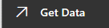
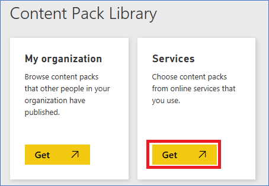
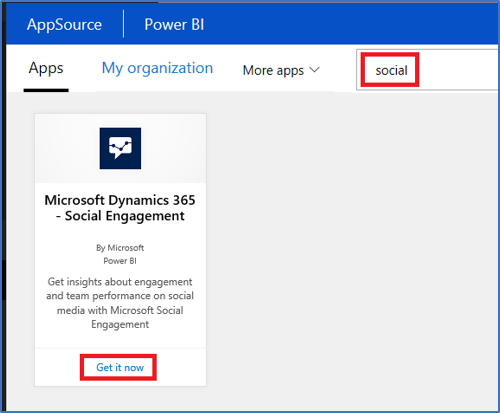
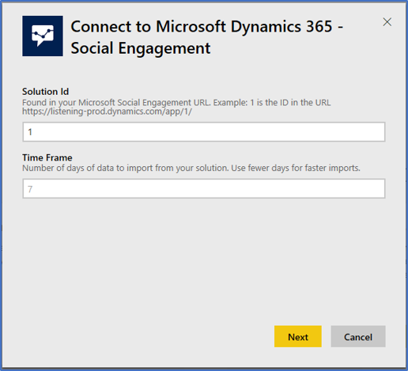
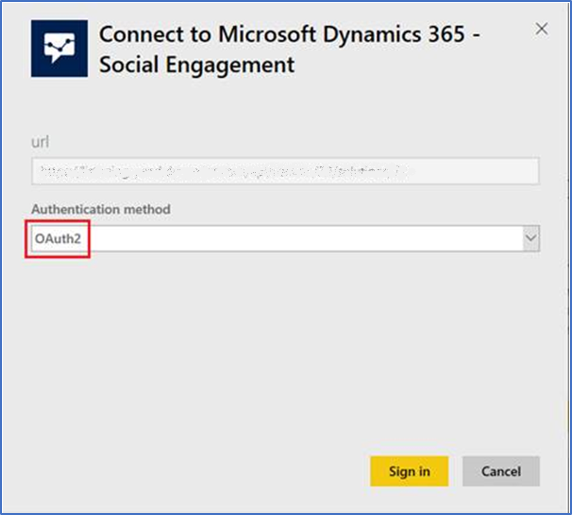
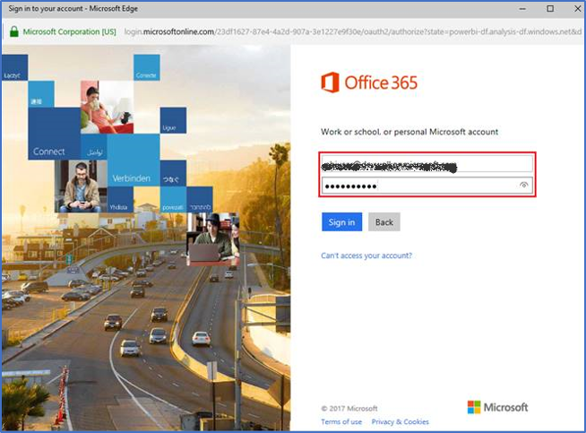
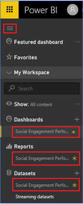
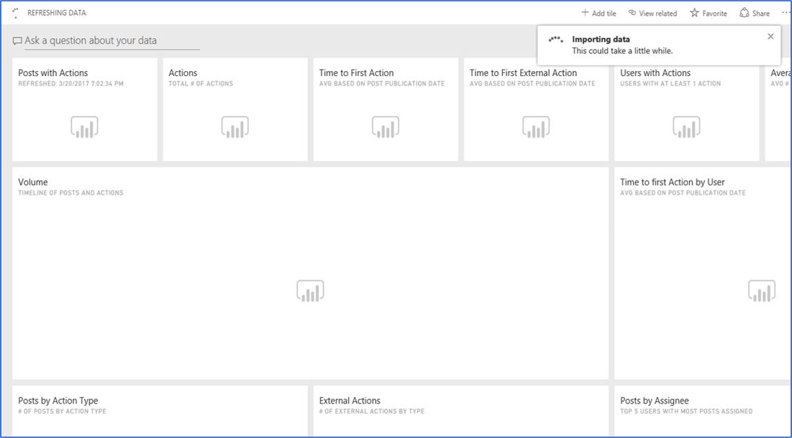
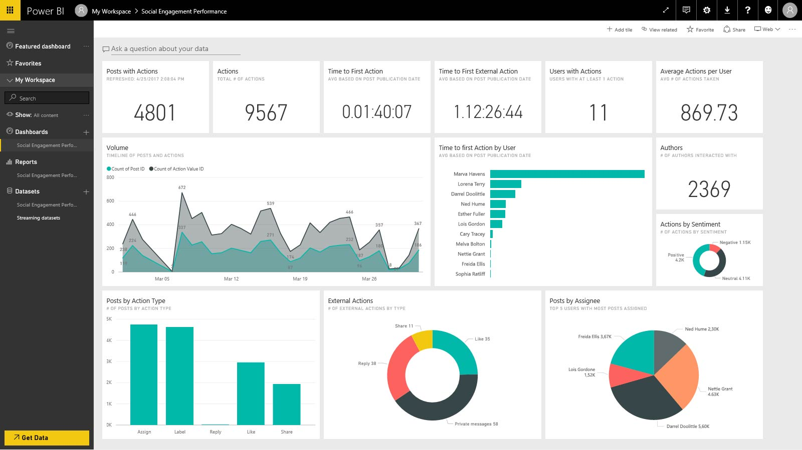

# Get the Microsoft Social Engagement content pack for Power BI
Engaging on social media by responding to posts is a core capability of [!INCLUDE[pn_netbreeze_long](../includes/pn-social-engagement-long.md)]. With this [!INCLUDE[pn_microsoft_power_bi](../includes/pn-microsoft-power-bi.md)] content pack, you can now get insights on how your organization, and your teams are engaging with KPIs such as volume of interactions and average response times.  
  
 This content pack is for organizations using [!INCLUDE[pn_netbreeze_short](../includes/pn-social-engagement-short.md)] and can only be accessed via [!INCLUDE[pn_power_bi](../includes/pn-power-bi.md)]. You can use this content pack with both [the free and the pro versions of Power BI](https://powerbi.microsoft.com/).  
  
 Use this content pack as a starting point on [!INCLUDE[pn_power_bi](../includes/pn-power-bi.md)] to create your own reports and dashboards that best meet your needs.  
  
## Getting Started  
 Connect to [!INCLUDE[pn_netbreeze_short](../includes/pn-social-engagement-short.md)] from [!INCLUDE[pn_power_bi](../includes/pn-power-bi.md)] with the [content pack for Microsoft Social Engagement](https://go.microsoft.com/fwlink/p/?linkid=846841).  
  
> [!NOTE]
>  Administrator or Manager permissions and access to [!INCLUDE[pn_netbreeze_short](../includes/pn-social-engagement-short.md)]'s solution ID are required to connect.  For more information about the solution ID, see  [Troubleshooting](#troubleshooting).  
  
### How to connect  
  
1.  Go to [!INCLUDE[pn_power_bi](../includes/pn-power-bi.md)] and select **Get Data** at the bottom of the left navigation pane.  
  
   
  
2.  In the **Services** box, select **Get**.  
  
   
  
3.  Search for **[!INCLUDE[pn_netbreeze_short](../includes/pn-social-engagement-short.md)]**, select the content pack from the results, and then click **Get it now**.  
  
   
  
4.  Provide the **Solution ID** (not the full URL) of the [!INCLUDE[pn_netbreeze_short](../includes/pn-social-engagement-short.md)] instance you want to connect to, choose the time frame you want to import and click **Next**.  For more information how to find the **Solution ID**, see [Troubleshooting](#troubleshooting).  
  
   
  
    > [!IMPORTANT]
    >  Choose an appropriate time frame based on the interaction data volume in your [!INCLUDE[pn_netbreeze_short](../includes/pn-social-engagement-short.md)] solution to avoid potentially long loading times. We recommend keeping the total number of posts with actions imported into [!INCLUDE[pn_power_bi](../includes/pn-power-bi.md)] under 100,000.  
  
5.  For **Authentication method**, select **oAuth2** and then click **Sign in**.  
  
   
  
     The first time you connect, [!INCLUDE[pn_power_bi](../includes/pn-power-bi.md)] may prompt you to allow read-only access to your account.  
  
     Select **Grant** to begin the import process. The import process can take a few minutes depending on the volume of data in your solution and will gather data for social posts that users of [!INCLUDE[pn_netbreeze_short](../includes/pn-social-engagement-short.md)] interacted with.  
  
   
  
6.  After [!INCLUDE[pn_power_bi](../includes/pn-power-bi.md)] imports the data you will see a new dashboard, report, and dataset in the left navigation pane. New items are marked with a yellow asterisk *:  
  
   
  
7.  Select the **Social Engagement Performance** dashboard. It may take a while initially to show the data.  
  
   
  
     Once your data is imported you can see the default dashboard that [!INCLUDE[pn_power_bi](../includes/pn-power-bi.md)] creates to display your data. You can modify this dashboard to display your data in any way you want.  
  
   
  
### What's next?  
  
-   Try [asking a question in the Q & A box](https://docs.microsoft.com/power-bi/power-bi-tutorial-q-and-a) at the top of the dashboard.  
  
-   [Change the tiles](https://powerbi.microsoft.com/documentation/powerbi-service-edit-a-tile-in-a-dashboard/) in the dashboard.  
  
-   [Select a tile](https://powerbi.microsoft.com/documentation/powerbi-service-dashboard-tiles/) to open the underlying report.  
  
-   While your dataset will be scheduled to refreshed daily, you can change the refresh schedule or try refreshing it on demand using **Refresh Now**.  
  
-   See also:  
  
    -   [Get started with Power BI](https://powerbi.microsoft.com/documentation/powerbi-service-dashboard-tiles/)  
  
    -   [Get Data for Power BI](https://powerbi.microsoft.com/documentation/powerbi-service-get-data/)  
  
## What's included  
 At the core of this content pack is the term 'Action'. We describe Action as a single, specific interaction with a given social post. For example, assigning a post to a user or retweeting a tweet, etc.  
  
 Depending on the type of action, related information is shown. It’s critical to understand that only actions taken in [!INCLUDE[pn_netbreeze_short](../includes/pn-social-engagement-short.md)] are part of this dataset.  
  
 To get you started quickly, the content pack includes a dashboard based on three [reports](https://powerbi.microsoft.com/documentation/powerbi-service-reports/):  
  
- **Engagement Performance**: Get insights on how your organization is engaging on  social media with KPIs on actions and response times.  
  
- **Team Performance**: Get insights on how teams and individuals in your organization are engaging on social media with KPIs on actions and response times.  
  
- **Engagement Analytics**: Analyze your organization’s engagement on social media with KPIs based on location, authors, tags and sentiment.  
  
### Action types  
 Contains the various types of actions that can be performed on social posts in [!INCLUDE[pn_netbreeze_short](../includes/pn-social-engagement-short.md)].  
  
- **Internal**: Actions that are directed at an internal audience.  
  
    -   Assign  
  
    -   Link to [!INCLUDE[pn_crm_shortest](../includes/pn-crm-shortest.md)]  
  
    -   Label  
  
- **External**: Actions that are directed at an external (public) audience.  
  
    -   Share  
  
    -   Like  
  
    -   Reply  
  
    -   Private message  
  
> [!NOTE]
>  This content pack contains only a subset of the available actions in [!INCLUDE[pn_netbreeze_short](../includes/pn-social-engagement-short.md)].  
  
### Actions  
 The Actions table provides the core details about the individual actions taken on posts.  
  
- **Post ID**: ID of the post the action was taken on.  
  
- **User ID**: ID of the user who took the action.  
  
- **Action Value**: Result or addressee of the action. For example: For Assign actions, this is the name of the user or user group. For Reply, this is the social profile used for the reply.  
  
- **Action Value Group**: Adds an additional layer of information regarding the Action Value. For example: For Assign actions, this describes if the action value is a user or a group. For Reply actions, this is the corresponding source.  
  
- **Action Value ID**: ID of the entity that was addressed by the action.  
  
- **Action Date**: Time stamp for the action.  
  
- **First Response Time**: Duration between Publication Date and Action Date.  
  
### Action modes  
 The Action Modes table contains information about the origin of actions.  
  
- **Manual**: Actions that were taken manually, in the [!INCLUDE[pn_netbreeze_short](../includes/pn-social-engagement-short.md)] or Social Selling Assistant user interface.  
  
- **Auto**: Actions that were taken by the system for example by processing automation rules, or by un-assigning posts when a user is deleted in [!INCLUDE[pn_netbreeze_short](../includes/pn-social-engagement-short.md)].  
  
 The table below maps out the possible combination of values for Action Type Group, Action Type, Action Value and Action Value Group fields:  
  
|Action Type Group|Action Type|Action Value|Action Value Group|  
|-----------------------|-----------------|------------------|------------------------|  
|Internal|Assign|User name or User Group name|User or User Group|  
|Internal|Label|Label name|Label|  
|Internal|Link to [!INCLUDE[pn_crm_shortest](../includes/pn-crm-shortest.md)]|Instance name|Instance type (Online or On-premises)|  
|External|Reply|Social profile in [!INCLUDE[pn_netbreeze_short](../includes/pn-social-engagement-short.md)] that was used.|Source ([!INCLUDE[tn_twitter](../includes/tn-twitter.md)], [!INCLUDE[tn_youtube](../includes/tn-youtube.md)] or [!INCLUDE[tn_facebook](../includes/tn-facebook.md)])|  
|External|Like|Social profile in [!INCLUDE[pn_netbreeze_short](../includes/pn-social-engagement-short.md)] that was used.|Source ([!INCLUDE[tn_twitter](../includes/tn-twitter.md)], [!INCLUDE[tn_youtube](../includes/tn-youtube.md)] or [!INCLUDE[tn_facebook](../includes/tn-facebook.md)] )|  
|External|Share|Social profile in [!INCLUDE[pn_netbreeze_short](../includes/pn-social-engagement-short.md)] that was used in:   -   Retweet on [!INCLUDE[tn_twitter](../includes/tn-twitter.md)] -   Share As on [!INCLUDE[tn_facebook](../includes/tn-facebook.md)] -   Post Link for [!INCLUDE[tn_twitter](../includes/tn-twitter.md)], [!INCLUDE[tn_facebook](../includes/tn-facebook.md)] and [!INCLUDE[pn_LinkedIn](../includes/pn-linkedin.md)]|Source ([!INCLUDE[tn_twitter](../includes/tn-twitter.md)], [!INCLUDE[tn_facebook](../includes/tn-facebook.md)], and [!INCLUDE[pn_LinkedIn](../includes/pn-linkedin.md)])|  
|External|Private messages|Social profile in [!INCLUDE[pn_netbreeze_short](../includes/pn-social-engagement-short.md)] that was used.|Source ([!INCLUDE[tn_twitter](../includes/tn-twitter.md)] or [!INCLUDE[tn_facebook](../includes/tn-facebook.md)])|  
  
### Authors  
 Contains the authors of all posts in the data set. If available, it also contains the author location. [!INCLUDE[proc_more_information](../includes/proc-more-information.md)] [See the locations for the posts](analytics-location.md)  
  
### Dynamics 365 connections  
 Contains the [!INCLUDE[pn_crm_shortest](../includes/pn-crm-shortest.md)] connections that posts were linked to using the Link to [!INCLUDE[pn_crm_shortest](../includes/pn-crm-shortest.md)] action and the instance type (online or on-premises).  
  
### Labels  
 Contains the labels that posts were labelled with using the Label action. Since users can change these values, it is a snapshot of the labels assigned to the posts at the time of the data refresh.  
  
### Posts  
 Contains the acquisition date, publication date, meta data such as sentiment, reach, and location of all the posts that have at least oneaction performed in the timeframe imported in the [!INCLUDE[pn_power_bi](../includes/pn-power-bi.md)] data set.  
  
### Users  
 The User table contains information about all users in the connected [!INCLUDE[pn_netbreeze_short](../includes/pn-social-engagement-short.md)] solution.  
  
### Active users  
 A subset of the Users table containing users and groups that have at least one action associated with them.  
  
### Assignee  
 A subset of the Users table containing users or groups that were assigned posts. Since users can change these values, it is a snapshot of the assignments at the time of the data refresh.  
  
### Search topics  
 Contains the name of all search topics  in the [!INCLUDE[pn_netbreeze_short](../includes/pn-social-engagement-short.md)] solution.  
  
### Search topic categories  
 Contains the name of all search topic categories  in the [!INCLUDE[pn_netbreeze_short](../includes/pn-social-engagement-short.md)] solution.  
  
### Social profiles  
 Contains all social profiles in the [!INCLUDE[pn_netbreeze_short](../includes/pn-social-engagement-short.md)] solution.  
  
### Solution  
 Contains the information used for reference in the Reports pages along with the total number of posts in the selected import time frame. Only posts with an action associated are imported to [!INCLUDE[pn_power_bi](../includes/pn-power-bi.md)].  
  
### Sources  
 Contains all available sources in the [!INCLUDE[pn_netbreeze_short](../includes/pn-social-engagement-short.md)] solution from which the data was imported.  
  
### Tags  
 Contains all available tags in the [!INCLUDE[pn_netbreeze_short](../includes/pn-social-engagement-short.md)] solution from which the data was imported. Since users can change these values, it is a snapshot of the tags assigned to the posts at the time of the data refresh.  
  
   
## Troubleshooting  
 If data is not showing up in [!INCLUDE[pn_power_bi](../includes/pn-power-bi.md)], check to make sure that you are using the correct Solution ID and that you have the required permissions to view the data.  
  
 If you are not already an admin in [!INCLUDE[pn_netbreeze_short](../includes/pn-social-engagement-short.md)], please contact your administrator to make sure you have rights to view the collected data.  
  
 The **Solution ID** of your [!INCLUDE[pn_netbreeze_short](../includes/pn-social-engagement-short.md)] solution can be found in the Solution URL. The Solution URL can be found in the browser’s address bar after signing in to [https://portal.office.com](https://portal.office.com) and opening [!INCLUDE[pn_netbreeze_short](../includes/pn-social-engagement-short.md)] from the app switcher.  
  
 The Solution URL is also shown on alerts or other email notifications you receive from [!INCLUDE[pn_netbreeze_short](../includes/pn-social-engagement-short.md)]. For example: 1 is the Solution ID in the Solution URL [https://listening-prod.dynamics.com/app/1/](https://www.microsoft.com). 
  
  
### See Also  
 [Engage on social networks](engage-on-social-networks.md)   
 [Publish and react to posts](publish-react-posts.md)   
 [View posts and conversations in Social Engagement](posts-conversations.md)   
 [Work with posts](work-with-posts.md)
