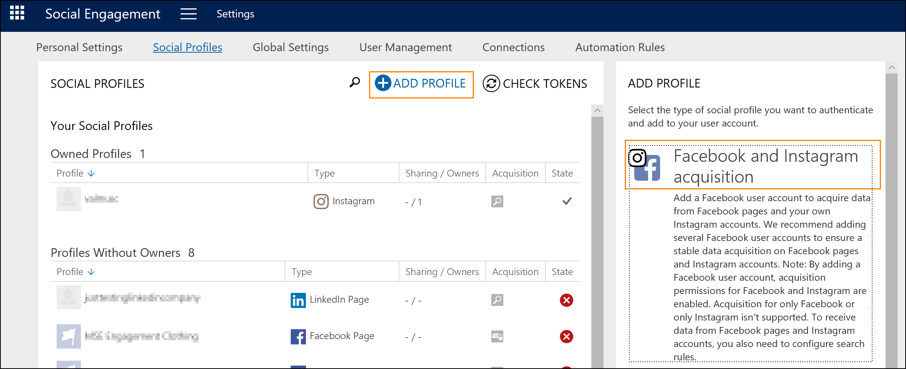

# [!INCLUDE [tn-instagram](../includes/tn-instagram.md)] account search and [!INCLUDE [tn-instagram](../includes/tn-instagram.md)] keyword search removal

On December 10, 2018, two changes were introduced in [!INCLUDE [pn-social-engagement-short](../includes/pn-social-engagement-short.md)] regarding [!INCLUDE [tn-instagram](../includes/tn-instagram.md)] as a data source. We're adding search rules for owned [!INCLUDE [tn-instagram](../includes/tn-instagram.md)] business accounts and are removing the [!INCLUDE [tn-instagram](../includes/tn-instagram.md)] keyword search functionality. 

## [!INCLUDE [tn-instagram](../includes/tn-instagram.md)] keyword search removal
Keyword searches were retired by [!INCLUDE [tn-instagram](../includes/tn-instagram.md)] on December 10, 2018. Due to this change, we have also removed the keyword search functionality in [!INCLUDE [pn-social-engagement-short](../includes/pn-social-engagement-short.md)]. 

## How will [!INCLUDE [tn-instagram](../includes/tn-instagram.md)] keyword search rules work after December 10, 2018?
Since the functionality of [!INCLUDE [tn-instagram](../includes/tn-instagram.md)] keyword searches were removed, no new keyword search queries for [!INCLUDE [tn-instagram](../includes/tn-instagram.md)] can be set up. 

Existing keyword search rules containing [!INCLUDE [tn-instagram](../includes/tn-instagram.md)] as a source will continue to exist as is, and the data acquired for these rules will be preserved, as long as the rules are not changed. However, no new posts for keyword search rules are acquired from [!INCLUDE [tn-instagram](../includes/tn-instagram.md)]. If a user changes such a rule, [!INCLUDE [tn-instagram](../includes/tn-instagram.md)] needs to be removed as a source to be able to save the edited search rule. Doing so will remove the [!INCLUDE [tn-instagram](../includes/tn-instagram.md)] posts from the database. 

If you don't want to remove existing [!INCLUDE [tn-instagram](../includes/tn-instagram.md)] posts but change values of a search rule we recommend that you [set up a separate rule](add-rules-search-topic.md#add-a-keywords-rule) with the changes, and keep the existing rule with [!INCLUDE [tn-instagram](../includes/tn-instagram.md)] as is to avoid deleting the previously acquired posts.  

## [!INCLUDE [tn-instagram](../includes/tn-instagram.md)] business account search

On December 10, a new functionality for [!INCLUDE [tn-instagram](../includes/tn-instagram.md)] is available in [!INCLUDE [pn-social-engagement-short](../includes/pn-social-engagement-short.md)]. Users are now able to acquire posts and comments from their own [!INCLUDE [tn-instagram](../includes/tn-instagram.md)] business accounts. To be able to acquire data from owned [!INCLUDE [tn-instagram](../includes/tn-instagram.md)] accounts, those accounts need to be [!INCLUDE [tn-instagram](../includes/tn-instagram.md)] business accounts and need to be connected to the corresponding [!INCLUDE [tn-facebook](../includes/tn-facebook.md)] page. [Find more information on how to connect a Facebook page with an Instagram Business account.](https://developers.facebook.com/docs/instagram-api/getting-started/#connect)

> [!WARNING]
> There's a [known issue with Facebook](https://developers.facebook.com/support/bugs/714852775564332/) when connecting from Instagram to Facebook pages. If you haven't connected your accounts yet, you can [connect them from Facebook](https://developers.facebook.com/docs/instagram-api/getting-started/#connect) to get the search working. If you already connected the accounts, we suggest you wait for the fix from Facebook to avoid losing your insights while reconnecting them.

The acquisition of posts and comments from owned [!INCLUDE [tn-instagram](../includes/tn-instagram.md)] accounts is done through the [!INCLUDE [tn-facebook](../includes/tn-facebook.md)] Graph API using a user token and thus relies on individual user permissions. All [!INCLUDE [tn-instagram](../includes/tn-instagram.md)] [tokens must have admin permissions](manage-access-tokens.md) on all [!INCLUDE [tn-facebook](../includes/tn-facebook.md)] pages and linked [!INCLUDE [tn-instagram](../includes/tn-instagram.md)] business accounts used in Social Engagement.

To be able to acquire [!INCLUDE [tn-instagram](../includes/tn-instagram.md)] posts and comments, users need to reauthenticate (or authenticate, in the case of new users) their [!INCLUDE [tn-facebook](../includes/tn-facebook.md)] and [!INCLUDE [tn-instagram](../includes/tn-instagram.md)] acquisition accounts in Social Profiles in [!INCLUDE [pn-social-engagement-short](../includes/pn-social-engagement-short.md)]. The [!INCLUDE [tn-facebook](../includes/tn-facebook.md)] Acquisition profile in **Social Profiles** has been renamed to [!INCLUDE [tn-facebook](../includes/tn-facebook.md)] and [!INCLUDE [tn-instagram](../includes/tn-instagram.md)] Acquisition. To be able to authenticate within [!INCLUDE [pn-social-engagement-short](../includes/pn-social-engagement-short.md)], users need to be the administrator of the [!INCLUDE [tn-facebook](../includes/tn-facebook.md)] page that their [!INCLUDE [tn-instagram](../includes/tn-instagram.md)] business account is linked to. 

For users who want to be able to acquire posts and identify the [!INCLUDE [tn-instagram](../includes/tn-instagram.md)] accounts linked to the [!INCLUDE [tn-facebook](../includes/tn-facebook.md)] page, we are requesting the *instagram_basic*, *manage_pages*, and *pages_show_list* permissions, along with the permissions to acquire data from [!INCLUDE [tn-facebook](../includes/tn-facebook.md)] pages. During the authentication, the user has the choice to disallow the use of those permissions but by doing so will not be able to use the [!INCLUDE [tn-instagram](../includes/tn-instagram.md)] functionality in [!INCLUDE [pn-social-engagement-short](../includes/pn-social-engagement-short.md)]. 

To acquire posts and comments, you will also need to set up [!INCLUDE [tn-instagram](../includes/tn-instagram.md)] account rules in **Search Setup**. The [!INCLUDE [tn-instagram](../includes/tn-instagram.md)] accounts linked to your [!INCLUDE [tn-facebook](../includes/tn-facebook.md)] pages are listed in the [!INCLUDE [tn-instagram](../includes/tn-instagram.md)] account rules setup, where they can be selected. If the owner of a [!INCLUDE [tn-facebook](../includes/tn-facebook.md)] and [!INCLUDE [tn-instagram](../includes/tn-instagram.md)] Acquisition profile decides to share it with other users, they can create search rules for the linked [!INCLUDE [tn-instagram](../includes/tn-instagram.md)] accounts too.

If you are not interested in using the [!INCLUDE [tn-instagram](../includes/tn-instagram.md)] functionality, you don’t have to reauthenticate your [!INCLUDE [tn-facebook](../includes/tn-facebook.md)] Acquisition accounts immediately. 

### See also
[Set up searches to listen to social media conversations](set-up-searches.md)    
[Acquire data from Facebook pages](facebook-pages-data-acquisition.md)
