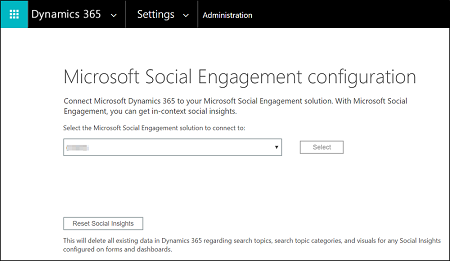
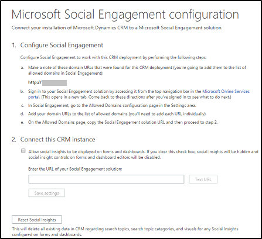
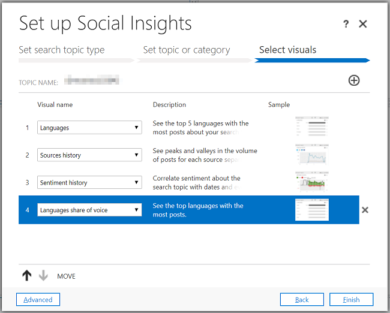
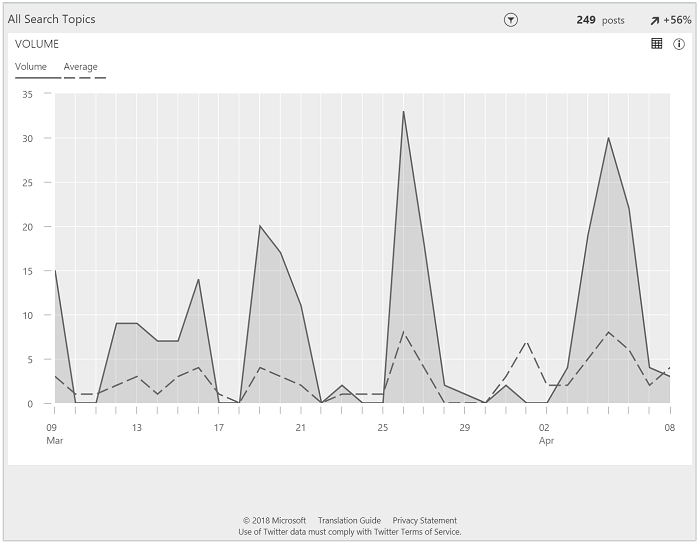
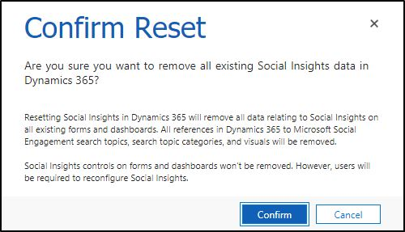

# Integrate Microsoft Social Engagement with Dynamics 365

In [!INCLUDE[pn_crm_online_shortest](../includes/pn-crm-shortest.md)], you can get powerful social insights by connecting [!INCLUDE[pn_crm_online_shortest](../includes/pn-crm-shortest.md)] to [!INCLUDE[pn_netbreeze_short](../includes/pn-social-engagement-short.md)]. [!INCLUDE[pn_netbreeze_short](../includes/pn-social-engagement-short.md)] puts social media at the fingertips of your sales teams, customer service agents, and everyone across the organization. The easy-to-understand widgets provide insights and help you understand what your customers or prospects are saying about your products, brands, and services. Identify any issues or compliments that are mentioned about your products or services on social media. 

With [!INCLUDE[pn_social_insights](../includes/pn-social-insights.md)], you bring social media data directly into [!INCLUDE[pn_crm_online_shortest](../includes/pn-crm-shortest.md)] dashboards and entity forms. As an administrator, you configure the connection to [!INCLUDE[pn_netbreeze_short](../includes/pn-social-engagement-short.md)] and add the [!INCLUDE[pn_social_insights](../includes/pn-social-insights.md)] controls to the entity forms and system dashboards. You use the [!INCLUDE[pn_social_insights](../includes/pn-social-insights.md)] controls to specify what social data you want to see and in what form you want this data to be presented to you. When you set up the [!INCLUDE[pn_social_insights](../includes/pn-social-insights.md)] controls, you choose a search topic or search topic category and visuals. After you choose the search topic or category, you pick the visuals. It can be a graph or chart, or some other visual representation of data. You can find a lot of interesting, useful, and easy-to-follow information.

The [!INCLUDE[pn_social_insights](../includes/pn-social-insights.md)] widgets in your [!INCLUDE[pn_crm_online_shortest](../includes/pn-crm-shortest.md)] forms and dashboards provide convenient access to social data right where you work. At any time, you can click on any widget to be taken into [!INCLUDE[pn_netbreeze_short](../includes/pn-social-engagement-short.md)] to [drill down and explore the data further](analyze-social-data-using-widgets.md).

## Connect Dynamics 365 (online) to Microsoft Social Engagement for Social Insights

To configure the connection, you need to have a subscription to [!INCLUDE[pn_netbreeze_short](../includes/pn-social-engagement-short.md)], be an authorized [!INCLUDE[pn_netbreeze_short](../includes/pn-social-engagement-short.md)] user, and have a [!INCLUDE[pn_netbreeze_short](../includes/pn-social-engagement-short.md)] instance provisioned for this [!INCLUDE[pn_crm_online_shortest](../includes/pn-crm-shortest.md)] instance.

### Prerequisites

- You need to have a System Administrator security role or equivalent permissions in [!INCLUDE[pn_crm_online_shortest](../includes/pn-crm-online-shortest.md)].

- You must ensure that your [!INCLUDE[pn_crm_online_shortest](../includes/pn-crm-shortest.md)] domain is [added to the list of allowed domains](connect-other-domains.md) in [!INCLUDE[pn_netbreeze_short](../includes/pn-social-engagement-short.md)]. 

### Connect Dynamics 365 (online) to Social Engagement

1. In Dynamics 365, select **Settings** > **Administration** > **Microsoft Social Engagement Configuration**.

2. Select **Continue** to accept the legal disclaimer.

3. On the **Microsoft Social Engagement Configuration** page, in the **Select the Microsoft Social Engagement solution to connect to** drop-down box, choose the Microsoft Social Engagement instance to which you want to connect. Select the **Select** button next to the drop-down box. The **Select** button becomes dim to indicate that the selection is confirmed.

     

## Connect Dynamics 365 on-premises to Microsoft Social Engagement for Social Insights

### Prerequisites

- You need to have a System Administrator security role or equivalent permissions in [!INCLUDE[pn_crm_online_shortest](../includes/pn-crm-online-shortest.md)].

- You must ensure that your [!INCLUDE[pn_crm_online_shortest](../includes/pn-crm-shortest.md)] domain is [added to the list of allowed domains](connect-other-domains.md) in [!INCLUDE[pn_netbreeze_short](../includes/pn-social-engagement-short.md)].

### Connect Dynamics 365 on-premises to Social Engagement

1. In Dynamics 365, select **Settings** > **Administration** > **Microsoft Social Engagement Configuration**.

2. Select **Continue** to accept the legal disclaimer.

3. Follow the directions on the **Microsoft Social Engagement Configuration** page.

   
  
## Add Social Engagement visuals to an entity form

To add Social Insights controls to an entity (record type) form, you have to [use the form editor](https://technet.microsoft.com/library/dn531185.aspx) provided in the Dynamics 365 Customization area. You can position the Social Insights control anywhere on the form and resize it, just like you would do with the iFrame controls. You can make the control bigger by increasing the number of rows and spanning the control over several columns. This is important if you want to make a graph or a chart in the control appear larger and be more readable. More information: Use the form editor.

1. Select **Settings** > **Customizations** > **Customize the System**.

2. In the navigation pane, under **Components**, expand **Entities**.

3. Expand the entity that you want to add the Social Insights control to. Select **Forms**.

4. In the grid view, select the entity’s **Main form**.

5. Select the **Insert** tab. At the top of the form, on the ribbon, select the **Social Insights** icon. In the setup dialog box, fill out the required fields, such as the unique name of the control and the label name.    
Choose to enable **Pass record object-type code and unique identifier as parameters**.

6. Select **OK**. The Social Insights control is now added to the entity form. You can resize the control or move the control to another location on the form.

7. Switch back to the **Home** tab. Select **Save** and then select **Publish** to publish the added customizations. The control called **Configure Social Insights** appears on all records based on this form. The search topics, search categories and visuals can be added to the control.  

## Add Social Engagement visuals to dashboards

You can add the Social Insights controls to the existing system dashboards or to a new dashboard. Let’s create a new dashboard and add the Social Insights control to it. We’ll use the Set Up Social Insights wizard to lead us through the setup. Shortly after the setup is finished and customizations are published, the charts and graphs with social data will appear on your dashboard.

1. Select **Settings** > **Customizations** > **Customize the System**.

2. In the Navigation Pane, under **Components**, select **Dashboards**.

3. Select **New** on the command bar. Choose a layout and select **Create**.

4. On the dashboard form, enter the name of the dashboard in the **Name** text box and select **Save**.

5. To add the control, select **Insert Social Insights** icon in the center of the section on the dashboard form, or select **More Commands** ... on the command bar and then select **Social Insights** in the drop-down list. The **Set Up Social Insights** wizard appears.

   

6. In the **Set Up Social Insights** wizard, select **Advanced**. The **Add Social Insights** dialog appears. Fill in the required fields and select **OK**. You can also use the default values and select **OK** or **Cancel** to close the dialog box.

   

7. In the **Set Up Social Insights** wizard main window, select **Search topic** or **Search topic category**, and then select **Next**.

8. To pick the search topic or the search topic category, in the drop-down list, select the topic or the category, depending on what you chose in the previous step and then select **Next**.

    > [!NOTE]
    > You can create a new search topic, instead of choosing a search topic in the drop-down list. Select **Create a new search topic**, fill in the required fields, and select **Next**.

   

9. In the visuals drop-down list, select a graph or a chart you want. You can add as many visuals as you want and move them up and down the list using the **MOVE UP** and **MOVE DOWN** arrows. You can also delete a visual by selecting the delete icon displayed to the right of the visual. Select **Finish**.

   

10. On the command bar, select **Save** and then select **Close**.

11. To publish the customizations, select **Publish All Customizations** on the command bar. After the customizations are published, you can see the Social Insights on your dashboard.

   

## Set up search topics from within Dynamics 365  

Search topics are usually created by Administrators or Power Analysts directly in the settings of [!INCLUDE[pn_netbreeze_short](../includes/pn-social-engagement-short.md)]. However, to get up and running quickly, users with Administrator or Power Analyst user roles in [!INCLUDE[pn_netbreeze_short](../includes/pn-social-engagement-short.md)] can set up searches from within [!INCLUDE[pn_crm_shortest](../includes/pn-crm-shortest.md)].  
  
To have the full set of options for creating a search topic available, it’s a good idea to work directly in [!INCLUDE[pn_netbreeze_short](../includes/pn-social-engagement-short.md)]. [Find out how to set up search topics in Social Engagement](set-up-searches.md).

## Reset Social Insights

This action deletes all existing data in Dynamics 365 for the search topics, search topic categories and visuals for Social Insights.

1. Select **Settings** > **Administration** > **Microsoft Social Engagement Configuration**.

2. On the **Microsoft Social Engagement Configuration** page, select **Reset Social Insights**. The **Reset Social Insights Confirmation** message box appears. Select **Confirm**, if you want to proceed, otherwise select **Cancel**.

   

## Troubleshoot sign-in problems  

Having trouble signing in to [!INCLUDE[pn_netbreeze_short](../includes/pn-social-engagement-short.md)] or another [!INCLUDE[pn_crm_online_shortest](../includes/pn-crm-online-shortest.md)] service? Read [CRM Help & Training: Troubleshoot sign-in problems](http://go.microsoft.com/fwlink/p/?LinkId=516923) for available resolutions.  
  
### See Also  
 [Get started with Social Engagement](get-started.md)   
 [Administer Microsoft Social Engagement](administer-microsoft-social-engagement.md)   
 [Assign permissions and user roles](assign-user-roles.md)   
