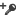

# Manage access tokens
[!INCLUDE[pn_netbreeze_long](../includes/pn-netbreeze-long.md)] requires you to provide access tokens in order to acquire data and interact with posts for social profiles. [!INCLUDE[tn_facebook](../includes/tn-facebook.md)] profiles, [!INCLUDE[tn_facebook](../includes/tn-facebook.md)] pages, and [!INCLUDE[tn_twitter](../includes/tn-twitter.md)] profiles, require access tokens before you can acquire and interact with posts. [!INCLUDE[tn_instagram](../includes/tn-instagram.md)] accounts require access tokens to acquire posts. Access tokens enable data acquisition and can be easily supplied by logging into your social media account. Acquisition tokens will not post anything to personal [!INCLUDE[tn_facebook](../includes/tn-facebook.md)], [!INCLUDE[tn_twitter](../includes/tn-twitter.md)], or [!INCLUDE[tn_instagram](../includes/tn-instagram.md)] accounts. We advise users to add at least two different tokens to [!INCLUDE[pn_netbreeze_short](../includes/pn-netbreeze-short.md)]. Adding more tokens can guarantee a faster data acquisition and reduce the risk of data acquisition stopping due to expired access tokens. Before adding a user token, make sure you have the appropriate user roles to add a social profile.[!INCLUDE[proc_more_information](../includes/proc-more-information.md)] [Manage social profiles](../social-engagement/manage-social-profiles.md)  
  
> [!NOTE]
>  Providing an access token is mandatory; not providing one will prevent [!INCLUDE[pn_netbreeze_long](../includes/pn-netbreeze-long.md)] from acquiring private messages from [!INCLUDE[tn_facebook](../includes/tn-facebook.md)] pages and [!INCLUDE[tn_twitter](../includes/tn-twitter.md)]. The access tokens received from users are stored and encrypted in a secure database. The data acquired with tokens is not shared with any other [!INCLUDE[pn_netbreeze_long](../includes/pn-netbreeze-long.md)] solutions.  
  
 The following table shows the tokens you need to add for your social profiles.  
  
|||  
|-|-|  
|**Type of social profile**|**Type of token**|  
|[!INCLUDE[tn_facebook](../includes/tn-facebook.md)] profile|**Acquisition token**: Acquire public data from [!INCLUDE[tn_facebook](../includes/tn-facebook.md)] pages   **Interaction token**: Publish and reply to posts on [!INCLUDE[tn_facebook](../includes/tn-facebook.md)] pages|  
|[!INCLUDE[tn_facebook](../includes/tn-facebook.md)] page|**Interaction token**: Acquire private messages from [!INCLUDE[tn_facebook](../includes/tn-facebook.md)] pages, and publish and reply to posts.|  
|[!INCLUDE[tn_instagram](../includes/tn-instagram.md)] account|**Acquisition token**: Acquire public data from [!INCLUDE[tn_instagram](../includes/tn-instagram.md)].|  
|[!INCLUDE[tn_twitter](../includes/tn-twitter.md)] profile|**Interaction token**: Acquire private messages from a [!INCLUDE[tn_twitter](../includes/tn-twitter.md)] profile, and publish and reply to posts.|  
|[!INCLUDE[tn_youtube](../includes/tn-youtube.md)] account|**Interaction token**: Comment and rate video posts and reply to comments on [!INCLUDE[tn_youtube](../includes/tn-youtube.md)].|  
  
   
## Tokens for data acquisition  
 Adding tokens for data acquisition allows you to acquire posts from [!INCLUDE[tn_instagram](../includes/tn-instagram.md)] and [!INCLUDE[tn_facebook](../includes/tn-facebook.md)]. It’s important to understand that acquiring  is a two-step process. After you add tokens and allow the data acquisition, you will not automatically start seeing posts. A power analyst or administrator needs to add a search rule for the added social profile when they set up a search topic in order to start analyzing posts from [!INCLUDE[tn_facebook](../includes/tn-facebook.md)] and [!INCLUDE[tn_instagram](../includes/tn-instagram.md)]. After users add a social profile and allowed data acquisition, they can also monitor [!INCLUDE[tn_facebook](../includes/tn-facebook.md)] pages and [!INCLUDE[tn_instagram](../includes/tn-instagram.md)] accounts they do not own. [!INCLUDE[proc_more_information](../includes/proc-more-information.md)] [Add rules to a search topic](../social-engagement/add-rules-search-topic.md)  
  
### Add a Facebook acquisition token and allow data acquisition  
 You need [!INCLUDE[tn_facebook](../includes/tn-facebook.md)] acquisition profilesto acquire data from [!INCLUDE[tn_facebook](../includes/tn-facebook.md)] pages.  You need to authenticate access tokens by logging into your account and allowing data acquisition to acquire public posts from a [!INCLUDE[tn_facebook](../includes/tn-facebook.md)] page.  
  
> [!NOTE]
>  Provided tokens will expire after 60 days. [!INCLUDE[pn_netbreeze_long](../includes/pn-netbreeze-long.md)] will notify you to re-authenticate your [!INCLUDE[tn_facebook](../includes/tn-facebook.md)] profile through emails sent from socialengagement@microsoft.com and through notifications in [!INCLUDE[pn_netbreeze_short](../includes/pn-netbreeze-short.md)].  
  
1.  Go to **Settings** > **Social Profiles**.  
  
2.  Select the appropriate social profile, and then in the [!INCLUDE[tn_facebook](../includes/tn-facebook.md)] page/profile details panel, click re-authenticate  under Allow data acquisition, and enter your log-in credentials.  
  
3.  Under **Use for search acquisition**, click the drop-down arrow next to the search acquisition symbol  and select the checkbox next to **Allow** to acquire data from [!INCLUDE[tn_facebook](../includes/tn-facebook.md)] pages. The token will become active after you select the check box.  
  
4.  Click **Save**.  
  
### Add an Instagram token and allow data acquisition  
  
1.  Go to **Settings** > **Social Profiles**.  
  
2.  Select the appropriate social profile ([!INCLUDE[tn_instagram](../includes/tn-instagram.md)] account) and in the [!INCLUDE[tn_instagram](../includes/tn-instagram.md)] account details panel, click re-authenticate  and enter your log-in credentials.  
  
3.  Under **Use for search acquisition**, click the drop-down arrow next to the search acquisition symbol  and select the check box next to **Allow** to acquire data from [!INCLUDE[tn_instagram](../includes/tn-instagram.md)]. The token will become active after you select the check box.  
  
4.  Click **Save**.  
  
   
## Tokens for interactions with posts  
 Adding tokens for interactions with posts allows you to acquire private messages from [!INCLUDE[tn_facebook](../includes/tn-facebook.md)] pages and [!INCLUDE[tn_twitter](../includes/tn-twitter.md)], as well as publish and reply to posts. You can check your token health states to make sure your tokens aren't expired. [!INCLUDE[proc_more_information](../includes/proc-more-information.md)] [Check the health state of your social profiles](../social-engagement/social-profiles-health-state.md)  
  
> [!NOTE]
>  View your social profiles page to add a token. If you don't see the social profile in question, you can add a social profile and add tokens directly.  
  
#### Add a Facebook user token to interact with posts  
  
1.  Go to **Settings** > **Social Profiles**.  
  
2.  Select the appropriate social profile, and then in the [!INCLUDE[tn_facebook](../includes/tn-facebook.md)] user details panel, click re-authenticate  and enter your log-in credentials.  
  
3.  Under **Use for Search Acquisition**, click the drop-down arrow next to the search acquisition symbol , and then select the check box next to **Allow** to interact with posts and replies on a [!INCLUDE[tn_facebook](../includes/tn-facebook.md)] page. The token will become active  after you select the check box.  
  
4.  Click **Save**.  
  
#### Add a Facebook page token and allow data acquisition for private messages  
  
1.  Go to **Settings** > **Social Profiles**.  
  
2.  Select the appropriate social profile, and in the [!INCLUDE[tn_facebook](../includes/tn-facebook.md)] page details panel, click **Re-authenticate**  and enter your  credentials.  
  
3.  Under **Acquisition of private messages**, click the drop-down arrow next to the private messages symbol  , and then select the check box next to **Allow** to acquire privates messages to and from your [!INCLUDE[tn_facebook](../includes/tn-facebook.md)] account. The token will become active  after you select the check box.  
  
4.  Click **Save**.  
  
#### Add a Twitter token and allow data acquisition for private messages  
  
1.  Go to **Settings** > **Social Profiles**.  
  
2.  Select the appropriate social profile, and then in the [!INCLUDE[tn_twitter](../includes/tn-twitter.md)] profile details panel, click **Re-authenticate**  under **Allow interactions**, then enter your  credentials.    Under Acquisition of Private Messages, click the drop-down arrow next to the private messages symbol  and select the check box next to **Allow** to acquire private messages to and from your [!INCLUDE[tn_twitter](../includes/tn-twitter.md)] account. The token will become active after you select the check box.  
  
3.  Click **Save**.  
  
   
## Re-authenticate a token  
 Expired tokens must be re-authenticated to continue data acquisition and interactions with posts.  You can also check the health state of your tokens in your lists of social profiles. [!INCLUDE[proc_more_information](../includes/proc-more-information.md)] [Check the health state of your social profiles](../social-engagement/social-profiles-health-state.md)  
  
1.  Select the appropriate social profile and click **Re-authenticate** .  
  
2.  Enter the appropriate credentials.  
  
   
## Delete tokens  
 Please note that social profiles require at least one valid token to continue acquiring private messages.  
  
1.  Go to **Settings** > **Social Profiles**.  
  
2.  Select the appropriate social profile, and in the social profile panel click the Delete your token button  next to the token you want to delete.  
  
3.  Click **Save**.  
  
### See Also  
 [Engage on social networks](../social-engagement/engage-on-social-networks.md)   
 [Set up searches to listen to social media conversations](../social-engagement/set-up-searches.md)   
 [Manage social profiles](../social-engagement/manage-social-profiles.md)
