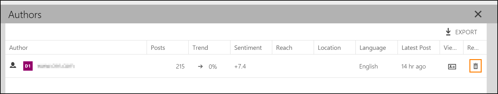
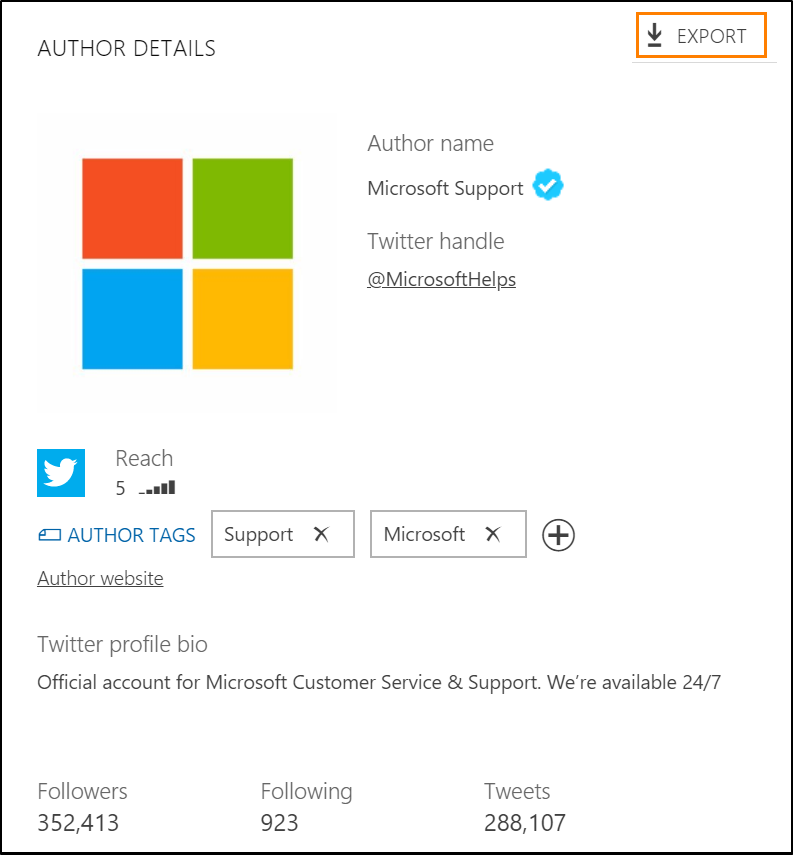

# Manage an author's data

Most posts in [!INCLUDE[pn-social-engagement-short](../includes/pn-social-engagement-short.md)] are linked to an author on a social network. With sufficient permissions, you can remove an author from [!INCLUDE[pn-social-engagement-short](../includes/pn-social-engagement-short.md)] and block all future posts by that author. Whenever [!INCLUDE[pn-social-engagement-short](../includes/pn-social-engagement-short.md)] acquires new posts, it checks if the author was deleted earlier and discards posts from deleted authors. It's critical to understand the implications of removing an author, because it can't be undone and can have a significant impact on data acquisition for your solution.
<!---
Since your search topics gather data about post authors, you could be contacted by authors who want to know the data you stored about them and, eventually, you could be asked to remove that data per laws in the European Union. To minimize your efforts to respond to such requests, follow the procedures below to remove or correct personal data about authors in Social Engagement.

## General Data Protection Regulation

The General Data Protection Regulation (GDPR) is a European Union (EU) directive that requires organizations operating within the EU to respect the privacy of EU citizens and to get explicit consent to contact them or use their personal information in any data automation or storage system. [!INCLUDE[pn-social-engagement-short](../includes/pn-social-engagement-short.md)] is prepared to help organizations comply with the GDPR. However, most organizations will need to review and update their information systems to come into complete compliance as part of a comprehensive, organization-wide effort. 

### Learn more about GDPR 

To learn more about bringing your Dynamics 365 systems into compliance with GDPR: 

- [Microsoft Dynamics 365 and GDPR](https://docs.microsoft.com/dynamics365/get-started/gdpr/). Provides links to resources, white papers, blogs, and other information related to Dynamics 365 applications and GDPR. 

- [Microsoft Trust Center](https://www.microsoft.com/trustcenter). Discover how new features help you secure personal data and meet strict GDPR privacy requirements. 

- [Service Trust Portal](https://servicetrust.microsoft.com/). Control management, integrated task assignment, evidence collection, and audit-ready reporting tools to streamline your compliance workflow. 
--->
## Delete an author

To remove all available information about an author (for example, if you need to respond to a deletion request, or want to remove posts from a spam account) in [!INCLUDE[pn-social-engagement-short](../includes/pn-social-engagement-short.md)], you can delete them. However, once you delete an author, there's no way to undo it. Data about and from this author will be lost, including their ability to post in the future. To delete an author in [!INCLUDE[pn-social-engagement-short](../includes/pn-social-engagement-short.md)], you need to have a Power Analyst or Administrator [configuration role](user-roles.md). 

Deleting an author will result in:

- All posts from the author will be removed.

- No new posts from the author will be acquired in the future.

- Search rules that were configured to gather posts from the author's profile will be deleted.

### Find and delete an author

1. In **[!INCLUDE[pn-social-engagement-short](../includes/pn-social-engagement-short.md)]** go to **Analytics** > **Overview**

2. [Define a custom time frame](use-filters.md#edit-the-analysis-time-frame) to include the past two years.    
   Since posts are stored for two years, this ensures that you review all available data in [!INCLUDE[pn-social-engagement-short](../includes/pn-social-engagement-short.md)] and find the author if they published a post during that time. 

3. Select the **Author** filter [using the filter menu](use-filters.md#add-edit-or-remove-a-filter). 

4. Search for the author name and apply the filter to see all posts by this author. 
   > [!NOTE]
   > If you are asked to remove information about a specific author, we recommend that you confirm the identity of that author first to validate the request. To confirm their identity, you can request a private message from the author. If they have access to the social media profile, they are likely to own it.

5. Go to **Analytics > Overview**. In the **Authors** widget, select **Widget actions**  and select **Expand to full view** .

6. In the expanded view, select the **Remove Author**  symbol and confirm your deletion.    

## Export author information

To inform an author about personal social profile data that is stored in [!INCLUDE[pn-social-engagement-short](../includes/pn-social-engagement-short.md)], administrators can export profile data to an [!INCLUDE[pn-excel-short](../includes/pn-excel-short.md)] file. 

### Export details about an author

1. In **[!INCLUDE[pn-social-engagement-short](../includes/pn-social-engagement-short.md)]** go to **Analytics** > **Overview**.

2. [Define a custom time frame](use-filters.md#edit-the-analysis-time-frame) to include the past two years.    
   Since posts are stored for two years, this ensures that you review all available data in [!INCLUDE[pn-social-engagement-short](../includes/pn-social-engagement-short.md)] and find the author if they published a post during that time. 

3. Select the **Author** filter [using the filter menu](use-filters.md#add-edit-or-remove-a-filter). 

4. Search for the author name and apply the filter to see all posts by this author. 

5. Go to **Analytics** > **Overview**. In the **Authors** widget, select the **View author details**  symbol.

6. In the author details view, select the **Export personal data for this author**  symbol and download the [!INCLUDE[pn-excel-short](../includes/pn-excel-short.md)] file.    
  

## Stop processing specific authors

To stop processing author data, you need to [delete the author](#delete-an-author). This will remove all search rules that are based on the author's profile and no new posts from this author will be acquired in the future. 

## Correcting author information

Administrators in [!INCLUDE[pn-social-engagement-short](../includes/pn-social-engagement-short.md)] can't change author names.    
However, if an author decides to change their name on a social network, this change will be reflected in [!INCLUDE[pn-social-engagement-short](../includes/pn-social-engagement-short.md)] when their next post is acquired. 

If an author decides to remove a public post on Twitter, Tumblr, or WordPress, this deletion is reflected in [!INCLUDE[pn-social-engagement-short](../includes/pn-social-engagement-short.md)] and the post is removed from the user interface, too.

### See also
[Get an overview about the data](analytics-overview.md)    
[Get started with Social Engagement](get-started.md)    
[Set up searches in Social Engagement](set-up-searches.md)
