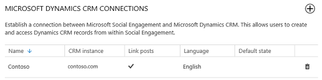
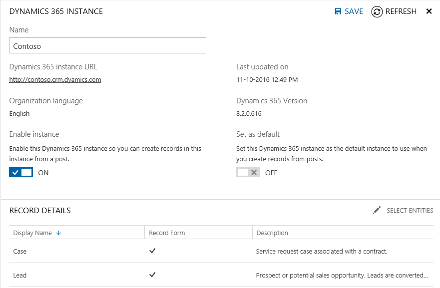

# Manage the connection between Dynamics 365 and Social Engagement

Understand how to change the settings for your connections between [!INCLUDE[pn_crm_shortest](../includes/pn-crm-shortest.md)] and [!INCLUDE[pn_netbreeze_short](../includes/pn-social-engagement-short.md)], and the consequences of doing so.    
You must already have a working connection between [!INCLUDE[pn_netbreeze_short](../includes/pn-social-engagement-short.md)] and [!INCLUDE[pn_dynamics_crm](../includes/pn-dynamics-crm.md)] established and you need to be have an Administrator role in [!INCLUDE[pn_netbreeze_short](../includes/pn-social-engagement-short.md)] to perform the following tasks.
  
The link between a [!INCLUDE[pn_netbreeze_short](../includes/pn-social-engagement-short.md)] post and [!INCLUDE[pn_crm_shortest](../includes/pn-crm-shortest.md)] record can be broken when:  
  
- The associated [!INCLUDE[pn_crm_shortest](../includes/pn-crm-shortest.md)] instance has been disabled or deleted in [!INCLUDE[pn_netbreeze_short](../includes/pn-social-engagement-short.md)].  
  
- The associated [!INCLUDE[pn_crm_shortest](../includes/pn-crm-shortest.md)] instance is experiencing downtime, or has expired.  
  
- The [!INCLUDE[pn_crm_shortest](../includes/pn-crm-shortest.md)] instance is enabled, but the [!INCLUDE[pn_crm_shortest](../includes/pn-crm-shortest.md)] record has been disassociated from the social activity, or has been deleted in [!INCLUDE[pn_crm_shortest](../includes/pn-crm-shortest.md)], or, in [!INCLUDE[pn_netbreeze_short](../includes/pn-social-engagement-short.md)] the linked [!INCLUDE[pn_crm_shortest](../includes/pn-crm-shortest.md)] record has been [unlinked](create-dynamics-365-record-from-social-post.md#remove-a-linked-dynamics-365-record-from-a-post) from the [!INCLUDE[pn_netbreeze_short](../includes/pn-social-engagement-short.md)] post.
  
## Edit an established connection

After you connect a [!INCLUDE[pn_crm_online_shortest](../includes/pn-crm-online-shortest.md)] instance to [!INCLUDE[pn_netbreeze_short](../includes/pn-social-engagement-short.md)], it will show in the list on **Settings** > **Connections** > **Microsoft Dynamics 365**.  
  
  
  
Click the row associated with the connection to open the **Dynamics 365 Instance** pane.  
  
  
  
- **Name**: Shows the name of this connection to identify the instance quickly when creating a social activity in [!INCLUDE[pn_dynamics_crm](../includes/pn-dynamics-crm.md)]. The display name corresponds with your organization name in [!INCLUDE[pn_Office_365](../includes/pn-office-365.md)], unless a [!INCLUDE[pn_netbreeze_short](../includes/pn-social-engagement-short.md)] administrator changes the name while setting up the connection.
  
- **Dynamics 365 Instance**: URL for your [!INCLUDE[pn_dynamics_crm](../includes/pn-dynamics-crm.md)] instance.  
  
- **Organization language**: See the organizational language of your [!INCLUDE[pn_dynamics_crm](../includes/pn-dynamics-crm.md)] instance.  
  
- **Connected on**: Shows the date and time when the connection between [!INCLUDE[pn_dynamics_crm](../includes/pn-dynamics-crm.md)] and [!INCLUDE[pn_netbreeze_short](../includes/pn-social-engagement-short.md)] was established.  
  
- **Set as default**: Lets you choose to have an instance selected by default when creating new links to [!INCLUDE[pn_crm_shortest](../includes/pn-crm-shortest.md)] records from social posts.  
  
- **Enable instance**: Lets you choose to temporarily disable the [creation of new links](create-dynamics-365-record-from-social-post.md) to [!INCLUDE[pn_crm_shortest](../includes/pn-crm-shortest.md)] records from social posts.
  
- **Refresh**: Lets you update the metadata of all [!INCLUDE[pn_dynamics_crm](../includes/pn-dynamics-crm.md)] entities associated with that [!INCLUDE[pn_crm_shortest](../includes/pn-crm-shortest.md)] connection in [!INCLUDE[pn_netbreeze_short](../includes/pn-social-engagement-short.md)].  
  
Make the necessary changes to the metadata and then click **Save** to apply the changes.  
  
### Change the default Dynamics 365 instance to use in Social Engagement

If your organization maintains multiple [!INCLUDE[pn_dynamics_crm](../includes/pn-dynamics-crm.md)] instances, you can connect [!INCLUDE[pn_netbreeze_short](../includes/pn-social-engagement-short.md)] to more than one instance. In this case, you can set the instance as a default connection that will be used most often to create new records in [!INCLUDE[pn_dynamics_crm](../includes/pn-dynamics-crm.md)]. Users can choose a different instance when creating a new [!INCLUDE[pn_crm_shortest](../includes/pn-crm-shortest.md)] record.  
  
1.  In [!INCLUDE[pn_netbreeze_long](../includes/pn-social-engagement-long.md)], go to **Settings** > **Connections** > **Microsoft Dynamics 365**.  
  
2.  In the **Microsoft Dynamics 365 Connections** pane, select the instance you want to set as the default.  
  
3.  In the **Dynamics 365 Instance** pane, set the **Set as default** option to ON.  
  
4.  Click **Save**  to apply your changes.  
  
## Results of deleting a connection

 You can delete already-established connections between a [!INCLUDE[pn_netbreeze_short](../includes/pn-social-engagement-short.md)] post and [!INCLUDE[pn_dynamics_crm](../includes/pn-dynamics-crm.md)] record at any time if you don’t want to create new records in the connected [!INCLUDE[pn_crm_shortest](../includes/pn-crm-shortest.md)] instance anymore.
  
- If you maintain more than one connected [!INCLUDE[pn_crm_shortest](../includes/pn-crm-shortest.md)] instance, you can delete one connection and still use the other connections.  
  
- If you delete a specific connection, all posts that had links pointing to that [!INCLUDE[pn_crm_shortest](../includes/pn-crm-shortest.md)] instance will have that link removed. Those posts will look like any other posts without an active link to [!INCLUDE[pn_crm_shortest](../includes/pn-crm-shortest.md)] and can be linked to any other enabled [!INCLUDE[pn_crm_shortest](../includes/pn-crm-shortest.md)] instance. [!INCLUDE[proc_more_information](../includes/proc-more-information.md)] [Connect Dynamics Dynamics 365 (online) and Social Engagement](connect-dynamics-365-social-engagement.md)  
  
- No new [!INCLUDE[pn_crm_shortest](../includes/pn-crm-shortest.md)] records can be created after deleting a connection to a [!INCLUDE[pn_crm_shortest](../includes/pn-crm-shortest.md)] instance, unless a connection is re-established.  
  
> [!NOTE]
> Removing a link from a [!INCLUDE[pn_netbreeze_short](../includes/pn-social-engagement-short.md)] post will not affect the [!INCLUDE[pn_crm_shortest](../includes/pn-crm-shortest.md)] record or social activity at all.  
  
### Delete an existing connection  
  
You can delete connections if you don't want to create new records in a [!INCLUDE[pn_crm_shortest](../includes/pn-crm-shortest.md)] instance anymore.
> [!NOTE]
>  You can't delete a connection if there are active automation rules that link posts to the connected [!INCLUDE[pn_crm_shortest](../includes/pn-crm-shortest.md)]. You will first need to [deactivate or delete all automation rules](automation-rules.md) using that connection.
  
1.  In [!INCLUDE[pn_netbreeze_long](../includes/pn-social-engagement-long.md)], go to **Settings** > **Connections** > **Microsoft Dynamics 365**.  
  
2.  Find the connected instance in the list of **Microsoft Dynamics 365 Connections**.  
  
3.  Click the **Delete this connection to Dynamics 365** button .  
  
4.  Confirm your deletion.  
  
## Results of disabling a connection

You can delete already-established connections between a [!INCLUDE[pn_netbreeze_short](../includes/pn-social-engagement-short.md)] post and [!INCLUDE[pn_dynamics_crm](../includes/pn-dynamics-crm.md)] record at any time if you no longer want to create new records in the connected [!INCLUDE[pn_crm_shortest](../includes/pn-crm-shortest.md)] instance.
  
-   If you maintain more than one connected [!INCLUDE[pn_crm_shortest](../includes/pn-crm-shortest.md)] instance, you can disable one connection and still use the other connection.  
  
-   If you maintain one single connected [!INCLUDE[pn_crm_shortest](../includes/pn-crm-shortest.md)] instance, you can disable it but you won’t be able to create new external links from [!INCLUDE[pn_netbreeze_short](../includes/pn-social-engagement-short.md)].  
  
-   Posts linked to that instance’s disabled connection will persist, but details about the [!INCLUDE[pn_crm_shortest](../includes/pn-crm-shortest.md)] record won’t be available. You can enable the instance to continue to create external links to the [!INCLUDE[pn_crm_shortest](../includes/pn-crm-shortest.md)] instance and see the updated record details. [!INCLUDE[proc_more_information](../includes/proc-more-information.md)] [Set up the connection between Dynamics 365 and Social Engagement](connect-dynamics-365-social-engagement.md)  

The following table summarizes the impact on a [!INCLUDE[pn_netbreeze_short](../includes/pn-social-engagement-short.md)] post when the status of an associated [!INCLUDE[pn_crm_shortest](../includes/pn-crm-shortest.md)] instance changes.  
  
|Status of associated [!INCLUDE[pn_crm_shortest](../includes/pn-crm-shortest.md)] instance in [!INCLUDE[pn_netbreeze_short](../includes/pn-social-engagement-short.md)]|Impact if [!INCLUDE[pn_crm_shortest](../includes/pn-crm-shortest.md)] record is linked with a [!INCLUDE[pn_netbreeze_short](../includes/pn-social-engagement-short.md)] post|Impact if [!INCLUDE[pn_crm_shortest](../includes/pn-crm-shortest.md)] record is not linked with a [!INCLUDE[pn_netbreeze_short](../includes/pn-social-engagement-short.md)] post|  
|-------------------------------------------------------------------------------------------------------------------------------------------------------------------------|-------------------------------------------------------------------------------------------------------------------------------------------------------------------------------|-----------------------------------------------------------------------------------------------------------------------------------------------------------------------------------|  
|Deleted|-   The [!INCLUDE[pn_netbreeze_short](../includes/pn-social-engagement-short.md)] post is available to be linked again. -   If the [!INCLUDE[pn_netbreeze_short](../includes/pn-social-engagement-short.md)] post is re-linked to another instance and the previously deleted [!INCLUDE[pn_crm_shortest](../includes/pn-crm-shortest.md)] instance is re-associated win [!INCLUDE[pn_netbreeze_short](../includes/pn-social-engagement-short.md)], don’t search for the original links and do not change the established link. -   If the [!INCLUDE[pn_netbreeze_short](../includes/pn-social-engagement-short.md)] post is not re-linked and the deleted [!INCLUDE[pn_crm_shortest](../includes/pn-crm-shortest.md)] instance is re-associated, establish the original link (provided [!INCLUDE[pn_crm_shortest](../includes/pn-crm-shortest.md)] social activity is available).|-   The [!INCLUDE[pn_crm_shortest](../includes/pn-crm-shortest.md)] instance is marked as disabled and is not available in the list of instances when creating a [!INCLUDE[pn_crm_shortest](../includes/pn-crm-shortest.md)] link. - [!INCLUDE[pn_netbreeze_short](../includes/pn-social-engagement-short.md)] is available for linking to any enabled instance selected by the user.|  
|Disabled|-   The [!INCLUDE[pn_netbreeze_short](../includes/pn-social-engagement-short.md)] post retains the link and shows an error message because the link will fail to load. -   The [!INCLUDE[pn_crm_shortest](../includes/pn-crm-shortest.md)] instance in [!INCLUDE[pn_netbreeze_short](../includes/pn-social-engagement-short.md)] is marked as disabled. -   In [!INCLUDE[pn_netbreeze_short](../includes/pn-social-engagement-short.md)], a user can unlink the post to make it available to link with another valid [!INCLUDE[pn_crm_shortest](../includes/pn-crm-shortest.md)] instance.|Same as above.|  
|Downtime|Same as above.|Same as above.|  
|Expired|-   The [!INCLUDE[pn_netbreeze_short](../includes/pn-social-engagement-short.md)] post retains the link and shows an error message because the link will fail to load. -   The [!INCLUDE[pn_crm_shortest](../includes/pn-crm-shortest.md)] instance is marked as disabled. -   In [!INCLUDE[pn_netbreeze_short](../includes/pn-social-engagement-short.md)], a user can unlink the post to make it available for linking to another valid [!INCLUDE[pn_crm_shortest](../includes/pn-crm-shortest.md)] instance.|Same as above.|  
  
 The following table summarizes the impact on a [!INCLUDE[pn_netbreeze_short](../includes/pn-social-engagement-short.md)] post when the status of an associated [!INCLUDE[pn_crm_shortest](../includes/pn-crm-shortest.md)] record changes.  
  
|Status of associated [!INCLUDE[pn_crm_shortest](../includes/pn-crm-shortest.md)] record|Impact if [!INCLUDE[pn_crm_shortest](../includes/pn-crm-shortest.md)] record is linked  with a [!INCLUDE[pn_netbreeze_short](../includes/pn-social-engagement-short.md)] post|Impact if [!INCLUDE[pn_crm_shortest](../includes/pn-crm-shortest.md)] record is not linked with a [!INCLUDE[pn_netbreeze_short](../includes/pn-social-engagement-short.md)] post|  
|-------------------------------------------------------------------------------------------------|--------------------------------------------------------------------------------------------------------------------------------------------------------------------------------|-----------------------------------------------------------------------------------------------------------------------------------------------------------------------------------|  
|In [!INCLUDE[pn_crm_shortest](../includes/pn-crm-shortest.md)], the [!INCLUDE[pn_crm_shortest](../includes/pn-crm-shortest.md)] record has been dissociated from the social activity.|-   The linkage with the [!INCLUDE[pn_netbreeze_short](../includes/pn-social-engagement-short.md)] post is broken. -   The associated [!INCLUDE[pn_netbreeze_short](../includes/pn-social-engagement-short.md)] post is available for linking again.|N/A|  
|In [!INCLUDE[pn_crm_shortest](../includes/pn-crm-shortest.md)], the [!INCLUDE[pn_crm_shortest](../includes/pn-crm-shortest.md)] record has been deleted.|Same as above.|N/A|  
|In [!INCLUDE[pn_crm_shortest](../includes/pn-crm-shortest.md)], the social activity has been deleted, but the linked record is available.|Same as above.|N/A|  
|In [!INCLUDE[pn_netbreeze_short](../includes/pn-social-engagement-short.md)], the linked [!INCLUDE[pn_crm_shortest](../includes/pn-crm-shortest.md)] record has been unlinked from the [!INCLUDE[pn_netbreeze_short](../includes/pn-social-engagement-short.md)] post. [!INCLUDE[proc_more_information](../includes/proc-more-information.md)] [Remove a linked Dynamics 365 record from a post](create-dynamics-365-record-from-social-post.md#remove-a-linked-dynamics-365-record-from-a-post)|The [!INCLUDE[pn_netbreeze_short](../includes/pn-social-engagement-short.md)] post is available for linking again.|N/A|  
  
### Disable an existing connection  

If you don’t want new records created in a [!INCLUDE[pn_crm_shortest](../includes/pn-crm-shortest.md)] instance temporarily, without deleting the connection, you can also disable the connection to an instance.  
> [!NOTE]
> You can't disable a connection if there are active automation rules that link posts to the connected [!INCLUDE[pn_crm_shortest](../includes/pn-crm-shortest.md)]. You will first need to [deactivate or delete all automation rules](automation-rules.md) using that connection. 
  
1.  In [!INCLUDE[pn_netbreeze_long](../includes/pn-social-engagement-long.md)], go to **Settings** > **Connections** > **Microsoft Dynamics 365**.  
  
2.  Find the connected instance in the list of **Microsoft Dynamics 365 Connections**.  
  
3.  Set the **Enable instance** option to OFF.  
  
4.  Click **Save**  to apply your changes.  
  
> [!NOTE]
> If your [!INCLUDE[pn_crm_shortest](../includes/pn-crm-shortest.md)] instance has expired or is in maintenance, details for linked [!INCLUDE[pn_crm_shortest](../includes/pn-crm-shortest.md)] records won’t be shown in [!INCLUDE[pn_netbreeze_short](../includes/pn-social-engagement-short.md)].  
  
## Privacy Notice

[!INCLUDE[cc_privacy_mse_post_and_automation_rules](../includes/cc-privacy-mse-post-and-automation-rules.md)]  
  
### See Also

[Link posts from Social Engagement to Dynamics 365](link-posts-to-dynamics-365.md)   
[Connect Dynamics 365 and Social Engagement](connect-dynamics-365-social-engagement.md)   
[Create a Dynamics 365 record from a social post](create-dynamics-365-record-from-social-post.md)   
[Administer Microsoft Social Engagement](administer-microsoft-social-engagement.md)