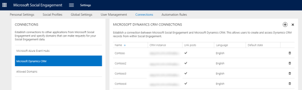

# Manage connections in Social Engagement
[!INCLUDE[pn_netbreeze_long](../includes/pn-netbreeze-long.md)] lets admins connect to and share social data with other applications.  To work with social data in other applications, you can connect them on the Connections page in the [!INCLUDE[pn_netbreeze_short](../includes/pn-netbreeze-short.md)] Settings area. Depending on the application you want to connect to, the type of connection varies.  
  
   
  
-   Connect to [!INCLUDE[pn_microsoft_azure_event_hubs](../includes/pn-microsoft-azure-event-hubs.md)] and stream posts matching a data set as events from [!INCLUDE[pn_netbreeze_short](../includes/pn-social-engagement-short.md)] to an event hub. [!INCLUDE[proc_more_information](../includes/proc-more-information.md)] [Stream data from Social Engagement to Microsoft Azure Event Hubs](stream-data-to-event-hubs.md)  
  
-   Connect   to [!INCLUDE[pn_microsoftcrm](../includes/pn-microsoftcrm.md)] to create new [!INCLUDE[pn_crm_shortest](../includes/pn-crm-shortest.md)] records from posts found in [!INCLUDE[pn_netbreeze_short](../includes/pn-social-engagement-short.md)]. [!INCLUDE[proc_more_information](../includes/proc-more-information.md)] [Link posts from Social Engagement to Dynamics 365](link-posts-to-dynamics-365.md)  
  
-   Manage  a list of domains that allow applications  to connect with and request data from your [!INCLUDE[pn_netbreeze_short](../includes/pn-social-engagement-short.md)] solution. [!INCLUDE[proc_more_information](../includes/proc-more-information.md)] [Connect Social Engagement to other domains](connect-other-domains.md)  
  
    -   To display [!INCLUDE[pn_netbreeze_short](../includes/pn-social-engagement-short.md)] widgets in [!INCLUDE[pn_microsoftcrm](../includes/pn-microsoftcrm.md)], you need to connect [!INCLUDE[pn_microsoftcrm](../includes/pn-microsoftcrm.md)] to [!INCLUDE[pn_netbreeze_short](../includes/pn-social-engagement-short.md)].  For [!INCLUDE[pn_microsoftcrm](../includes/pn-microsoftcrm.md)] to be able to connect to [!INCLUDE[pn_netbreeze_short](../includes/pn-social-engagement-short.md)], its domain must be allowed in [!INCLUDE[pn_netbreeze_short](../includes/pn-social-engagement-short.md)]. [!INCLUDE[proc_more_information](../includes/proc-more-information.md)] [Integrate Microsoft Social Engagement with Dynamics 365](integrate-social-engagement-dynamics-365.md)  
  
### See Also  
 [Administer Microsoft Social Engagement](administer-microsoft-social-engagement.md)