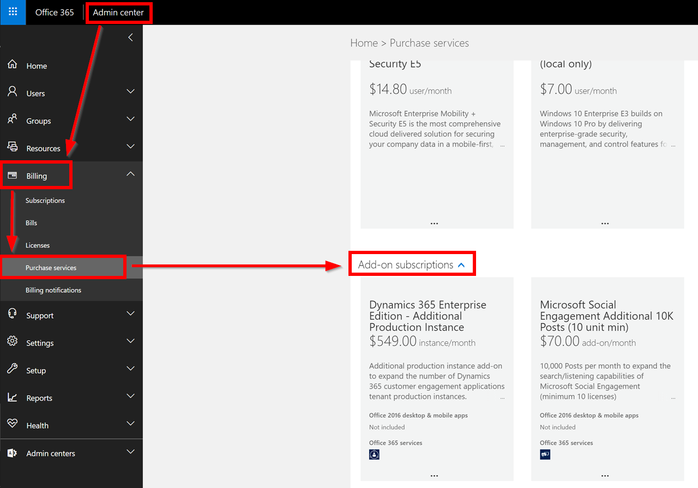

# Manage your post quota
Keep track of the number of posts that result from your search topics and count toward your solution's post quota. Your solution is priced based on the number of posts you can acquire per month.  
  
> [!NOTE]
>  This topic is part of a walkthrough on how you can set up searches. [!INCLUDE[proc_more_information](../includes/proc-more-information.md)] [Set up searches to listen to social media conversations](set-up-searches.md)  
  
> [!IMPORTANT]
>  If you're expected to exceed the post quota for the current month, you'll get a notification email. When you exceed your post quota, data acquisition will be stopped for either of the following reasons:  
>   
>  -   You still exceed your post quota after a grace period of 48 hours from the time the notification was sent.  
>  -   Your solution passes the additional post quota granted for the grace period, which is five times your monthly allocated quota.  
  
 For example, if your monthly post quota is 10,000 posts, your grace period starts when you receive a notification that your solution will probably exceed your quota limits. Data acquisition will be stopped automatically after 48 hours if you have exceeded your post quota by then, or as soon as your solution gathered more than 50,000 posts before the 48 hours have passed.  
  
 To see the state of your current post quota, go to **Search Setup**.  
  
 The quota period is one calendar month:  
  
-   Start: First day of a month, 00:00 AM.  
  
-   End: Last day of a month, 11:59 PM.  
  
## Get the post quota status  
 To get a quick overview of the post quota for all your search topics, for single categories or for single search topics, go to **Search Setup** > **Summary**. For more detailed quota information, drill down into the categories and search topics to see the quota usage of these items.  
  
 If your solution tends to exceed the quota, all users with an Administrator role will get an email notification. You have the following options to take action:  
  
-   Optimize your search topics regularly. Review the search topics to make sure that only relevant data is selected. Previewing a search topic before saving it is a great help to get an impression of how many posts we're expecting for the configuration you provided.  
  
-   Maintain a list of blocked content to avoid any posts appearing in your results from the domains in the list or matching any blocked keywords.  
  
-   Exclude authors who publish irrelevant posts that match one of your search queries.  
  
> [!CAUTION]
>  Proceed carefully when excluding an author or blocking contents. Posts matching items on the list of blocked contents will be deleted irreversibly after four hours. [!INCLUDE[proc_more_information](../includes/proc-more-information.md)] [Manage the quality of your search results](search-results-quality.md).  
  
|Quota status|Appears|What you should do|  
|------------------|-------------|------------------------|  
|Within quota|When the calculated expectations are still within your monthly limits.|No action is required.|  
|Expected to exceed quota|If your solution is expected to reach your monthly quota before the current month ends.|Monitor your post quota closely. Alternatively, increase the post quota, or edit or remove search topics or [!INCLUDE[tn_facebook](../includes/tn-facebook.md)] pages.|  
|Quota exceeded|If your solution acquired more posts than your post quota allows.|Take immediate action by adding post quota. Your solution will continue to acquire posts until you either surpass the granted grace period or you reach the additionally granted post quota.|  
|Acquisition stopped|When Administrators were informed and the solution exceeded your post quota without any action taken. The solution's acquisition was stopped automatically.|Increase the post quota to restart your acquisition immediately, or wait until the first day of the next month to restart the acquisition.|  
  
 Your [!INCLUDE[pn_Office_365](../includes/pn-office-365.md)] admin can upgrade your subscription and purchase additional post quotas for your solution at any time in the [Office 365 admin center](https://portal.office.com/).  
  
 [!INCLUDE[proc_more_information](../includes/proc-more-information.md)] [Microsoft Dynamics 365 pricing and licensing](http://go.microsoft.com/fwlink/p/?LinkID=401462)  
  
## Keep the post quota healthy  
 Keeping the post quota healthy is crucial to make sure data acquisition isn't interrupted and you don't miss any relevant information.  
  
> [!VIDEO https://www.youtube.com/embed/nBwNFQ-xEsw]
  
### Impact of exceeding limits  
 All [!INCLUDE[pn_netbreeze_long](../includes/pn-social-engagement-long.md)] Administrators receive email notifications about the monthly post quota. To reduce the number of posts found by your solution, you can narrow your search topics by removing rules that you don’t need any more. [!INCLUDE[proc_more_information](../includes/proc-more-information.md)] [Manage the quality of your search results](search-results-quality.md)  
  
 If no action is taken, exceeding the post quota will get your solution blocked from data acquisition until the end of the month. No more posts are acquired, even if they match your search topics. You can [purchase additional post quota](https://portal.office.com/) at any time to unblock your solution immediately.  
  
> [!IMPORTANT]
>  Note that [!INCLUDE[pn_netbreeze_short](../includes/pn-social-engagement-short.md)] doesn't gather posts retrospectively. Any post that you missed won't appear in your solution if you update your post quota after the acquisition has stopped.  
  
### Understand estimations  
 On the **Summary** page in the **Search Setup** area, you'll find quota information for all active search topics. The following values are provided for each search topic and all categories that contain a search topic:  
  
- **Monthly post quota**: The initial amount of posts that can be acquired each month.  
  
- **Current number of posts:** The total number of posts (including hidden and visible posts) that were acquired during the current calendar month.  
  
- **Expected number of posts:** The calculated number of posts that [!INCLUDE[pn_netbreeze_short](../includes/pn-social-engagement-short.md)] is expecting until the end of the calendar month, based on the number of current posts.  
  
 When you set up a search topic, you can validate the rules to estimate how their volume affects your post quota. The rule validation provides the number of posts that would match your query within a month, based on the post volume of the past month. Additionally, if you have [!INCLUDE[tn_twitter](../includes/tn-twitter.md)] selected as a source, you'll find a preview of the most recent tweets matching your keywords rule.  
  
> [!CAUTION]
>  Peaks and trending terms can't be estimated. For example, if you set up a search topic in advance for a conference that you plan to establish a hashtag for, the estimates can be far off. Be aware that the post volume will rise significantly when the conference starts, which will affect your post quota. Deleting a search topic will stop the acquisition of posts for this topic, but will not recover your quota&mdash;meaning you will see no difference in the number of current posts. If you want to recover your quota, you will have to add the keywords of a deleted topic to the list of blocked content.

## Buy additional quota
When you run out of post quota and data acquisition has stopped, your organization's admin can buy add-on subscriptions for addtional post quota. 
Three types of quota add-on subscriptions are available. They are billed on a monthly basis. The price per post drops with the size of the add-on subscription. 
- [!include] Additional 10,000 posts (no minimum): 10,000 posts per month.
- [!include] Additional 10,000 posts (10-unit minimum): 100,000 posts per month.
- [!include] Additional 10,000 posts (100-unit minimum): 1,000,000 posts per month.
[Learn more about pricing and licensing for Dynamics 365.](http://go.microsoft.com/fwlink/p/?LinkID=401462)

### To buy add-on subscriptions for Social Engagement

An Office 365 admin can buy additional post quota from the Office 365 admin center. You will only see the [!include] add-on subscriptions if your Dynamics 365 plan includes [!include]. Trials aren't eligible for [!include]. 
For more information, see [Pricing and licensing for Dynamics 365](http://go.microsoft.com/fwlink/p/?LinkID=401462).

1. Go to https://portal.office.com and sign in as a global administrator or billing administrator.

2. Select **Admin** to open the Office 365 admin center.

3. Go to **Billing**, and then select **Purchase services**.

4. Scroll down to the **Add-on subscription** section and look for the **[!include] Additional 10k posts** add-on subscriptions.

5. Click **Buy now**, and then complete the billing process.

> [!NOTE]
> It can take a few minutes to complete the provisioning process and make the additional post quota available for your organization after you complete the purchase.
  
### Privacy notice  
 [!INCLUDE[cc_privacy_mse_bing_social_check](../includes/cc-privacy-mse-bing-social-check.md)]  
  
### See Also  
 [Set up searches to listen to social media conversations](set-up-searches.md)   
 [Manage the quality of your search results](search-results-quality.md)   
 [Refine your search rules](refine-search-rules.md)
 
