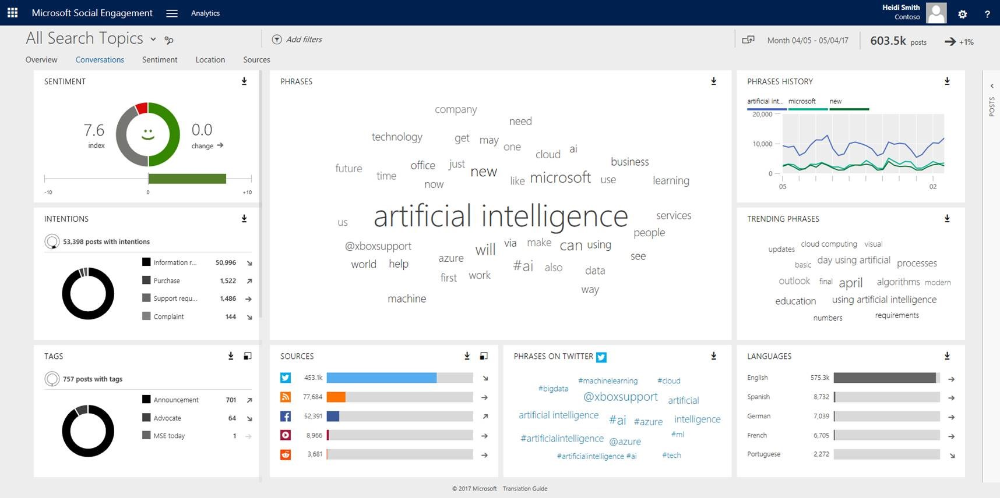

# Connect with customers. Empower your organization. Create real results.

The speed at which we do business, and the number of channels we're using to do it, are both rapidly increasing. Employees and customers have a wide array of choices when it comes to communicating, and social media channels are key components of the customer journey as customers connect with your brand, your employees, and each other.

Social media is no longer relegated to a select few in the marketing department. Empower a broader set of employees and connect with customers by using [Social Engagement, part of Dynamics 365](https://go.microsoft.com/fwlink/p/?linkid=842309). [!INCLUDE[Social Engagement](../includes/pn-social-engagement-short.md)] puts social media at the fingertips of your sales teams, customer service agents, and everyone across the organization. Service agents can meet customers on the channel of their choice&mdash;on social media or through more traditional service channels&mdash;to solve problems effectively. Sales teams can gather intelligence, source new leads, and build credibility through social selling. Marketers can measure and manage brand reputation. Employees in any role can leverage social insights to better understand the voice of the customer. You can harness the power of social media to go beyond likes or shares to create real, measurable business results.

## Success stories

See how some of our customers are using [!INCLUDE[Social Engagement](../includes/pn-social-engagement-short.md)] to address their use cases.  

-   [UK banking disrupted: Metro Bank reinvents customer service with Microsoft](https://customers.microsoft.com/story/uk-banking-disrupted-metro-bank-reinvents-customer-ser)&mdash;transforming customer service and social insights.

-   [The RIGI Bahn moves closer to its guests with the help of Social Engagement](https://customers.microsoft.com/story/the-rigi-bahn-moves-closer-to-its-guests-with-the-help-of-microsoft-social-engagement)&mdash;social engagement and marketing.

-   [Bremont accelerates customer service with Social Engagement](https://enterprise.microsoft.com/en-gb/customer-story/industries/retail-and-consumer-goods/bremont-accelerates-customer-service/)&mdash;customer service and engagement.

-   [5 tips to help your business weather changes in the financial services industry](https://customers.microsoft.com/story/5-tips-to-help-your-business-weather-changes-in-the-fi)&mdash;digital transformation and customer engagement.

-   [The Liebherr Group harnesses social media to stay ahead with Microsoft Dynamics CRM and Social Engagement](https://customers.microsoft.com/story/the-liebherr-group-harnesses-social-media-to-stay-ahea)&mdash;brand reputation and social sentiment.

## Pricing information

[!INCLUDE[Social Engagement](../includes/pn-social-engagement-short.md)] is included with the [!INCLUDE[pn_crm_shortest](../includes/pn-crm-shortest.md)] Plan, Customer Engagement Plan, and Customer Engagement Application (Sales, Customer Service, Field Service, and Project Service Automation) subscriptions. So, everyone across the organization can benefit from its capabilities. For more information about pricing and licensing for [!INCLUDE[pn_crm_shortest](../includes/pn-crm-shortest.md)], visit [Dynamics 365 pricing](http://go.microsoft.com/fwlink/p/?LinkID=401462).  
Note that [!INCLUDE[Social Engagement](../includes/pn-social-engagement-short.md)] pricing is based on a monthly post quota. [Learn more about how to buy post quota add-on subscriptions for your organization](manage-post-quota.md#buy-additional-quota).

## Getting started

Setting up [!INCLUDE[pn_netbreeze_short](../includes/pn-social-engagement-short.md)] doesn't take long. The following topics will help you get started quickly.

-   [Get started with Social Engagement](get-started.md): Find important information to help you get around in [!INCLUDE[pn_netbreeze_short](../includes/pn-social-engagement-short.md)].

-   [Administer Social Engagement](administer-microsoft-social-engagement.md): If you're an administrator, review this information to get your users set up quickly with the appropriate permissions. Learn how you can integrate [!INCLUDE[pn_netbreeze_short](../includes/pn-social-engagement-short.md)] with other services, like [!INCLUDE[pn_crm_shortest](../includes/pn-crm-shortest.md)].

-   [Set up searches to listen to social media conversations](set-up-searches.md): Capturing the right data for your business is a crucial step for successfully analyzing social media data. Set up searches and refine the quality of the results they give you, organize searches to meet your needs, and maintain an optimal post quota.

-   [Analyze social data by using widgets](analyze-social-data-using-widgets.md): Visualize data in different areas to analyze your search results. See which filters are available to form a data set and how you can apply them to various widgets.

-   [Engage on social networks](engage-on-social-networks.md): Interact with other users on social media and keep the conversations flowing. Create streams to follow the conversations that matter most to you, and reply to posts directly from within [!INCLUDE[pn_netbreeze_short](../includes/pn-social-engagement-short.md)]. Find out how you can connect a social profile with [!INCLUDE[pn_netbreeze_short](../includes/pn-social-engagement-short.md)] and share it with other users of the solution.

-   [Stay up to date with alerts](email-alerts.md): Stay on top of what's happening on the social web. Set up alerts to be sent directly to your inbox, and find out right away when something important happens.

## Business scenarios

The business scenarios that [!INCLUDE[pn_netbreeze_short](../includes/pn-social-engagement-short.md)] helps address lead to many different implementation scenarios. We've compiled overviews for three of the core business scenarios: sales, marketing, and service.

- Sales: [Social selling - grow your network and boost sales](overview-sales-scenario.md)

- Service: [Address customer service scenarios on social media with Social Engagement](overview-service-scenario.md)

- Marketing: [Manage your brand and reputation on social media](overview-marketing-scenario.md)

## Product updates

We frequently release updates to introduce new capabilities, improve existing features, and fix various issues.

-   Have a look at [what's new in Social Engagement](what-s-new-in-microsoft-social-engagement.md) to learn about the latest changes.

-   Read the latest [Social Engagement readme](http://go.Microsoft.com/fwlink/p/?LinkId=393612) for any late-breaking changes to this release.

-   Download the [Social Engagement translation guide](http://go.Microsoft.com/fwlink/p/?LinkID=391086) for a list of languages [!INCLUDE[pn_netbreeze_short](../includes/pn-social-engagement-short.md)] is translated into, which languages you can search on, and which languages support sentiment analysis.

## Videos and e-books

Check out the [videos and e-books](videos-ebooks.md) page for the full collection of published content.

Subscribe to the [Dynamics 365 YouTube channel](http://go.microsoft.com/fwlink/p/?LinkId=400720) and be the first to know when a new video is published.

## Community contributions

Have a look at these additional assets that are waiting for you.

-   [Nick Fratello's video: Social Engagement customer care demonstration](https://www.youtube.com/watch?v=OIkSl6R5APo)

-   [Jesper Osgaard's Microsoft Lystavlen](https://blogs.technet.microsoft.com/lystavlen/tag/microsoft-social-engagement/) covers many Microsoft products and services. Be sure to bookmark his blog.

### See also

[Social Engagement FAQ](faq.md)   
[Get connected to the social conversation by using Social Engagement](get-connected-social-conversation.md)
