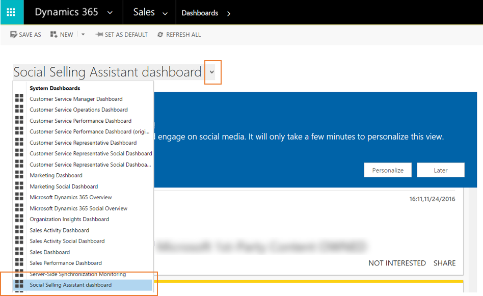
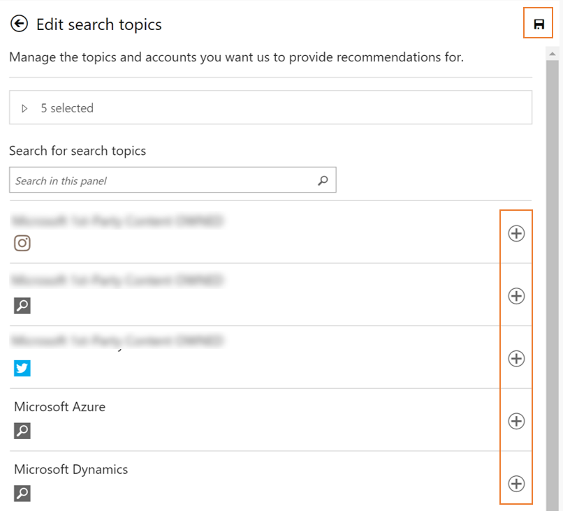

# Personalize the Social Selling Assistant
When using the Social Selling Assistant for the first time, users will get recommendations for all available search topics in [!INCLUDE[pn_netbreeze_short](../includes/pn-social-engagement-short.md)]. To personalize the experience, we recommend each user select specific topics that are of interest to them. Additionally, users must add their social profiles to be able to share content recommendations on their networks.  
  
## Access the Social Selling Assistant dashboard  
 To access the Social Selling Assistant in [!INCLUDE[pn_ms_dyn_365](../includes/pn-ms-dyn-365.md)], go to **Sales** > **Dashboards** and select the **Social Selling Assistant dashboard**.  
  
   
  
 If you don't see the Social Selling Assistant dashboard, contact your [!INCLUDE[pn_ms_dyn_365](../includes/pn-ms-dyn-365.md)] administrator.  
  
 [!INCLUDE[proc_more_information](../includes/proc-more-information.md)] [TechNet: Install the Social Selling Assistant](https://technet.microsoft.com/library/mt793319\(CRM.8\).aspx)  
  
## Personalize the Social Selling Assistant  
 When you open the Social Selling Assistant for the first time, you can personalize how you experience it. We currently offer two types of recommendations: one for sharing content and one for getting insights. Select which search topics you find relevant and choose whether you want to get insights about a group of search topics. Additionally, you add social profiles to share the recommended content.  
  
### Configure your personal experience  
  
1.  Open the Social Selling Assistant.  
  
2.  In the personalization wizard, click **Personalize**.  
  
3.  Click **Share Content**, select the search topics that are relevant for you, and click **Save**  to apply your changes.  
  
   
  
4.  Click **Get Insights** and manage the topics you want insights for. For example, you might create a new insight group for your business partners and add search topics relating to your partners to get insights so you can stay on top of what your partners are saying on social media. Click **Save**  to apply your changes.  
  
   
  
     By default, [!INCLUDE[pn_netbreeze_short](../includes/pn-social-engagement-short.md)] creates Insight Groups for **Customers**, **Competitors**, and **My brands**. You can edit (), or remove () them, and create () additional insight groups.  
  
5.  If you have a responder or manager interaction role, click **Social Profiles** to add profiles you own. You can add profiles from LinkedIn [!INCLUDE[tn_twitter](../includes/tn-twitter.md)], [!INCLUDE[tn_facebook](../includes/tn-facebook.md)] or [!INCLUDE[tn_instagram](../includes/tn-instagram.md)] to share content directly from the Social Selling Assistant. If your administrator shared a social profile with you, you can select it from the list. To add a social profile or to share a social profile you own with other users, see [Manage social profiles](manage-social-profiles.md).  
  
> [!NOTE]
>  If you’ve set the dark theme in [!INCLUDE[pn_netbreeze_short](../includes/pn-social-engagement-short.md)], the Social Selling Assistant will inherit this setting.  
  
### See also  
 [Increase your influence using the Social Selling Assistant](social-selling-assistant-overview.md)   
 [Work with the Social Selling Assistant](work-with-social-selling-assistant.md)   
 [Configure Social Engagement for the Social Selling Assistant](configure-social-selling-assistant.md)
