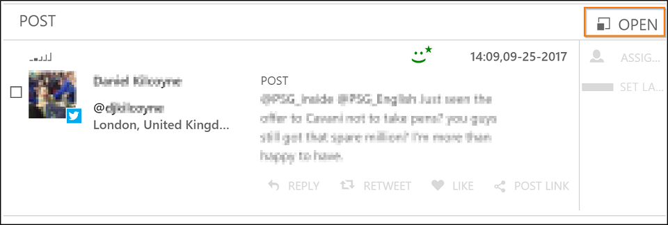
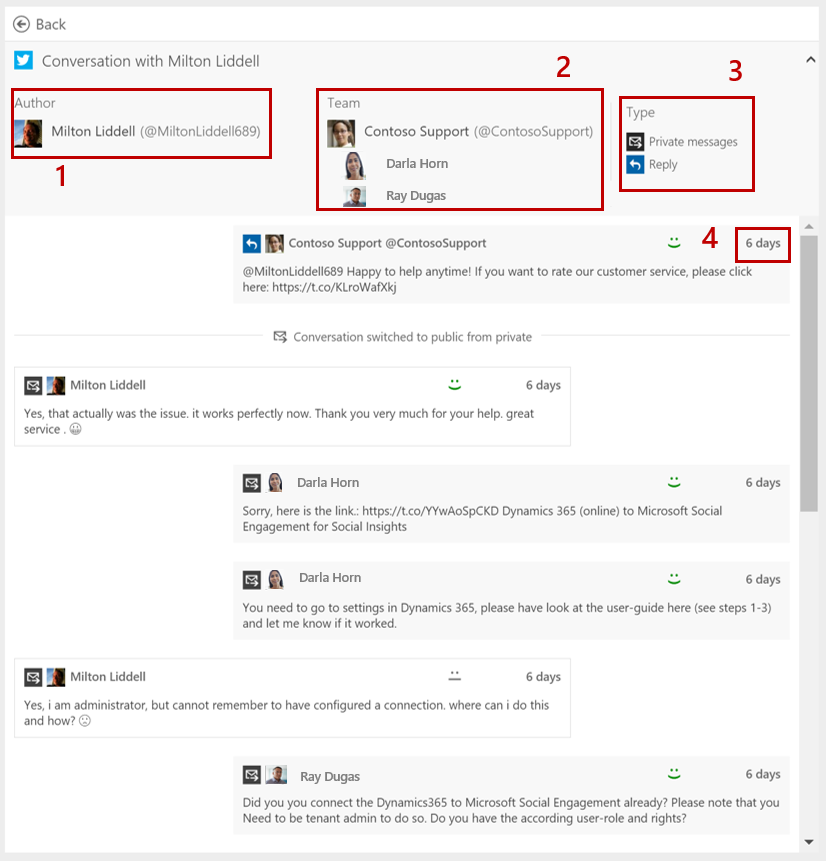

# View posts and conversations in Social Engagement
[!INCLUDE[pn_netbreeze_long](../includes/pn-social-engagement-long.md)] provides two ways to access the list of posts that match a given data set. You can either work with the post list or with a stream, depending on your requirements and preferences.  
  
   
## Access posts in Analytics and Social Center  
To show the post list, select **Posts** on the right side of any Analytics page or Activity map. Posts in the post list within Analytics don't get updated automatically. You need to refresh the page to see the latest updates. However, you'll get notified when another user changes a value of the same post that you're working on. For example, if another user already changed a sentiment value, your planned update might no longer be required.  
  
You can also go to **Social Center** to access your streams and choose the stream you want to work with. If you select a post in your streams, you can expand the contents (if applicable) to read the post.  
  
To quickly see new posts that match a predefined data set, set up a stream in **Social Center**. Fresh and updated posts are automatically pushed to your client, to make sure you're always on top of the information. [!INCLUDE[proc_more_information](../includes/proc-more-information.md)] [Keep track of live data streams with Social Center](social-center.md)  
  
In the post list, you find the posts and the main actions to work with posts. [!INCLUDE[proc_more_information](../includes/proc-more-information.md)] [Engage on social networks](engage-on-social-networks.md), [Work with posts](work-with-posts.md)  
  
Select **Open** on a post to see the single post pane showing the post's details, a full view of the contents with all available actions. You can also select the post content to bring up post details.

  
The details of a post are displayed depending on the interactions from within [!INCLUDE[pn_netbreeze_short](../includes/pn-social-engagement-short.md)]. By default, posts show the single post pane, which focuses on displaying a post and its threads. The single post pane gives you access to all the content of a post and (if available) also the parent post. If there are direct interactions between an author and one of the social profiles in [!INCLUDE[pn_netbreeze_short](../includes/pn-social-engagement-short.md)], you'll find the conversation view, which is optimized to show interactions between customers and your owned social profiles.  
  
The posts in a post list that open a conversation view include:  
  
-   Any private message.  
  
-   A [!INCLUDE[tn_twitter](../includes/tn-twitter.md)] reply, if that reply involves one of the social profiles in your tenant.  
  
    > [!NOTE]
    >  This can include all social profiles, not just the ones shared to the current user.  
  
 [!INCLUDE[proc_more_information](../includes/proc-more-information.md)] [See the conversations with an author](#conversationView)  
  
 Any other post in the post list will open the single post pane with post details. For example, if a [!INCLUDE[tn_twitter](../includes/tn-twitter.md)] reply involves authors who aren't social profiles in your tenant, they appear in the single post pane. [!INCLUDE[proc_more_information](../includes/proc-more-information.md)] [See the publish history of a post in Social Engagement](#publishHistory)  
  
   
## See threads of replies and retweets on Twitter  

When you view the details of a post, all [!INCLUDE[tn_twitter](../includes/tn-twitter.md)] replies reference the tweet the post refers to. Every [!INCLUDE[tn_twitter](../includes/tn-twitter.md)] reply has a parent post, which you can interact with depending on whether that tweet was acquired through your search topics.  
  
[!INCLUDE[pn_netbreeze_short](../includes/pn-social-engagement-short.md)] supports two types of threads for a tweet: replies and retweets.  
  
-   For [!INCLUDE[tn_twitter](../includes/tn-twitter.md)] replies, you see the thread of all replies acquired in [!INCLUDE[pn_netbreeze_short](../includes/pn-social-engagement-short.md)] that reply to the parent post. Replies to replies or entire conversations aren't covered in the threads.  
  
-   For retweets, you see the thread of all retweets of a parent tweet.  
  
   
## See the engagement action history of a post in Social Engagement  

Communicate consistently and find out whether another user has already taken action on a post that you plan to interact with.  
  
When a user takes a publish action on a post in the [!INCLUDE[pn_netbreeze_short](../includes/pn-social-engagement-short.md)] application, this action is visible to other users as the publish history. The publish history contains the social profile along with the users who posted by using this social profile, and the time stamp, type, and published content of the action.  
  
This helps avoid unwanted duplications. For example, if somebody on your team has already replied to a question, your planned answer might no longer be necessary.  
  
To see the publish history on a post in [!INCLUDE[pn_netbreeze_short](../includes/pn-social-engagement-short.md)], two prerequisites apply:  
  
-   The post you plan to interact with has been acquired by one of the search topics.  
  
-   Earlier interactions on this post were performed in [!INCLUDE[pn_netbreeze_short](../includes/pn-social-engagement-short.md)].  
  
To see posts that have engagement action history, look for posts that have a number appended to the action button.  
  
If another user changes a value on a post you're working on, you'll be notified through the user interface that the post was refreshed and you'll see the most recent version. Make sure your planned action still makes sense when you try to perform it.  
  
To build custom [!INCLUDE[pn_microsoft_power_bi](../includes/pn-microsoft-power-bi.md)] reports about how efficiently your team engages on social media, see [Get the Power BI content pack for Microsoft Social Engagement](get-content-pack-for-power-bi.md).  
  
   
### See the conversations with an author

When you engage in a private conversation or reply on Twitter by using a social profile in [!INCLUDE[pn_netbreeze_short](../includes/pn-social-engagement-short.md)], these posts allow you to see the full conversation.  
  
  
  
1.  Addressee of the conversation. In many cases, this is a customer requesting information or help.  
  
2.  Owned social profiles that participate in the conversation. Team members who used the social profile to interact with an author are listed below the profile.  
  
3.  Type of posts that are part of this conversation.  
  
4.  Time stamp of the interaction.  
  
To show you and your team all sent messages, the conversation view even shows you messages sent from [!INCLUDE[pn_netbreeze_short](../includes/pn-social-engagement-short.md)] that haven't yet been acquired.  
  
Example: Say you and your colleague currently respond to customer queries on social media. When you open a conversation with a customer and answer from within [!INCLUDE[pn_netbreeze_short](../includes/pn-social-engagement-short.md)], your colleague sees the message you just sent regardless of how quickly [!INCLUDE[pn_netbreeze_short](../includes/pn-social-engagement-short.md)] acquires this post through configured searches. As soon as that post is acquired by one of your searches, you can access the details for the post. In the conversation view, you can't perform any action on an individual post such as assigning, labeling, or tagging it. To get access to those actions, you open the single post pane for the individual post and perform your action in the post details.  
  
> [!NOTE]
>  The amount of information depends on the number of posts you have loaded in the conversation view. To increase the number, scroll to the bottom of the view where you can load additional posts.  
>   
>  Publish actions taken before mid-March 2017 are indicated  with an appended star symbol .  
  
   
## Parts of a post  

On the left side of a post, you'll find a symbol that indicates the post's source, the profile picture (if available), and the name of the post's author.  
  
In the center of the post list, you'll find the title and content of a post. Select a post to see its details. Select the **Expand** button  next to the post's content excerpt to expand the post and read its content.  
  
You'll find additional metadata and controls for the posts:  
  
- **Sentiment value**: See which sentiment value the application calculated for a post. You can manually update a sentiment value by selecting a different value from the drop-down list. Fragments of a post that were rated positive are highlighted in green and negative fragments are highlighted in red.  
  
- **Remove post**: Deletes the post from your solution's database.  
  
- **Copy internal URL ()**: Generates an internal link to this post in [!INCLUDE[pn_netbreeze_short](../includes/pn-social-engagement-short.md)]. Copy this URL to your clipboard and share it with other users of [!INCLUDE[pn_netbreeze_short](../includes/pn-social-engagement-short.md)] to point them to a specific post.  
  
- **Reach**: This indicates the potential size of an author's network and connections on [!INCLUDE[tn_twitter](../includes/tn-twitter.md)] or the influence of a news source. The higher the number of an author's reach, the more likely that this is an influential author. [!INCLUDE[proc_more_information](../includes/proc-more-information.md)] [Get relevant data using filters](use-filters.md)  
  
- **Date and time of publication**: The date and time when the post was published by the author. Redirects you to the original URL where the post was found. This lets you see the post in the context of the site or social network it originated from.  
  
- **Post location**: The geographical location information (latitude/longitude) that a user shared when publishing the post (if available). [!INCLUDE[proc_more_information](../includes/proc-more-information.md)] [See the locations for the posts](analytics-location.md)  
  
- **Author location**: The geographical information that a user shared on a profile (if available). For example, this might be the location of a [!INCLUDE[tn_twitter](../includes/tn-twitter.md)] user as it was entered in the user's [!INCLUDE[tn_twitter](../includes/tn-twitter.md)] profile. [!INCLUDE[proc_more_information](../includes/proc-more-information.md)] [See the locations for the posts](analytics-location.md)  
  
- **Author details**: The details about a user's [!INCLUDE[tn_twitter](../includes/tn-twitter.md)] profile. The author name, username, profile picture, location, website, and bio are provided if the author has been active in the last 30 days. [!INCLUDE[proc_more_information](../includes/proc-more-information.md)] [Get details on specific authors](author-details.md)

### See also

[Keep track of live data streams with Social Center](social-center.md)    
[Engage on social networks](engage-on-social-networks.md)    
[Work with posts](work-with-posts.md)