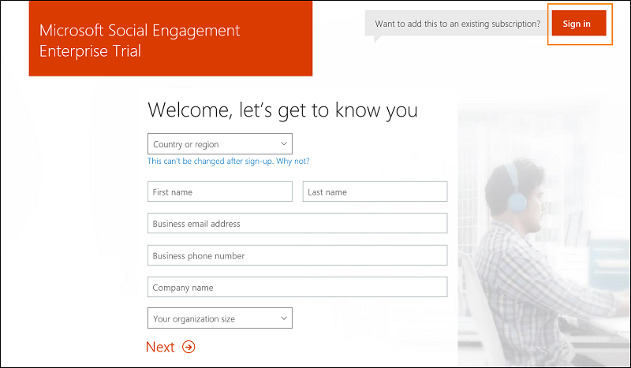
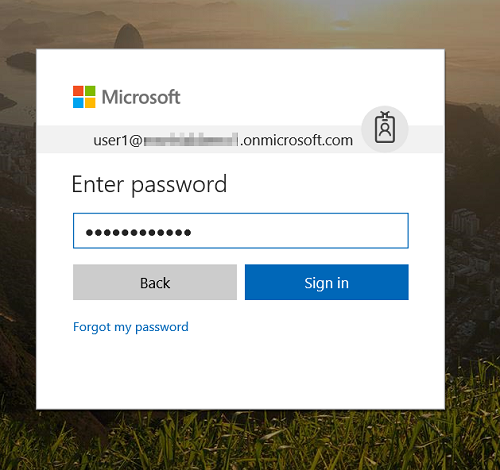
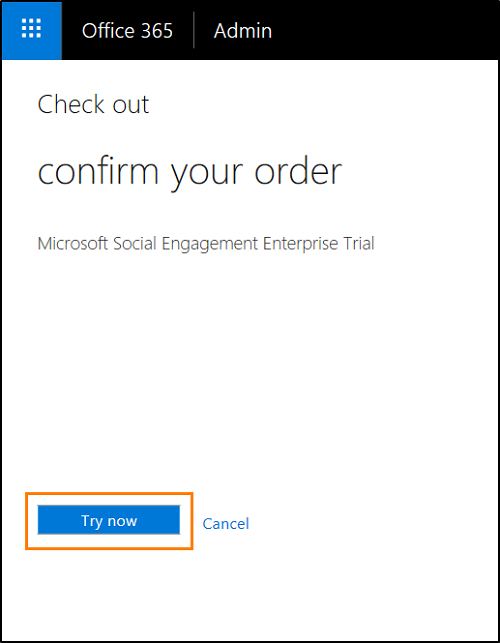

# Provision trial solutions for Microsoft Social Engagement

This article provides a step-by-step guide to get up and running with a trial solution for Social Engagement. 

If you already have an Office 365 tenant where you have admin permissions, review [Add a Social Engagement trial to an existing Office 365 tenant](#add-a-social-engagement-trial-to-an-existing-office-365-tenant).
To create a new Office 365 tenant for your trial, review [Create a new Office 365 tenant for the Social Engagement trial](#create-a-new-office-365-tenant-for-the-social-engagement-trial).

## Add a Social Engagement trial to an existing Office 365 tenant

1. [Request a trial](https://experience.dynamics.com/trials/) for Social Engagement.

2. Open the link with the Social Engagement promo code you received in email in a _private session of your browser_. To learn how to open a private session in your browser, see: 
   - [Internet Explorer](https://support.microsoft.com/products/internet-explorer)
   - [Edge](https://support.microsoft.com/help/4026200/windows-browse-inprivate-in-microsoft-edge)
   - [Mozilla Firefox](https://support.mozilla.org/kb/private-browsing-use-firefox-without-history)
   - [Google Chrome](https://support.google.com/chrome/answer/95464)

3. Don't enter any data on the **Welcome, let's get zo know you** page. Simply select the **Sign in** button.
   

4. Enter your admin credentials for the Office 365 tenant you want to add the trial solution to.
5. Select **Sign in**.
   

6. Confirm the order and select **Try now**. Trials are free of charge.
   

7. Select **Continue**
8. In the Office 365 admin center, go to **Users** > **Active users**.
9. Select a user you want to give access to the trial and select **Edit** in the **Product licenses** section. 
10. Ensure that both, a Dynamics 365 license and the **Microsoft Social Engagement Enterprise** license are set to **On**.
11. Social Engagement will be available for the selected user in the configured tenant within 5-10 minutes. If Social Engagement isn't available from the app switcher in the top-right corner, close your browser and sign in with a private session again.
 
## Create a new Office 365 tenant for the Social Engagement trial

1. [Request a trial](https://experience.dynamics.com/trials/) for Social Engagement.
2. Open the link with the Social Engagement promo code you received in email in a _private session of your browser_. To learn how to open a private session in your browser, see: 
   - [Internet Explorer](https://support.microsoft.com/products/internet-explorer)
   - [Edge](https://support.microsoft.com/help/4026200/windows-browse-inprivate-in-microsoft-edge)
   - [Mozilla Firefox](https://support.mozilla.org/kb/private-browsing-use-firefox-without-history)
   - [Google Chrome](https://support.google.com/chrome/answer/95464)
3. On the **Welcome, let's get zo know you** page fill in the required information and select **Next**. The provided **Business email address** will be used to send your new user credentials after successful provisioning.   
4. On the **Create your user ID** page fill in the required information and select **Create my account**.
5. On the next page, select your country code from the drop-down list. Enter your phone number and select **Text me**.
6. Enter the verification code from the text message you received and select **Next**.
7. Select **You're ready to go...** and the Social Engagement license will be assigned to your newly created user. 
8. Once the provisioning has completed and the solution is set up, you'll receive an email to the address provided in step 3. It contains a link to your Social Engagement solution and some helpful links to get you started quickly. 

> [!TIP]
> Once you have access to your solution, make sure to [configure it for other users](administer-microsoft-social-engagement.md) and [set up searches](set-up-searches.md) to gather data.

### See also
[Connect with customers. Empower your organization. Create real results.](overview.md)    
[Administer Microsoft Social Engagement](administer-microsoft-social-engagement.md)    
[Set up searches to listen to social media conversations](set-up-searches.md)