# Work with widgets in Social Insights

After setting up Social Insights in Dynamics 365, you can integrate widgets presenting data from Microsoft Social Engagement on forms and dashboards in Dynamics 365. This article presents an overview of the available widgets and information about how to configure them on the fly in Dynamics 365.

## Work with filters on widgets

Social Insights supports a subset of filters provided by Social Engagement. You can apply and remove filters to further customize the data set shown in the widgets. Additionally, you can choose the timeframe for your dataset. You can apply the following filters on the widgets: 
-	Keywords
-	Sources
-	Languages
-	Sentiment
-	Reach
-	Location

Learn more about [how filters work in Social Engagement](use-filters.md) and which data they select.

### Edit or apply filters

1.	In the header of the Social Insights control, select the filter symbol. 
    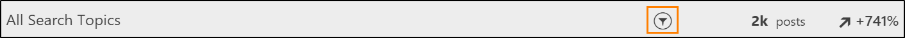
 
2.	Add or remove filters from the list of available filters.

3.	Select the checkmark symbol  to apply your filter changes.

### Remove filters

1.	In the header of the Social Insights control, select the filter symbol.
    
 
2.	Select the clear filters symbol  to remove all active filters.

## Switch widgets between chart view and table view

Social Insights widgets offer two ways to look at the data. You can switch each widget between a table view for detailed data points and a chart view to understand the data visually.   

By default, widgets are shown in the chart view. To change this default, you can [edit your personal preferences](user-preferences.md) in Social Engagement. 

To switch the view in chart mode, select the **Switch to table view** symbol. 
 

To switch the view in table mode, select the **Switch to chart view** symbol.
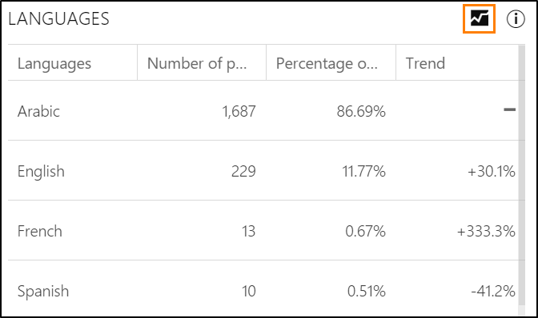

## Get information about the data presented in widgets

The Social Insights widgets provide helpful tooltips to help you understand the data you're looking at. Simply hover over the information symbol in the widget header to see the tooltips.

## List of Social Insights widgets

To learn more about the information presented through widgets in Social Insights, refer to the sections below. 

### Languages share of voice

Find out which languages were used most often across the posts in your dataset. 

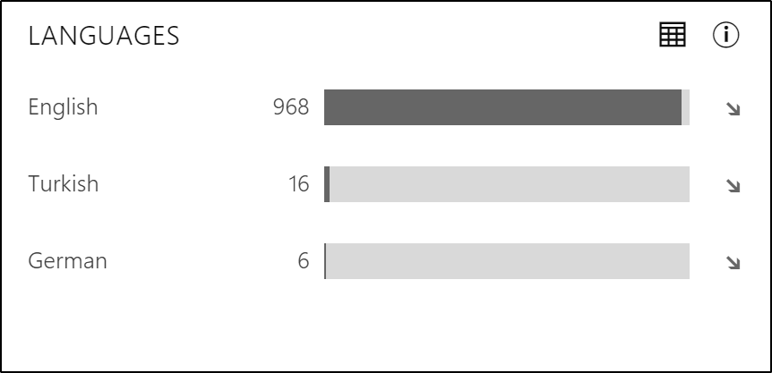

### Locations

See the locations where posts are coming from. Note that [not all posts contain location data](understand-filters.md#location), so you might only look at a subset of the posts in your data set. 

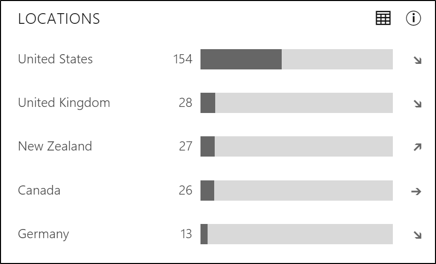

### Most active authors

Find out who are the five most active authors posting the most about your search topic or category in the selected data set. This helps to identify potential influencers, fans, or critics.

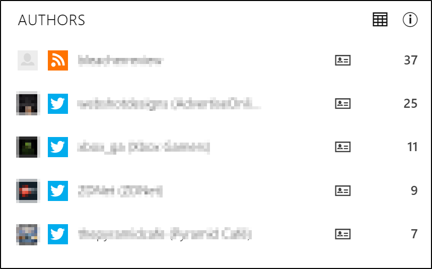

### Recent posts

See an excerpt of the five most recent posts matching your data set. Keep in mind that you can always switch to the full experience of Social Engagement to see all matching posts and their full content, and interact with them.

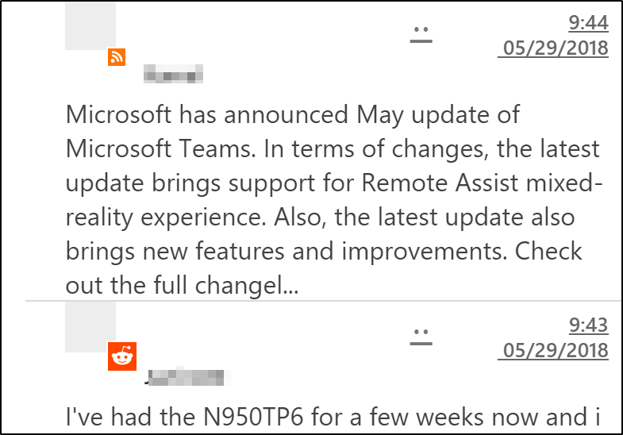

### Sentiment history

Find out how the sentiment developed in the selected time frame to correlate the sentiment about the search topic with dates and events.

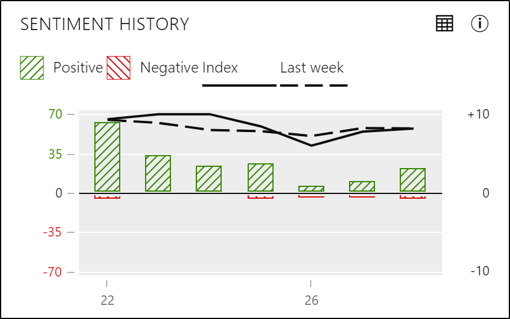

### Sentiment share of voice

See how positive, negative, and neutral sentiment values are distributed in your selected data set. 

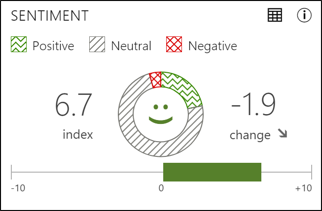

### Sentiment summary by sources

Find out how the sentiment index varies among the most active sources in your data set. 

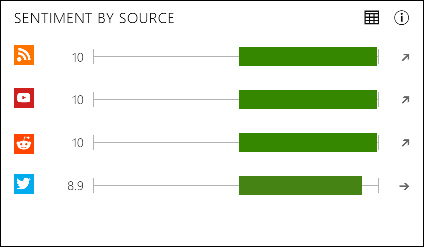

### Sources history

Find out how the post volume developed over time across the sources in your data set to identify peaks and valleys in the volume of posts. 

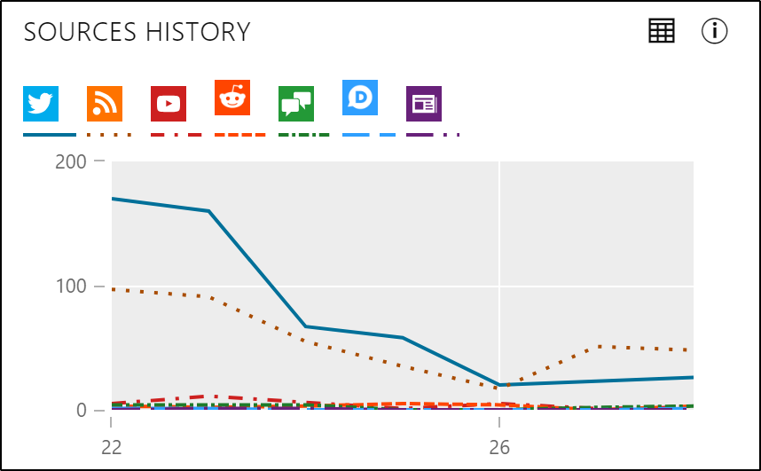

### Sources share of voice

See which sources were the most active and how they contributed to the overall post volume. 

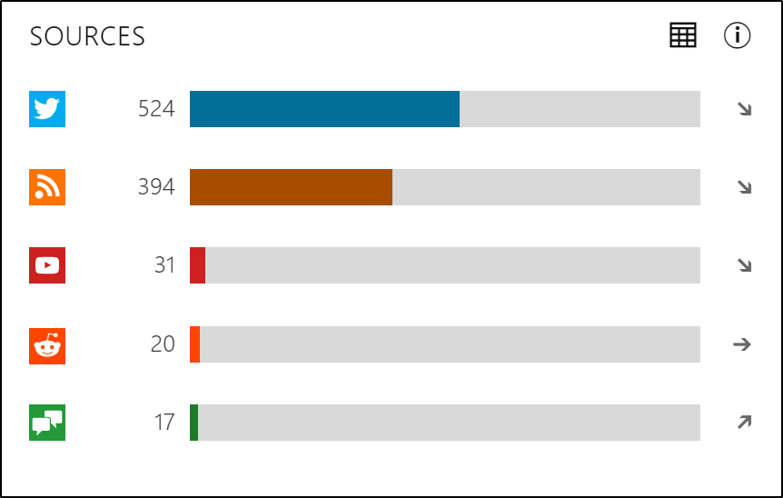

### Top phrases

Find out which phrases were most often used in your data set to quickly get an impression of significant phrases to understand what's on the authors' minds. 

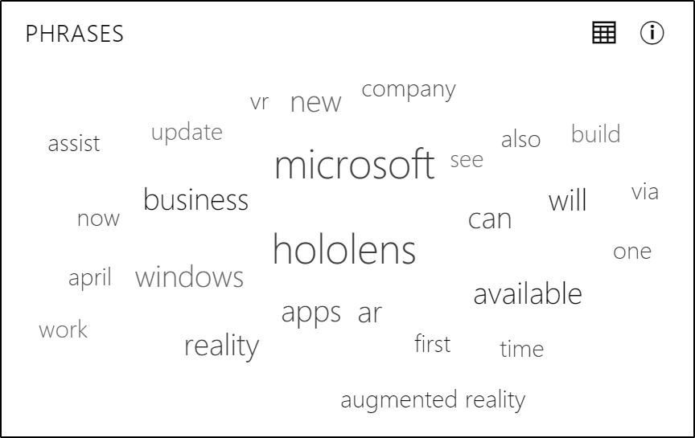

### Volume history

Find out how the total post volume developed over time and the average number of posts. 

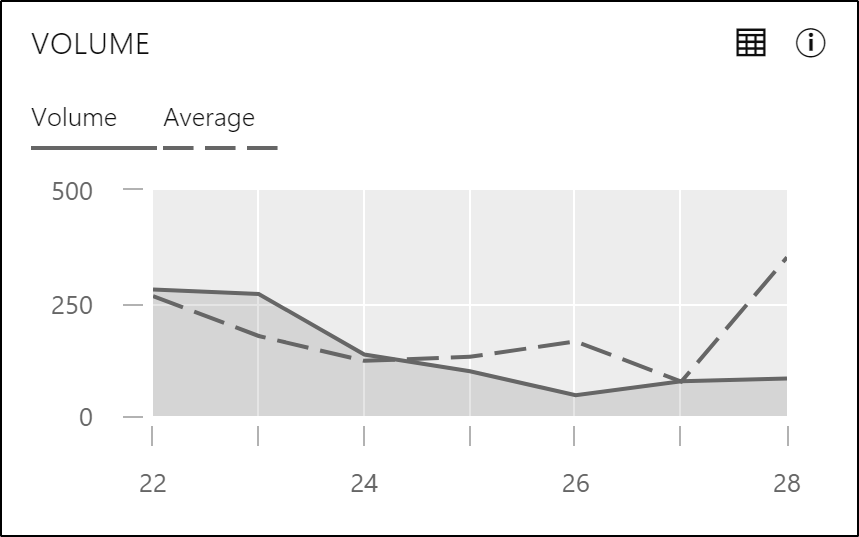

### See also

[Integrate Microsoft Social Engagement with Dynamics 365](integrate-social-engagement-dynamics-365.md)    
[Connect with customers. Empower your organization. Create real results.](overview.md)    
