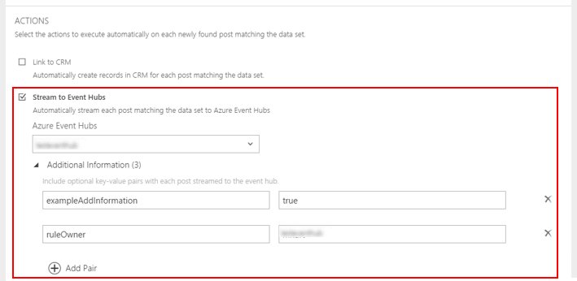

# Stream data from Social Engagement to Microsoft Azure Event Hubs
Start building out your custom metrics or analysis based on the posts found by [!INCLUDE[pn_netbreeze_long](../includes/pn-netbreeze-long.md)]. Using [Microsoft Azure Event Hubs](https://azure.microsoft.com/services/event-hubs/)—a highly scalable publish-subscribe event ingestor that can intake millions of events per second—you can transform and store social data for further processing. Specify an automation rule in [!INCLUDE[pn_netbreeze_short](../includes/pn-netbreeze-short.md)] and stream all posts that match a data set as events to a connected event hub. Once you have the data ingested into the event hub, you can access the data from any application that you connected to your event hub.  
  
 In [!INCLUDE[pn_netbreeze_short](../includes/pn-netbreeze-short.md)], go to **Settings > Connections** to connect your [!INCLUDE[pn_netbreeze_short](../includes/pn-netbreeze-short.md)] solution to [!INCLUDE[pn_azure_event_hubs](../includes/pn-azure-event-hubs.md)].  
  
   
## Prerequisites to stream posts to Azure Event Hubs  
 To stream posts to [!INCLUDE[pn_azure_event_hubs](../includes/pn-azure-event-hubs.md)], the following prerequisites must be met:  
  
-   You have access to an existing event hub, and you also have its connection string with Send rights. For more information about how to create an [!INCLUDE[pn_azure_event_hubs](../includes/pn-azure-event-hubs.md)] and how to get the connection string, see [Microsoft Azure: Get started with Event Hubs](https://azure.microsoft.com/documentation/articles/event-hubs-csharp-ephcs-getstarted/).  
  
-   You have a [!INCLUDE[pn_netbreeze_short](../includes/pn-netbreeze-short.md)] Enterprise license assigned to your [!INCLUDE[pn_MS_Office_365](../includes/pn-ms-office-365.md)] user account. Although Administrators with Professional licenses can configure the connection to an event hub, you’ll need an Enterprise license to create automation rules that stream data to a connected event hub. [!INCLUDE[proc_more_information](../includes/proc-more-information.md)] [Integrate Social Engagement with Office 365](../social-engagement/manage-licenses.md)  
  
-   You have an Administrator role in [!INCLUDE[pn_netbreeze_short](../includes/pn-netbreeze-short.md)]. [!INCLUDE[proc_more_information](../includes/proc-more-information.md)] [Understand user roles](../social-engagement/user-roles.md)  
  
   
## Connect Social Engagement to Azure Event Hubs  
 [!INCLUDE[pn_netbreeze_short](../includes/pn-netbreeze-short.md)] allows you to connect to multiple event hubs. Before you can start to stream posts to [!INCLUDE[pn_azure_event_hubs](../includes/pn-azure-event-hubs.md)], you need to enable the connection and acknowledge that you agree data can be sent to a third-party application. [!INCLUDE[proc_more_information](../includes/proc-more-information.md)] [Privacy Notice](#privacy)  
  
   
#### Connect to Azure Event Hubs  
  
1.  In [!INCLUDE[pn_netbreeze_short](../includes/pn-netbreeze-short.md)], go to **Settings > Connections**.  
  
2.  In the **Connections** pane, select **Microsoft Azure Event Hubs** from the list.  
  
3.  When adding your first [!INCLUDE[pn_azure_event_hubs](../includes/pn-azure-event-hubs.md)] connection, you will be shown a disclaimer.  Read the disclaimer carefully, and then click **Continue** to proceed setting up the connection. More information: [Privacy Notice](#privacy)  
  
4.  In the **Connect to Azure Event Hubs** pane, enter an **Event hub name** and the **Connection string** for the event hub you want to connect.  
  
     For more information about where to find the connection string, see [Microsoft Azure: Get started with Event Hubs](https://azure.microsoft.com/documentation/articles/event-hubs-csharp-ephcs-getstarted/).  
  
5.  Click **Save** .  
  
> [!TIP]
>  For an end-to-end example, see [Work with events from Social Engagement in Azure Event Hubs](../social-engagement/work-with-event-hubs.md "Work with events from Social Engagement in Azure Event Hubs").  

## Social Engagement as a data source in Customer Insights

[Dynamics 365 Customer Insights](https://docs.microsoft.com/dynamics365/customer-insights/overview) includes a connector to add Social Engagement as a data source. This connector creates and manages the connection between Social Engagement and Azure Event Hubs. For more information about the connector, see [Add Microsoft Social Engagement as a data source](https://docs.microsoft.com/dynamics365/customer-insights/deploy/datasourcemse)

   
## Disable or re-enable a connection to Azure Event Hubs  
 Disable a connection if you want to pause the stream of posts to the connected event hubs. Re-enable the connection to start the stream again. Posts that were acquired while the connection to an event hub was disabled will not be processed retroactively.  
  
> [!IMPORTANT]
>  Before you disable a connection, make sure no active automation rule is configured to stream posts to an event hub. We’ll inform you with an error message if you try to disable a connection that is used in active automation rules. [!INCLUDE[proc_more_information](../includes/proc-more-information.md)] [Route posts using automation rules](../social-engagement/automation-rules.md)  
  
   
#### Disable a connection  
  
1.  In [!INCLUDE[pn_netbreeze_short](../includes/pn-netbreeze-short.md)], go to **Settings > Connections**.  
  
2.  In the **Connections** pane, select **Microsoft Azure Event Hubs** from the list.  
  
3.  Select the connection you want to disable and set **Enable connection** to Off.  
  
4.  Click **Save** .  
  
   
#### Re-enable a disabled connection  
  
1.  In [!INCLUDE[pn_netbreeze_short](../includes/pn-netbreeze-short.md)], go to **Settings > Connections**.  
  
2.  In the **Connections** pane, select **Microsoft Azure Event Hubs** from the list.  
  
3.  Select the connection you want to re-enable and set **Enable connection** to On.  
  
4.  Click **Save** .  
  
   
## Choose the data to stream to event hubs using automation rules  
 Once you established the connection to [!INCLUDE[pn_azure_event_hubs](../includes/pn-azure-event-hubs.md)], you need to select which data is passed on to your event hub. To do this, go to **Settings > Automation Rules**, and then create a new automation rule. Select the search topics and filters you want to apply to your data set. Then, select the **Stream to Event Hubs** check box. In the **Azure Event Hubs** drop-down list, select the event hub to stream social posts to.  For detailed information and procedures about how to set up automation rules, see [Route posts using automation rules](../social-engagement/automation-rules.md).  
  
   
  
> [!TIP]
>  If you find a data set that you want to use in an automation rule while working with the application, click the **More options with the current filters** button . This populates the filters of the automation rule with the currently-active filters for you. For more information about the areas of [!INCLUDE[pn_netbreeze_short](../includes/pn-netbreeze-short.md)] that provide this feature, see [Explore more options with your data set](../social-engagement/more-options-with-data-set.md).  
  
 When [!INCLUDE[pn_netbreeze_short](../includes/pn-netbreeze-short.md)] sends a social post as an event to an [!INCLUDE[pn_azure_event_hubs](../includes/pn-azure-event-hubs.md)], a JSON payload is sent to the connected event hub. Along with the default properties of the post, you can define custom key-value pairs to add when you set up the automation rule for a given data set. These additional properties will show in the metadata section of the JSON payload. More information: [JSON reference for events from Social Engagement](../social-engagement/event-hubs-json-reference-social-engagement.md)  
  
 To work with the events that [!INCLUDE[pn_netbreeze_short](../includes/pn-netbreeze-short.md)] streams to an event hub, you have several options to define the processing and use the data.  For an example about how to create a [!INCLUDE[pn_microsoft_power_bi](../includes/pn-microsoft-power-bi.md)] dashboard by using [!INCLUDE[pn_azure_stream_analytics](../includes/pn-azure-stream-analytics.md)] queries, see [Work with events from Social Engagement in Azure Event Hubs](../social-engagement/work-with-event-hubs.md), [Step 4: Create an Azure Stream Analytics job](../social-engagement/work-with-event-hubs.md#step4_create_stream_analytics_job).  
  
   
### Privacy notice  
 [!INCLUDE[cc_privacy_mse_azure_event_hubs](../includes/cc-privacy-mse-azure-event-hubs.md)]  
  
### See Also  
 [Manage connections in Social Engagement](../social-engagement/manage-connections.md)   
 [Work with events from Social Engagement in Azure Event Hubs](../social-engagement/work-with-event-hubs.md)   
 [Administer Microsoft Social Engagement](../social-engagement/administer-microsoft-social-engagement.md)   
 [JSON reference for events from Social Engagement](../social-engagement/event-hubs-json-reference-social-engagement.md)
