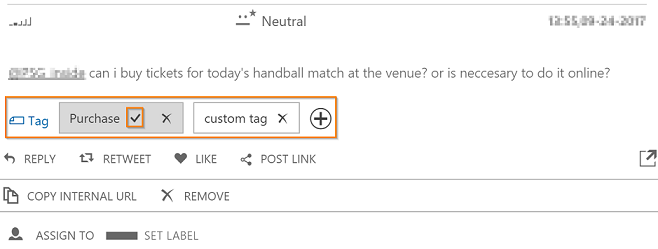

# Work with tags
Intention tags and custom tags are two ways [!INCLUDE[pn_netbreeze_short](../includes/pn-social-engagement-short.md)] allows you to prioritize and filter your posts. When authors publish posts on social media, they usually have a messaging purpose in mind. The larger the number of posts, the more work intensive and time consuming it gets to read through all of these posts and identify those relevant for your business—for example, to find out if authors are asking a question that you want to answer, or if they are complaining about a service that you want to follow up on. In [!INCLUDE[pn_netbreeze_short](../includes/pn-social-engagement-short.md)], once a post is acquired from a search topic, we take some of the workload off your desk. Acquired posts are analyzed by the machine-learning based algorithm to detect authors’ intentions or you can add your own custom tags and later promote them to auto tags.

  
   
## How intention analysis works  
Intention analysis is applied to posts when they are picked up by a search topic. Posts are scored against the algorithm and, if applicable, marked with the intentions identified. A post can have multiple intention tags, but more commonly there’s just one.  
  
The following intention tags are used by [!INCLUDE[pn_netbreeze_short](../includes/pn-social-engagement-short.md)].  
  
|||  
|-|-|  
|**Intention tag**|**What the author expresses**|  
|Purchase|Interest in buying a product or service|  
|Complaint|Frustration about a product or service|  
|Information request|A need for additional information about a service or product|  
|Support request|A need for help and support in using a service or product|  
  
> [!NOTE]
>  Intention analysis is available for [!INCLUDE[pn_netbreeze_short](../includes/pn-social-engagement-short.md)] posts found on [!INCLUDE[tn_twitter](../includes/tn-twitter.md)] and [!INCLUDE[tn_facebook](../includes/tn-facebook.md)] in the English language.  
  
Intention tags are predefined in [!INCLUDE[pn_netbreeze_long](../includes/pn-social-engagement-long.md)]. The machine learning service makes predictions on whether posts relate to one of the supported intention tags. We recommend that you [remove or add intention tags](work-with-posts.md#add-or-remove-tags) from posts if they aren’t accurate to improve machine learning.
  
   
## Add custom tags  
[!INCLUDE[pn_netbreeze_short](../includes/pn-social-engagement-short.md)] lets you add one or more custom tags to posts. You can then filter posts to match specific custom tags. Custom tags are different from intention tags because they are not predefined tags and they are not automatically added once a post is acquired.
  
> [!NOTE]
> Only Managers and Responders can create a new custom tag, but any user role can add or remove tags on posts. [!INCLUDE[proc_more_information](../includes/proc-more-information.md)] [Understand user roles](user-roles.md)  
  
1.  Select **Posts** on the right side of any Analytics page to see the posts list.  
  
     --OR--  
  
     Go to **Social Center** to see your streams.  
  
2.  Select a post, and then next to the custom tags symbol  , select **Add** . Start typing to enter the custom tag that you want to add, and then press **Enter** to select the tag or create a new one.  
  
3.  Select **Confirm**.  
  
    > [!NOTE]
    >  The maximum amount of custom tags you can add per post is 20 tags. To add more tags, you must first remove other tags.  
  
   
## Promote custom tags to auto tags  
Enable adaptive learning on your custom tags by adding them to your list of auto tags. [!INCLUDE[pn_netbreeze_short](../includes/pn-social-engagement-short.md)] applies adaptive learning on auto tags to predict tags for new incoming posts.  The system learns from posts when the user makes edits and actions on tags.  Auto tags use text analytics and Azure Machine Learning techniques to learn patterns from posts that are manually tagged by the user, tags that are added by the system and confirmed by the user, or tags that are added by the system and removed by the user.  
To improve your workflows and increase efficiency, you can leverage auto tagged posts in [!INCLUDE[pn_netbreeze_short](../includes/pn-social-engagement-short.md)] as [email alerts](email-alerts.md), [streams](engage-on-social-networks.md), [activity maps](activity-maps.md), and [automation rules](automation-rules.md).
  
> [!NOTE]
> Only Administrators can promote custom tags to auto tags. [!INCLUDE[proc_more_information](../includes/proc-more-information.md)] [Understand user roles](user-roles.md)  
  
### Add a custom tag to your auto tags list  
  
1.  Go to **Settings** > **Global Settings**  
  
2.  In the Global Settings pane, select **Auto Tags**.  
  
3.  Under Auto Tags, select **Add tag**   
  
    > [!NOTE]
    >  You can maintain up to five auto tags simultaneously.  
  
4.  In the **Add Auto Tag** pane, enter a tag to search and select existing custom tags to be turned into auto tags. If you don't have any custom tags created yet, refer to the [Add custom tags](tags.md#add-custom-tags) section. 
  
5.  Select **Save** to apply your changes.  
  
6.  In your list of custom tags, select the tag, and then in the **Tag Details** pane, set **Auto tagging** to **On**.  
  
     --OR--  
  
     In your list of custom tags, set **Auto tagging** to **On** next to the custom tag title.  
     
    > [!NOTE]
    > It may take up to six hours for posts to start being automatically tagged.  
  
### Remove auto tags  
  
1.  Go to **Settings** > **Global Settings**.  
  
2.  In the Global Settings pane, select **Auto Tags**.  
  
3.  In the Auto Tags panel, select **Remove**, and then select **Confirm**.  
    Removed tags will remain visible on previous posts, but auto scoring will stop for incoming posts. 

## Improve accuracy of sytem-rated tags

To further improve the underlying machine learning model for auto tags and intention tags, you can confirm and remove system-rated. Removing a system-rated tag from a post lets the model know that it was added wrongly while confirming a tag indicates the model was adding it correctly. 

### Remove a system-rated tag

1.  Select an auto tag or intention tag in the **Post Tags and Intentions** filter to create a data set that contains the tagged posts you want to review.   
  
2.  Select a post.
  
3.  Next to the tags symbol , select **Remove this tag** .  
The system-rated tag gets removed from the post and the machine learning model will take this removal into account for future assignement of system-rated tags.

### Confirm a system-rated tag

1.  Select an auto tag or intention tag in the **Post Tags and Intentions** filter to create a data set that contains the tagged posts you want to review.   
  
2.  Select a post.  
  
3.  Next to the tags symbol , select **Confirm this auto tag** .   
    
A stars symbol indicates that this system-rated tag was manually confirmed and the machine learning model will take this confirmation into account for future assignement of system-rated tags. 

## Review the quality of a tagging model

You can check the quality of your auto tags at any time to ensure a high quality model. It's important to understand that quality varies over time and you should turn auto tagging on only after your quality is acceptable. To achieve acceptable quality, [!INCLUDE[pn_netbreeze_short](../includes/pn-social-engagement-short.md)] recommends that you have at least 50 posts tagged first.     
To check the quality of your auto tags, select the tag name in the list. In the **Tag Details** pane, you can see the quality, quality history, and tagged posts history of that auto tag.  
  
**Quality**: The quality indicates whether the score of your selected tags exceeds or doesn't meet the minimum quality requirements.  
  
**Quality History**: The quality history chart shows the quality of the auto tag from the past 30 days.  
  
**Tagged posts history**: The Tagged posts history chart shows how many posts have been automatically tagged and how many have been manually edited since turning auto tagging on.  
 
  
## Manage your tags  
  
### Delete tags  
  
1.  Go to **Settings** > **Global Settings**.  
  
2.  In the **Global Settings** pane, select **Custom Tags**.  
  
3.  In the **Custom Tags** pane, next to the tag name, select **Delete** , and then select **Confirm**.  
  
### Rename tags  
  
1.  Go to **Settings** > **Global Settings**.  
  
2.  In the **Global Settings** pane, select **Custom Tags**.  
  
3.  In the **Custom Tags** pane, select **Edit**  next to the tag name, and then start typing in the edit box.  
  
4.  Select **Confirm**   
  
## Find posts with tags  
To quickly find posts with tags use the **Post Tags and Intentions** [filter to configure a data set](use-filters.md). 
  
### See Also  
[Manage global settings](manage-global-settings.md)   
[Work with posts](work-with-posts.md)