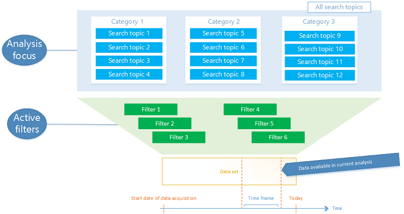

# Use filters to see relevant data
You can use [filters](understand-filters.md) to slice and dice your data to narrow your analysis to the most relevant view of the data. Imagine a steady stream of data where your search topics define the posts that are selected and available for analysis. Filters can narrow your view of the data to a more restricted data set. If you navigate the application by drilling down into the data, filters are applied and removed automatically.  
  
   
## Set a baseline for your analysis with a data set  
 Data sets are an important concept in [!INCLUDE[pn_netbreeze_long](../includes/pn-social-engagement-long.md)], defining the set of posts that your current analysis focuses on. Data sets are used in Analytics, Alerts, and Social Center to give you the most flexibility for your views of the data.  
  
 You can create a data set by providing parameters for your analysis focus and the filters:  
  
1. **Analysis focus**: In the drop-down list on the left side of the filter section, select All Search Topics, a category of search topics, or a single search topic. This defines the search topics that you’re interested in.  
  
2. **Active filters**: In the filter section, set all required filters. You can apply multiple filters to narrow your data set.  
  
   
  
## Drill down into data and apply filters from widgets  
 [!INCLUDE[pn_netbreeze_long](../includes/pn-social-engagement-long.md)] widgets provide you with drill-down functionality to narrow your data set. You can select a data point to get a more detailed view on the data.  
  
 When you work through the application by drilling down, it redirects you to corresponding pages, and updates filters in the filter section. For example, if you select a data point in a **Sources History** widget (which spans more than one day) on **Analytics** > **Sources**, the widget on the **Sources** page applies the filter for the source that you selected, and your time frame updates to the time frame of the selected data point.  
  
> [!NOTE]
>  You can switch between pages in the Analytics area (for example Sources, Sentiments, Locations), and the applied filters will stay in place. If you go to a different area of Social Engagement by using the nav bar (for example from Analytics to Social Center or Settings), all filters will be reset.  
>   
>  To keep your data set available in other applications, use the **More options with the current filters** button . [!INCLUDE[proc_more_information](../includes/proc-more-information.md)] [Explore more options with your data set](more-options-with-data-set.md)  
  
 There are many more entry points to drill down into your data. To identify the filter-enabled area, hover over or click the widget’s display area. For the areas that support visual filtering, the cursor changes to a hand pointer. Click the data point to apply the filter.

 For the list of available filters, see [Get to know your filters](understand-filters.md).
  
   
## Avoid conflicting filter combinations  
 In some cases,  filter options are available, but  selecting them results in a data set with zero posts because the filters are conflicting. You’ll see a notification next to the affected filters if a specific combination is required, or if a combination isn’t possible due to a conflict. For example, the Reach filter is only available for News and [!INCLUDE[tn_twitter](../includes/tn-twitter.md)] sources. In this case, selecting exclusively the Videos source won’t work if you have a Reach filter selected. Also, some filters will not be displayed for certain areas because they are not applicable.  
  
> [!NOTE]
>  The Sentiment status, Assignee, Labels,  Link to Dynamics 365, and Custom Tags filters do not display for alerts, activity maps, or automation rules.  
  
## Add, edit, or remove a filter  
 Customize your data set with filters. Add filters to your analysis by drilling down or by adding filters to the filter section.  
  
### Add a filter  
  
1.  Select a data point on a widget to drill down and apply the corresponding filters.    
  
     --OR--  
  
     Below the nav bar, in the filter section, click the **Filter** button .  
  
2.  Expand the filters that you want to add.  
  
3.  Select your options, and then click the **Apply** button .  
  
### Edit a filter  
  
1.  Below the nav bar, in the filter section, click the **Filter** button .  
  
     --OR--  
  
     Select an active filter in the filter section.  
  
2.  Adjust your options, and then click the **Apply** button .  
  
### Remove a filter  
  
1.  Click **Remove all filters**  to remove all active filters.  
  
     --OR--  
  
     Select an active filter in the filter section to open the filter details.  
  
2.  Next to the active filter, click the **Remove** button  or clear the selection in the filter details.  
  
## Edit the analysis time frame  
 Choose the start date and end date for the analysis of your data set.  
  
1.  In the Analytics area, select **Change time frame**.  
  
2.  Select **Today**, **Last week**, or **Last month** as the time frame, or define a **Custom time frame**.  
  
### See Also  
 [Analyze social data using widgets](analyze-social-data-using-widgets.md)   
 [Stay up to date with alerts](email-alerts.md)   
 [Keep track of live data streams with Social Center](social-center.md)  
 [Get to know your filters](understand-filters.md)
 
