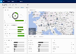

# Videos &amp; eBooks
   
  
   
  
   
  
   
  
> [!TIP]
>  Check back regularly on our [!INCLUDE[tn_youtube](../includes/tn-youtube.md)] channel to view the latest videos about [!INCLUDE[pn_netbreeze_long](../includes/pn-social-engagement-long.md)].  
>   
>  More information: [Microsoft Social Engagement YouTube channel](http://go.microsoft.com/fwlink/p/?LinkId=400720)  
  
## Get started  
  [Microsoft Social Engagement Getting Started (3:11)](http://go.microsoft.com/fwlink/p/?LinkId=613693)  
  
  [Microsoft Social Engagement Overview (3:55)](http://go.microsoft.com/fwlink/p/?LinkId=544936)  
  
  [Microsoft Social Engagement Gain Insights Analytics (7:23)](http://go.microsoft.com/fwlink/p/?LinkId=615285)  
  
  [Microsoft Social Engagement Search Setup (3:29)](http://go.microsoft.com/fwlink/p/?LinkId=544939)  
  
  [Microsoft Social Engagement Social Center (3:36)](http://go.microsoft.com/fwlink/p/?LinkId=613692)  
  
  [Microsoft Social Engagement Activity Maps (4:25)](http://go.microsoft.com/fwlink/p/?LinkID=618573)  
  
  [Microsoft Social Engagement Alerts (3:13)](http://go.microsoft.com/fwlink/p/?LinkId=544937)  
  
  [Microsoft Social Engagement Quota Management (2:33)](http://go.microsoft.com/fwlink/p/?LinkId=544938)  
  
  [New features in Microsoft Social Engagement 2016  (4:19)](http://go.microsoft.com/fwlink/p/?LinkId=723350)  
  
  [3 intelligent ways to engage your customers in Microsoft Social Engagement 2016 (3:00)](http://go.microsoft.com/fwlink/p/?LinkId=723351)  
  
  [eBook: Introducing Social Engagement](http://go.microsoft.com/fwlink/p/?LinkId=395230)  
  
  [eBook: Microsoft Social Engagement for CRM](http://go.microsoft.com/fwlink/p/?LinkId=393642)  
  
  [eBook: Set Up a Social Engagement Search for Your Product](http://go.microsoft.com/fwlink/p/?LinkId=394392)  
  
## Sales boosts from social engagement  
  [Microsoft Social Engagement Social Sales  (5:26)](http://go.microsoft.com/fwlink/p/?LinkID=615282)  
  
  [eBook: Microsoft Social Engagement for CRM](http://go.microsoft.com/fwlink/p/?LinkId=393642)  
  
  [eBook: Social is for Closers](http://go.microsoft.com/fwlink/p/?LinkId=394677)  
  
## Marketing boosts from social engagement  
  [Microsoft Social Engagement Marketing Scenarios (3:23)](http://go.microsoft.com/fwlink/p/?LinkID=618572)  
  
  [eBook: Increase your impact with Microsoft Dynamics Marketing](http://go.microsoft.com/fwlink/p/?LinkId=394499)  
  
  [eBook: Introducing Social Engagement](http://go.microsoft.com/fwlink/p/?LinkId=395230)  
  
  [eBook: Microsoft Social Engagement for CRM](http://go.microsoft.com/fwlink/p/?LinkId=393642)  
  
  [eBook: Your Brand Sux](http://go.microsoft.com/fwlink/p/?LinkId=394688) - See how you can enhance your marketing efforts and brand management through social engagement.  
  
  [eBook: Social is for Closers](http://go.microsoft.com/fwlink/p/?LinkId=394677) - Learn how social engagement can help you find new opportunities.  
  
## Customer care boosts from social engagement  
  [eBook: Your Brand Sux](http://go.microsoft.com/fwlink/p/?LinkId=394688) - See how social engagement helps you better manage your customers.
 
