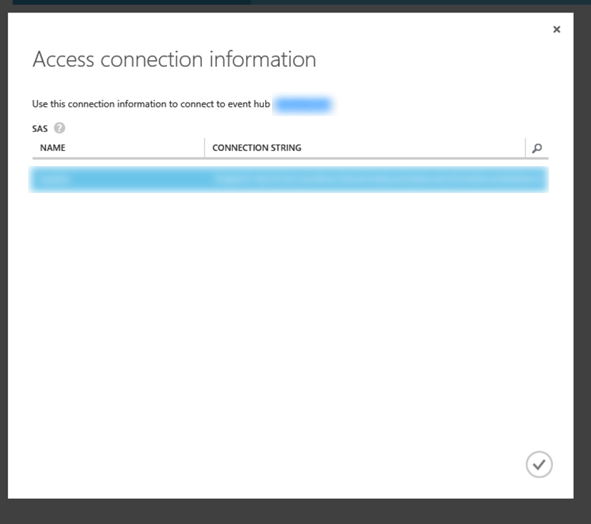
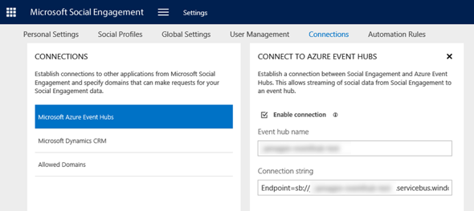
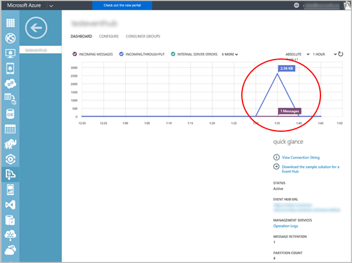
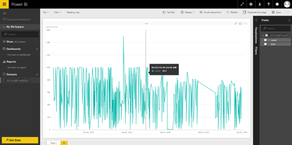
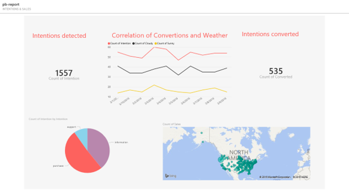

# Work with events from Social Engagement in Azure Event Hubs
[!INCLUDE[pn_netbreeze_long](../includes/pn-social-engagement-long.md)] lets you stream posts to [!INCLUDE[pn_microsoft_azure_event_hubs](../includes/pn-microsoft-azure-event-hubs.md)] and empowers you with data, so unleash your creativity! The options that [!INCLUDE[pn_azure_event_hubs](../includes/pn-azure-event-hubs.md)] offer are huge. Benefit from a simple data format and highly performant cloud services to work with your data with endless possibilities. Build your own apps, connect your data with other data sources, and step into big data analysis.  
  
 To get you started, we’ve provided some inspiration to build a real-time [!INCLUDE[pn_microsoft_power_bi](../includes/pn-microsoft-power-bi.md)] Dashboard where we’ll stream posts from [!INCLUDE[pn_netbreeze_long](../includes/pn-social-engagement-long.md)] to [!INCLUDE[pn_azure_event_hubs](../includes/pn-azure-event-hubs.md)]. By using the power of [!INCLUDE[pn_azure_stream_analytics](../includes/pn-azure-stream-analytics.md)] we can consolidate the information and push it to [!INCLUDE[pn_power_bi](../includes/pn-power-bi.md)] to analyze our data in real time. [!INCLUDE[pn_azure_stream_analytics](../includes/pn-azure-stream-analytics.md)] provides the capabilities to combine the data from a variety of sources, where [!INCLUDE[pn_azure_event_hubs](../includes/pn-azure-event-hubs.md)] is one of them. It can send the data to another event hub, a SQL database, or to [!INCLUDE[pn_power_bi](../includes/pn-power-bi.md)]. [!INCLUDE[pn_power_bi](../includes/pn-power-bi.md)] lets you build your own business intelligence based on the data sources you are connected to. All connections listed in the scenario below are supported by default with the services. No need to customize—get started right away!  
  
 For the following scenario, we assume that you have access to [!INCLUDE[pn_power_bi](../includes/pn-power-bi.md)] and an Azure subscription (including [!INCLUDE[pn_azure_service_bus](../includes/pn-azure-service-bus.md)], [!INCLUDE[pn_azure_event_hubs](../includes/pn-azure-event-hubs.md)], and [!INCLUDE[pn_azure_stream_analytics](../includes/pn-azure-stream-analytics.md)]), and have admin permissions to work through the steps. If you want to know more about the functionality of these services, please refer to the following links:  
  
-   [Service Bus documentation](https://azure.microsoft.com/documentation/services/service-bus/)  
  
-   [Event Hubs documentation](https://azure.microsoft.com/documentation/services/event-hubs/)  
  
-   [Stream Analytics documentation](https://azure.microsoft.com/documentation/services/stream-analytics/)  
  
-   [Get started with Power BI](http://go.microsoft.com/fwlink/p/?LinkId=786439)  
  
<a name="Analyze_in_Power_BI"></a>   
## Analyze social posts in real time with Power BI  
 Learn more about the power and flexibility of the integration with [!INCLUDE[pn_azure_event_hubs](../includes/pn-azure-event-hubs.md)], connecting [!INCLUDE[cc_Microsoft](../includes/cc-microsoft.md)] services across the board. In this lightweight example, we’ll connect a data set of social posts to [!INCLUDE[pn_power_bi](../includes/pn-power-bi.md)] to perform real-time analysis. Make sure that you have access to the required services with the right privileges (usually admin permissions).  
  
|Step|Description|Step|  
|----------|-----------------|----------|  
||Create the event hub you will  stream data to.<br /><br /> You can skip this step if you already have an event hub to work with.|[Step 1: Create an event hub](#step1_create_event_hub)|  
||Establish the connection between [!INCLUDE[pn_netbreeze_long](../includes/pn-social-engagement-long.md)] and [!INCLUDE[pn_azure_event_hubs](../includes/pn-azure-event-hubs.md)].|[Step 2: Connect Social Engagement to the event hub](#step3_connect_to_event_hub)|  
||Define the data set that gets streamed as events to [!INCLUDE[pn_azure_event_hubs](../includes/pn-azure-event-hubs.md)].|[Step 3: Create an automation rule to select the posts that get streamed to the event hub](#step3_create_automation_rule)|  
||Create an [!INCLUDE[pn_azure_stream_analytics](../includes/pn-azure-stream-analytics.md)] job and write the query to further process your data.|[Step 4: Create an Azure Stream Analytics job](#step4_create_stream_analytics_job)|  
||Send the data to a [!INCLUDE[pn_power_bi](../includes/pn-power-bi.md)] dashboard.|[Step 5: Create a dashboard in Power BI](#step5_create_powerBI_dashboard)|  
  
<a name="step1_create_event_hub"></a>   
### Step 1: Create an event hub  
  
1.  Create a new namespace in Service Bus. Select **Type: Messaging**, and then choose the other values to your preference. You can also use an existing Service Bus namespace.  
  
2.  [Create a new event hub](https://azure.microsoft.com/documentation/articles/event-hubs-csharp-ephcs-getstarted/) in the namespace.  
  
3.  To get the connection string, click **Connection Information** in the Event Hub view in [Azure Portal](https://portal.azure.com/). If it’s a new setup, you need to configure the Shared Access Signature (SAS) Policies first.  
  
    1.  Create a new SAS policy under **shared access policies**. Give it a name, add a rule named *SendRule* with *Send* rights,  and then click **Save**.  
  
    2.  Copy the **Connection String** for *SendRule*; we’ll need it again in the next step.  
  
   
  
<a name="step3_connect_to_event_hub"></a>   
### Step 2: Connect Social Engagement to the event hub  
 Now that the event hub is ready to receive data, you need to connect [!INCLUDE[pn_netbreeze_short](../includes/pn-social-engagement-short.md)] to your event hub using the Connection String provided for your event hub in the [Azure Portal](https://portal.azure.com/). [!INCLUDE[proc_more_information](../includes/proc-more-information.md)] [Stream data from Social Engagement to Microsoft Azure Event Hubs](stream-data-to-event-hubs.md)  
  
   
  
<a name="step3_create_automation_rule"></a>   
### Step 3: Create an automation rule to select the posts that get streamed to the event hub  
 In [!INCLUDE[pn_netbreeze_short](../includes/pn-social-engagement-short.md)], create an automation rule that streams events to your event hub. Make sure the filters are defined according to your requirements so you get the posts that you are looking for. [!INCLUDE[proc_more_information](../includes/proc-more-information.md)] [Route posts using automation rules](automation-rules.md), [Get relevant data using filters](use-filters.md)  
  
1.  In [!INCLUDE[pn_netbreeze_short](../includes/pn-social-engagement-short.md)], go to **Settings > Automation Rules**, and then create an automation rule that streams events to your event hub.  
  
2.  In [Azure Portal](https://portal.azure.com/), check the dashboard of the event hub and verify that the events from [!INCLUDE[pn_netbreeze_short](../includes/pn-social-engagement-short.md)] appear. Depending on the selected data set, it may take a while for new posts to get published on social media and pushed to the event hub.  
  
   
  
<a name="step4_create_stream_analytics_job"></a>   
### Step 4: Create an Azure Stream Analytics job  
 Let's go ahead and connect the event hub and [!INCLUDE[pn_azure_stream_analytics](../includes/pn-azure-stream-analytics.md)].  
  
1.  In the [Azure Portal](https://portal.azure.com/), create a new [!INCLUDE[pn_azure_stream_analytics](../includes/pn-azure-stream-analytics.md)] job.  
  
2.  Name the job, and then choose the Region and the [Regional Monitoring Storage Account](https://azure.microsoft.com/documentation/articles/storage-monitor-storage-account/).  
  
3.  Go to **Stream Analytics Job details** and define the **input** source as **Data Stream > Event Hub**. Provide an alias for your input and choose the namespace created in Step 1.  
  
     For Event Hub Policy name, select **RootManagedSharedAccessKey**. Make a note of your input alias; you’ll need it later.  
  
4.  Keep the Serialization settings to **JSON** and **UTF8**.  
  
5.  Add an **output sink** for [!INCLUDE[pn_stream_analytics](../includes/pn-stream-analytics.md)]. For our scenario, select [!INCLUDE[pn_power_bi](../includes/pn-power-bi.md)]. Provide an alias for your output and make a note of it; we’ll need it later.  When you select [!INCLUDE[pn_power_bi](../includes/pn-power-bi.md)], you need to authorize your account, or create a new subscription.  
  
    > [!TIP]
    >  Sign in to the [Office 365 portal](https://portal.office.com) and open [!INCLUDE[pn_power_bi](../includes/pn-power-bi.md)] first to establish a fresh session with [!INCLUDE[pn_power_bi](../includes/pn-power-bi.md)] before you choose it as the output sink.  
  
6.  Now for the tricky part: We need to tell the [!INCLUDE[pn_stream_analytics](../includes/pn-stream-analytics.md)] job what data it should look for and what it should pass on to [!INCLUDE[pn_power_bi](../includes/pn-power-bi.md)]. This is done with a SQL statement, which selects the events that match certain conditions (the selectors). The resulting data gets pushed to the connected service (in this case [!INCLUDE[pn_power_bi](../includes/pn-power-bi.md)]), to store the events generated by [!INCLUDE[pn_stream_analytics](../includes/pn-stream-analytics.md)]. Refer to our examples below or develop your own [!INCLUDE[pn_stream_analytics](../includes/pn-stream-analytics.md)] SQL statement to query the data on the event hub and aggregate the data set you want to push to the output sink. [!INCLUDE[proc_more_information](../includes/proc-more-information.md)] [MSDN: Stream Analytics Query Language Reference](https://msdn.microsoft.com/library/dn834998.aspx)  
  
    > [!TIP]
    >  Windows Dev Center hosts the Service Bus Explorer—a tool to manage [!INCLUDE[pn_azure_service_bus](../includes/pn-azure-service-bus.md)] components. [!INCLUDE[proc_more_information](../includes/proc-more-information.md)] [Service Bus Explorer Download](https://code.msdn.microsoft.com/windowsapps/Service-Bus-Explorer-f2abca5a)  
    >   
    >  Connect with Service Bus Explorer to your [!INCLUDE[pn_azure_service_bus](../includes/pn-azure-service-bus.md)] namespace.  
    >   
    >  In the [Azure Portal](https://portal.azure.com/), go to **Service Bus > [namespace] > Connection Information**. Copy the connection string from your SAS key for RootManagedSharedAccessKey to connect to your namespace.  
    >   
    >  In Service Bus Explorer, expand the event hub you connected to [!INCLUDE[pn_netbreeze_short](../includes/pn-social-engagement-short.md)]. Right-click the $Default consumer group, and then click Create Consumer Group Listener. Start the listener, and then review the JSON payload in the Event Text field of the Events tab.  
    >   
    > [!INCLUDE[proc_more_information](../includes/proc-more-information.md)] [JSON reference for events from Social Engagement](event-hubs-json-reference-social-engagement.md)  
  
    1.  Example 1: In this simple “Hello World” example, we count all new posts over time and push them every 30 seconds to the output sink.  
  
        ```  
        SELECT  
            count (*) AS count,  
            System.TimeStamp AS Time  
        INTO  
            [your-output-sink-alias]  
        FROM  
            [your-stream-input-alias]  
        GROUP BY  
        TumblingWindow(second,30)  
  
        ```  
  
    2.  Example 2: In this example, we select unique publishers and their country/region information. The results will get pushed to the output sink every 30 seconds.  
  
        ```  
        WITH current_window AS  
        (  
            SELECT  
                post.profile.profileLocation.adminDistrict,  
                post.profile.profileLocation.countryRegion,  
                count (*) AS count  
            FROM  
                [your-stream-input-alias]  
            GROUP BY  
                post.profile.profileLocation.adminDistrict,  
                post.profile.profileLocation.countryRegion,  
                TumblingWindow (second,30)  
        )  
        SELECT  
            *,  
            System.Timestamp AS Time  
        INTO  
            [your-output-sink-alias]  
        FROM   
            current_window  
  
        ``` 

    3.  Example 3: In this example, we select the name of a matching search topic in addition to the id, title, acquisition date and time, source name, and the content excerpt of posts. We're using the [GetArrayElement function](https://msdn.microsoft.com/azure/stream-analytics/reference/getarrayelement-azure-stream-analytics) to select the first object of the [post.matchingSearchTopic](event-hubs-json-reference-social-engagement.md#document.matchingSeachTopics) array. To select all objects of the array, you can use the [GetArrayElements function](https://msdn.microsoft.com/azure/stream-analytics/reference/getarrayelements-azure-stream-analytics).

        ```
        WITH sub_query AS
        (
            SELECT
                post.id,
                post.title,
                post.acquisitionDate,
                post.source.param,
                post.sentiment.polarity,
                System.TimeStamp AS time,
                GetArrayElement(post.matchingSearchTopics, 0) AS SearchTopic,
                post.content.text
            FROM
                [your-stream-input-alias]
        )
        SELECT
            id,
            title,
            acquisitionDate,
            param AS source,
            polarity,
            time,
            SearchTopic.name AS topic,
            text
        INTO
            [your-output-sink-alias]
        FROM
            sub_query
        ```

  
<a name="step5_create_powerBI_dashboard"></a>   
### Step 5: Create a dashboard in Power BI  
 Let’s close the loop. Since our goal is to create a real-time dashboard in [!INCLUDE[pn_power_bi](../includes/pn-power-bi.md)], we need to make sure it receives data from [!INCLUDE[pn_stream_analytics](../includes/pn-stream-analytics.md)]. When we defined the output sink, we authorized [!INCLUDE[pn_power_bi](../includes/pn-power-bi.md)] with the [!INCLUDE[pn_stream_analytics](../includes/pn-stream-analytics.md)] job. A data set in [!INCLUDE[pn_power_bi](../includes/pn-power-bi.md)] was already created. Go to [!INCLUDE[pn_power_bi](../includes/pn-power-bi.md)] and select the data set you defined in step 4.5. The name of the data set matches the name of your [!INCLUDE[pn_stream_analytics](../includes/pn-stream-analytics.md)] output sink.  
  
 In [!INCLUDE[pn_power_bi](../includes/pn-power-bi.md)], create a new visualization.  
  
1.  For the example 1, in step 4, it’s a **line chart**.  
  
 **Values:** *count*  
  
 **Axis:** *time*  
  
   
  
2.  For the example 2, in step 4, we can select a map to visualize the data.  
  
 **Location:** *countryregion* or *admindisctrict*  
  
 **Values:** *count*  
  
 There are almost unlimited options to combine data from [!INCLUDE[pn_netbreeze_short](../includes/pn-social-engagement-short.md)] with data from other applications or the Internet. The following picture shows you a [!INCLUDE[pn_power_bi](../includes/pn-power-bi.md)] dashboard that correlates weather data with the different types of intentions from [!INCLUDE[pn_netbreeze_short](../includes/pn-social-engagement-short.md)]'s machine-learning based intention analysis.  
  
   
  
<a name="privacy"></a>   
### Privacy notice  
 [!INCLUDE[cc_privacy_mse_azure_event_hubs](../includes/cc-privacy-mse-azure-event-hubs.md)]  
  
### See Also  
 [Stream data from Social Engagement to Microsoft Azure Event Hubs](stream-data-to-event-hubs.md)   
 [JSON reference for events from Social Engagement](event-hubs-json-reference-social-engagement.md)   
 [Manage connections in Social Engagement](manage-connections.md)   
 [Administer Microsoft Social Engagement](administer-microsoft-social-engagement.md)
