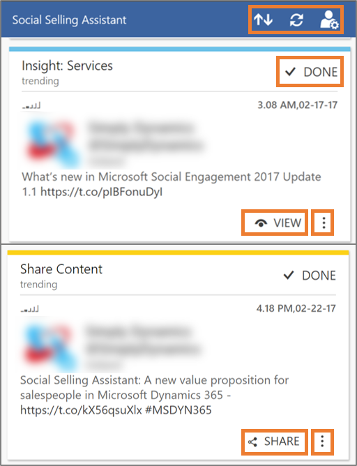
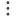
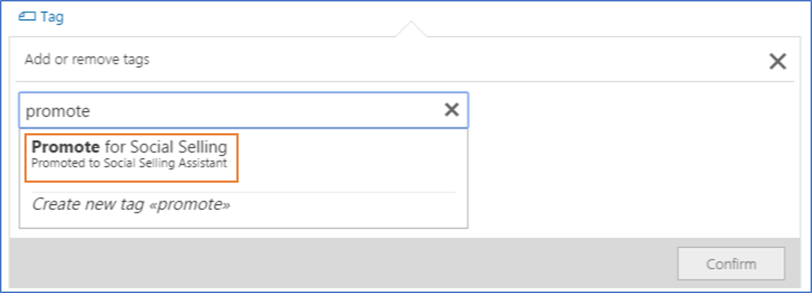

# Work with the Social Selling Assistant

After personalizing the Social Selling Assistant for your individual use-case, you can start using it to discover and share posts that are of interest for your audience

## Share posts from your personalized feed

When you work with the feed of your Social Selling Assistant, keep in mind that some actions also influence the underlying recommendation algorithm. The more inputs you provide to the system, the more it can learn and the more relevant posts it can recommend.

- **Share** is the main action for recommendations based on Share Content personalization settings. It lets you choose from your social profiles and to share the link to the selected post. [!INCLUDE[proc_more_information](../includes/proc-more-information.md)] [Publish and react to posts](publish-react-posts.md)

- **View** is the main action for recommendations based on Get Insights personalization settings. It opens the details of the post and shows additional information. [!INCLUDE[proc_more_information](../includes/proc-more-information.md)] [Publish and react to posts](publish-react-posts.md)

- Clicking  **Done** indicates that you don't plan any further actions on this post. It will be removed from the post list in the Social Selling Assistant.

- Click **More actions** () for more options to work with this post.

  -  Clicking **Not interested** indicates to the algorithm that the recommended content wasn’t relevant for you.  
     This sends a signal to the recommendation model to improve it over time.

  -  You can click **Copy to clipboard** (  ) if you want to work with the source of the post. For example, you can create a new task in [!INCLUDE[pn_ms_dyn_365](../includes/pn-ms-dyn-365.md)] if you plan to follow up on a post later.  

  - You can **Retweet**  on [!INCLUDE[tn_twitter](../includes/tn-twitter.md)].

By default, posts are sorted by recommendation type.  To change to a chronological order, click **Sort** ().  

To get the latest recommendations, click **Refresh** (). New recommendations may or may not contain posts that were present in the list prior to refreshing.

To change your personalization settings,  click **Personalize** () .

## Recommendation types

There are four types of recommendations in the Social Selling Assistant. Posts in the assistant’s feed can match more than one type. By default, posts are ordered as below.

- **Promoted**:  Users in [!INCLUDE[pn_netbreeze_long](../includes/pn-social-engagement-long.md)] with appropriate employee roles (i.e. a community manager) can promote posts in the Social Selling assistant by tagging them in [!INCLUDE[pn_netbreeze_short](../includes/pn-social-engagement-short.md)]. Think of it as a carefully selected Editor’s pick.  If a promoted post matches both Share Content and Insights, it will be shown for Share Content. Otherwise, it will be shown for Insights.

- **Owned**: Posts from profiles that your organization owns. Keep an eye for newsworthy announcements and help spreading the word. This recommendation type is currently not available for Insights.

- **Trending**: Popular posts matching the selected search topics. Usually, these are posts that are shared more often than others.

- **Recommended**: This is where the magic happens. A personalized machine learning algorithm looks at which posts you share and which you aren’t interested in. It will adapt over time and refine its recommendations based on your personal usage patterns.

Labels and colored borders indicate why a post shows in the list. When titled **Insight: \<Insight Group Name>**, cards have blue borders, and the post originates from your personalization settings for **Get Insights**. Cards titled **Share Content** with yellow borders are based on the selected search topics for **Shared Content**.

## Promote a post to the Social Selling Assistant

When a tag is configured to promote a post in the Social Selling Assistant, you can add this tag to any post you'd like to promote in the Social Selling Assistant.

### See Also

 [Increase your influence using the Social Selling Assistant](social-selling-assistant-overview.md)   
 [Personalize the Social Selling Assistant for individual users](personalize-social-selling-assistant.md)   
 [Configure Social Engagement for the Social Selling Assistant](configure-social-selling-assistant.md)
