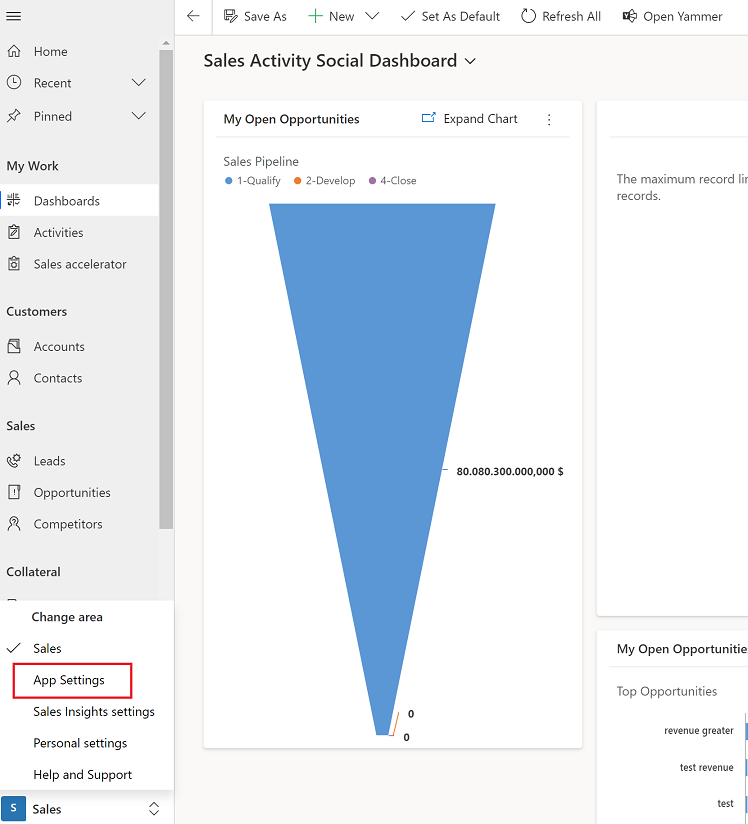
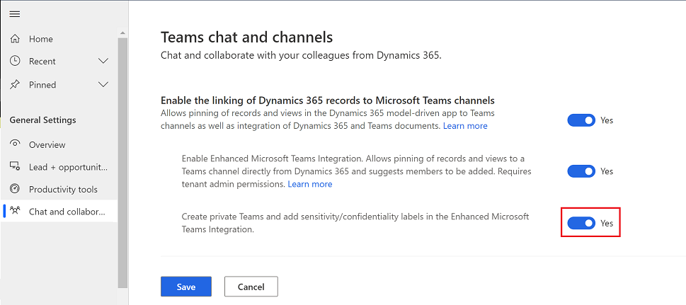

# Enable sensitivity labels to protect content in Microsoft Teams

Users in your organization collaborate with others both inside and outside the organization. This means that content no longer stays behind a firewall—it can roam everywhere, across devices, apps, and services. And when it roams, you want it to do so in a secure, protected way that meets your organization's business and compliance policies. For more information, see [Get started with sensitivity labels](/microsoft-365/compliance/get-started-with-sensitivity-labels).

Sensitivity labels in Microsoft Teams integration with customer engagement apps in Dynamics 365 (such as Dynamics 365 Sales, Dynamics 365 Customer Service, Dynamics 365 Field Service, Dynamics 365 Marketing, and Dynamics 365 Project Service Automation) lets you create teams with sensitivity label and  make the team private so that only the owner of the team can add other members to the team.

> [!div class="mx-imgBorder"]
> 

## Prerequisites

The following prerequisites are required before you can turn on Sensitivity labels in your app:

 - Azure Information Protection (AIP) P2 Premium license. For more information, see [Azure Information Protection](https://azure.microsoft.com/services/information-protection)
 - Create and configure sensitivity labels in your tenant. For more information, see [Create and configure sensitivity labels and their policies](/microsoft-365/compliance/create-sensitivity-labels?view=o365-worldwide).

## Turn on Sensitivity labels

Sensitivity labels are only available when the Enhanced Collaboration Experience is turned on. For more information, see [Install and set up Microsoft Teams integration](teams-install-app.md).

1. In the Sales Hub app, select the **Change area** icon
    
    in the lower-left corner and then select **App Settings**.
   > [!div class="mx-imgBorder"]
   > 

2. From the site map, under **General Settings**, select **Chat and collaborate**.

3. Set the **Enable Confidential Labels** toggle to **Yes**. When you're done, select **Save**. 

   > [!div class="mx-imgBorder"]
   > 

To learn how to use sensitivity labels, see [Enhanced Collaboration Experience with Microsoft Teams](teams-collaboration-enhanced-experience.md).
