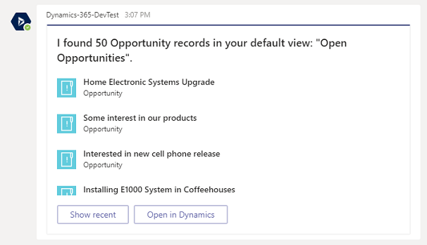

# Use the bot 

> [!IMPORTANT]
> Effective June 2, 2020, Dynamics 365 Sales bot is deprecated. Until July 31, 2020, Microsoft will continue to provide support for the feature, but won't release any additional functionality beyond what is already present. After July 31, 2020, the Dynamics 365 Sales bot won't be available.
>
> For further information, see [Important changes (deprecations) coming in Power Apps, Power Automate, and model-driven apps in Dynamics 365](https://docs.microsoft.com/power-platform/important-changes-coming).

The Dynamics 365 app for Microsoft Teams bot feature allows you to search for model-driven app records within a Microsoft Teams conversations.

Find and open the Dynamics 365 bot. Open **Chat** on the left side of the Microsoft Teams, and then select **Dynamics 365**.

The **Conversation** tab opens with the welcome message sent by the bot. Select **Sign in**.

> [!div class="mx-imgBorder"] 
> 

You'll see some preloaded options. For example, select **Opportunities** to have the bot return a list view of records from your default view.

> [!div class="mx-imgBorder"] 
> 

> [!div class="mx-imgBorder"] 
> 

## Search
Enter text like "contoso" in the search field to find related records.

> [!div class="mx-imgBorder"] 
> 

> [!div class="mx-imgBorder"] 
> 

<!-- Removing for GA since these features will shop sometime after GA
## Edit
Edit and update a record.

> [!div class="mx-imgBorder"] 
> 

## Post
Create a post in Dynamics 365 app.

> [!div class="mx-imgBorder"] 
> 

## Other
Use the bot menu for other actions such as change the environment or app module.

> [!div class="mx-imgBorder"] 
> -->

### See also  
[Set up the Dynamics 365 bot](teams-install-app.md#bkmk_setup_dynamics365_bot)  
