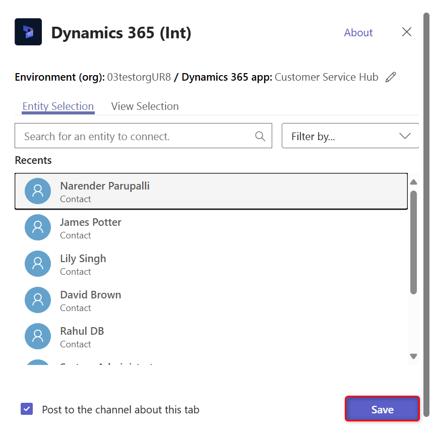

# Basic Collaboration Experience with Microsoft Team integration

Once installed, the Dynamics 365 app for Teams enables collaborating with other team members by adding a model-driven app in Dynamics 365 tab to a channel in Microsoft Teams.

For more information on which entities support the collaborate option, see [Record types supporting collaborate](teams-work-records-and-view.md#record-types-supporting-collaborate)

## Connect a model-driven app record or view to a team channel

From a team channel, you can connect a model-driven app record or view to collaborate on any entity such as customer accounts, opportunities, and more.

1. Open a team channel and select the **Add** button ().

   > [!div class="mx-imgBorder"]
   > 

2. Select the **Dynamics 365** icon to pin a model-driven app record to a channel.

   > [!div class="mx-imgBorder"]
   > 

3. Select **Entity Selection** or **View Selection**.

- **Entity Selection**
    1. Search for an entity to connect. You can pick a recently viewed record or use search to find records. You can use **Filter by** to narrow the search to an entity type.

   > [!div class="mx-imgBorder"] 
   > 

    2. If you are the owner of the team, you will see an option to add other members to the team who either own the record or it has been shared with them. When you are done select **Save**. 
     > [!NOTE] 
     > The Enhanced Collaboration Experience needs to be enabled to add members to the team. For more information, see [Install and set up the Dynamics 365 app for Teams ](teams-install-app.md).
     
   Once you complete the above steps, you'll see a notification of a successful connection and the model-driven app record will load in the new added tab. You can interact with the record as if you were using the your app. Those with Write permissions can edit the record. Changes will be synchronized with the model-driven app in Dynamics 365.

    > [!div class="mx-imgBorder"] 
    > 
   
    
### Two connection states

**Successful** or **Failed** are only two connection states possible when connecting model-driven apps in Dynamics 365 and Microsoft Teams.

The successful connection state indicates that the connection was successfully saved in Dynamics 365 apps so that the link to the connected Microsoft Teams channel appears on the Dynamics 365 apps page and the files used on this channel also appear on the **Documents** tab in Dynamics 365 apps.

A failed connection means the connection was not successfully saved. When seeing this message, you should remove and connect the record again See: [Error: This record is not connected to Dynamics 365. Repin the tab and try again.](teams-troubleshoot.md#error-this-record-is-not-connected-to-dynamics-365-repin-the-tab-and-try-again)

### View and associate files

Select the **Files** tab in the connected Teams channel to associate files with a Dynamics 365 apps record. Files added here will appear in Dynamics 365 apps under **Documents** for the linked record. Likewise, when you add a document to a record in Dynamics 365 apps, that document will appear in Teams under the **Files** tab.

   > [!div class="mx-imgBorder"] 
   > 

- **View Selection**
    1. Select an entity to see the list of available views in model-driven apps in Dynamics 365. Once you've picked a view, , select **Save**.
  
   > [!div class="mx-imgBorder"] 
   > 
   
   > [!div class="mx-imgBorder"] 
   > 
   
   Once you complete the above steps, you'll see the model-driven app entity view in the new added tab.

   > [!div class="mx-imgBorder"] 
   > 
     
     
   > [!NOTE]
   > - If you select a personal view (**My Views**) instead of **System Views**, it’s recommended that you share the view with other users in Teams before you add the view to the Teams channel. Otherwise, other team members will not hae access to the view content.
   
   > [!div class="mx-imgBorder"] 
   > 

4. If you have multiple environments or app modules, you can change the environment and app module by selecting **Edit** () to specify which environment or app module to use in Teams.
 
   > [!div class="mx-imgBorder"] 
   > 

   You can enable **Remember this preference** to set the environment and app selections to be the default personal dashboard that appears when you select **My Dashboard**.

   You can return to these settings any time by selecting the **Settings** tab.

## Teams integration in Dynamics 365 apps

In Dynamics 365 apps, you can see the connected Microsoft Teams channel and files from the Microsoft Teams channel.

In Dynamics 365 apps records, select **Collaborate** to display a list of all the connected team channels. Then, select a team channel to go to the relevant channel conversation in Teams.

> [!div class="mx-imgBorder"] 
> 

In addition, document management actions in Dynamics 365 apps are integrated with Teams. You can see the channel file library in Dynamics 365 apps and directly upload files; uploaded files will appear in the Teams channel file library under the **Files** tab. Files uploaded in the Teams app will appear in the **Documents** tab in Dynamics 365 apps.

> [!div class="mx-imgBorder"] 
> 

### See also  
 [Install the app and set up the Teams tab](teams-install-app.md#install-the-app-and-set-up-the-teams-tab)
 
[Enhanced Collaboration with Teams](teams-collaboration-enhanced-experience.md)

[Use Teams to open a record or view](teams-work-records-and-view.md)

