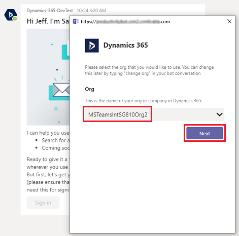

# Install and setup Microsoft Teams integration 

By default, the Basic and Enhanced Microsoft Teams Integration is disabled in Common Data Service. To turn these features on, follow the steps below. To learn more about what the difference, see [Difference between the Basic and Enhanced Collaboration Experience with Microsoft Teams](teams-basic-vs-enhanced-collaboration.md).

   > [!div class="mx-imgBorder"] 
   > 

   > [!NOTE]
   > - If Microsoft Teams integration is not enabled on the **System Settings** page in Common Data Service, then Microsoft Teams users can still connect to model-driven apps record or view to Microsoft Teams collaboration channel, but the connected Microsoft Teams channel and the file library do not appear in model-driven apps in Dynamics 365.
   > - When the feature is enabled, the collaboration feature is [enabled only for a selected set of system entities](https://docs.microsoft.com/dynamics365/teams-integration/teams-collaboration#record-types-that-support-microsoft-teams-integration-in-model-driven-apps). If you want to enable Microsoft Teams integration for additional entities or custom entities, you can only do it programmatically using the **msdyn_SetTeamsDocumentStatus** Web API action. More information: [Enable or disable Microsoft Teams Integration using code](../developer/integration-dev/teams-integration-using-code.md).
   > - If you run into any issues during configuration, see [Troubleshoot configuration issues with Teams Integration](https://docs.microsoft.com/dynamics365/teams-integration/teams-troubleshoot#troubleshoot-configuration-issues-with-microsoft-teams-integration).

## For Common Data Service admins: enable Microsoft Teams integration feature 

1. Sign in as a System administrator to Common Data Service.
2. Go to **Settings** > **Administration** > **System Settings** > **General** tab.
3. To enable [basic collaboration experience](teams-collaboration.md), select **Yes** for **Enable Basic Microsoft Teams Integration**. When Basic Microsoft Teams Integration is enabled, the **Collaborate** button appears on records in model-driven apps in Dynamics 365 so you can see the connected team channel or set up a new connection in Microsoft Teams. In addition, in the **Documents** tab on model-driven app record page, the connected team channel file library will appear. 
   > [!NOTE]
   >  You can only set **Enable Enhanced Microsoft Teams Integration** to, **Yes** if **Enable Basic Microsoft Teams Integration** is set to, **Yes**. If you don't enable Basic Microsoft Teams Integration then the option **Enable Enhanced Microsoft Teams Integration** is grayed out.  
   >  > [!div class="mx-imgBorder"] 
   >  > 

   

4. To enable [enhanced collaboration experience](teams-collaboration-enhanced-experience.md), select **Yes** for **Enable Enhanced Microsoft Teams Integration**. To turn this option on, you need Office 365 tenant admin permissions. When Enhanced Microsoft Teams Integration is enabled, the **Collaborate** button appears on the record and view page in model-driven apps for Dynamics 365. You can set up a connection with any Microsoft Teams collaboration channel within a model-driven app.

    1. When you select **Yes** to **Enable Enhanced Microsoft Teams Integration**, there is two consent permission popup boxes that will display. If you have a pop-up blocker and you don't see the second consent dialog, then you need to disable the pop-up blocker in your browser.
  
        > [!div class="mx-imgBorder"] 
        > 

    2. On the second consent dialog box, select the checkbox for **Consent on behalf of organization** and then select **Accept**. 
    
       > [!NOTE]
        > If you don't select **Consent on behalf of organization** option, then when another user tries to pin an entity record or view to Microsoft Teams and shares the tab with another user, they will get this error message, **The admin has not consented to use user sync feature, you can add them manually**. If you see this error message, see [Error when you pin a record or view to teams channel](https://docs.microsoft.com/dynamics365/teams-integration/teams-troubleshoot#error-when-you-pin-a-record-or-view-of-any-model-driven-app-to-a-team-channel-if-your-user-role-permission-is-not-configured-correctly-by-your-common-data-service-system-admin).  

    
        > [!div class="mx-imgBorder"] 
        > 
    
          
5. After the second consent is accepted select, **Finish** and then select **OK** on the **System Settings** screen. If you don't select **OK** on the **System Settings** screen then you will lose your changes. 

    > [!div class="mx-imgBorder"] 
    > 
   

## In Microsoft Teams: Install the Dynamics 365 app and set up the Microsoft Teams collaboration channel tab

1. In Microsoft Teams, select **Store**. 

   > [!div class="mx-imgBorder"]
   > 

2. Search for **dynamics**, and then select the **Dynamics 365** tile.

   > [!div class="mx-imgBorder"]
   > 

3. Verify that **Add for you** and **Add to a team** are both set to **Yes**.

   You can use Dynamics 365 app for your own use or use on a Microsoft Teams channel to collaborate with others. If you have an existing Microsoft Teams channel, select both options. Otherwise, you can start installing for your personal use and install the app for your Microsoft Teams later.

   > [!div class="mx-imgBorder"] 
   > 

4. For **Add to a team**, choose a team and then select **Install**. 

   > [!div class="mx-imgBorder"] 
   > 

5. Pick a channel in Microsoft Teams to connect to a model-drvice app record and then select **Set up**.

   > [!div class="mx-imgBorder"] 
   > 

6. Select a version 9.x environment and a Unified Interface app to connect, and then choose **Save**.

   > [!div class="mx-imgBorder"] 
   > 

   > [!NOTE]
   > - Only Common Data Services environments that contain model-driven apps appear in the list. Also, only active environments (those that are not disabled or provisioning) are displayed. 
   > - Only Unified Interface apps are listed.
   > - Only app modules licensed for the selected environment are listed. 

7. Select **Entity Selection** or **View Selection**.

    1. **Entity Selection**: Select an entity to connect. You can pick a recently viewed record or use search to find records. You can     use **Filter by** to narrow the search to an entity type. Once you've picked a record, select **Save**.

   > [!div class="mx-imgBorder"] 
   > 

    2. **View Selection**: Select an entity to see the list of available views. Once you've picked a view, select **Save**.
    
   > [!div class="mx-imgBorder"] 
   > 
   
      > [!NOTE]
   > If you select a personal view (**My Views**) instead of **System Views**, it’s recommended that you share the view with other users in Common Data Service before you add the view to the Microsoft Teams channel. Otherwise, other team members will not have access to the view tab content.

8. After completing the above steps, you will see a new Dynamics 365 tab in the selected team channel. 
 
 
See [Collaborate with Microsoft Teams](teams-collaboration.md#have-a-conversation) for information on how you can use the tab feature to collaborate with Dynamics 365 apps.

## In Microsoft Teams: Set up the Dynamics 365 bot

> [!IMPORTANT]
> Effective June 2, 2020, Dynamics 365 Sales bot is deprecated. Until July 31, 2020, Microsoft will continue to provide support for the feature, but won't release any additional functionality beyond what is already present. After July 31, 2020, the Dynamics 365 Sales bot won't be available.
>
> For further information, see [Important changes (deprecations) coming in Power Apps, Power Automate, and model-driven apps in Dynamics 365](https://docs.microsoft.com/power-platform/important-changes-coming).

Set up the bot feature to interact with Dynamics 365 apps.

1. Find and open the Dynamics 365 bot. Open **Chat** on the left side of the Microsoft Teams app, and then select **Dynamics 365 apps**.

2. The **Conversation** tab opens with the welcome message sent by the bot that provides an overview of the bot’s abilities. Select **Sign in**.

   > [!div class="mx-imgBorder"] 
   > 

3. Select an environment, and then select **Next**.

   If the environment has multiple app modules (Sales, Marketing, Service, and so on), then you'll also select an app module.

   > [!div class="mx-imgBorder"] 
   > 

   > [!NOTE]
   > Only Common Data Service environments appear in the list. Also, only active environments (those that are not disabled or provisioning) are displayed.

4. Enter credentials and sign in.

   The Dynamics 365 bot setup is complete and some preloaded options are available for getting started.

   > [!div class="mx-imgBorder"] 
   > 

See [Use the bot](teams-bot-search.md) for information on how you can use the bot feature to interact with model-driven apps in Dynamics 365.

## In Microsoft Teams: Set up the personal dashboard
Set up the personal dashboard (My Dashboard) to interact with model-driven apps in Dynamics 365 without involving other team members.

1. Open the Dynamics 365 app.

   > [!div class="mx-imgBorder"] 
   > 

2. Select a Common Data Service environment and a Unified Interface app to connect with model-driven apps in Dynamics 365, and then choose **Save Changes**.

   > [!div class="mx-imgBorder"] 
   > 

   > [!NOTE]
   > - Only Common Data Service environments appear in the list. Also, only active environments (those that are not disabled or provisioning) are displayed. 
   > - Only Unified Interface apps are listed.
   > - Only app modules licensed for the selected environments are listed. 

3. Select the **My Dashboard** tab.

See [Use the personal dashboard](teams-personal-use.md) for information on how you can use **My Dashboard**.

### See also  
 [Troubleshoot Microsoft Teams integration](teams-troubleshoot.md)

