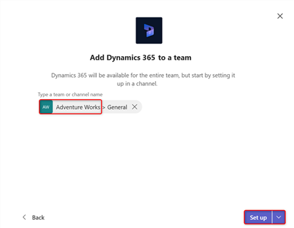

# Install and set up the Dynamics 365 app for Teams 

 
## For Dynamics 365 admins: enable Microsoft Teams integration feature 

By default, the Basic and Enhanced Microsoft Teams Integration is disabled. To turn these features on, follow the steps below. To learn more about what the difference, see [Difference between the Basic and Enhanced Collaboration Experience with Teams](teams-basic-vs-enhanced-collaboration.md).

If you run into any issues during configuration, see [Troubleshoot configuration issues with Teams Integration](teams-troubleshoot.md#troubleshoot-configuration-issues-with-teams-integration).

1. Sign in as a System administrator to Dynamics 365 apps.
2. Go to **Settings** > **Administration** > **System Settings** > **General** tab.
3. For the [Basic collaboration experience](teams-collaboration.md), select **Yes** to **Enable Basic Microsoft Teams Integration**. When Basic Microsoft Teams Integration is enabled, the **Collaborate** button appears on records in Dynamics 365 apps so you can see the connected team channel. In addition, in the **Documents** tab of Dynamics 365 record page, the connected Teams Channel file library will appear. This lets you set-up a connection in the Teams app.
   > [!NOTE]
   >  You can only **Enable Enhanced Microsoft Teams Integration** if **Enable Basic Microsoft Teams Integration** is set to **Yes**. If you don't **Enable Basic Microsoft Teams Integration** then the option to **Enable Enhanced Microsoft Teams Integration** will be grayed out.
    > [!div class="mx-imgBorder"] 
    > 
   
4. For the [Enhanced collaboration experience](teams-collaboration-enhanced-experience.md), enable **Enable Enhanced Microsoft Teams Integration**. To turn this option on, you need need Office 365 tenant admin permissions. When Enhanced Microsoft Teams Integration is enabled, the **Collaborate** button appears on records and views in Dynamics 365 apps and you can set up a connection with any Teams collaboration channel within Dynamics 365 app.
  -  When you select **Yes** to **Enable Enhanced Microsoft Teams Integration**, a consent pop-up dialog boxe will display. If you have a pop-up blocker and you don't see the consent dialong box, then you need to disable the pop-up blocker in your browser.
  
   > [!div class="mx-imgBorder"] 
   > 
  
   > [!IMPORTANT]
   > - When you select the option to enable enhanced collaboration experience, there are two request permission dialog boxes that you will need to accept. On the second dialog box, select the checkbox for  **Consent on behalf of organization** and then select **Accept**. If you don't select check this option, then when another user tries to pin an entity record or view to Teams and shares the tab with another user, they will get this error message, **The admin has not consented to use user sync feature, you can add them manually**. If you see this error message, see [Error messages in the Teams app](https://docs.microsoft.com/dynamics365/customer-engagement/basics/teams-troubleshoot#error-messages-in-the-teams-app).

   > [!div class="mx-imgBorder"] 
   > 

   > [!IMPORTANT]
   > - If not enabled, users can still connect Dynamics 365 apps records to Microsoft Teams but the connected Microsoft Teams channel and the file library do not appear in Dynamics 365 apps.
   > - > When the feature is enabled, the collaboration feature is [enabled only for a selected set of system entities](teams-work-records-and-view.md#record-types-supporting-collaborate). If you want to enable Microsoft Teams integration for additional entities or custom entities, you can only do it programmatically using the **msdyn_SetTeamsDocumentStatus** Web API action. More information: [Enable or disable Microsoft Teams Integration using code](../developer/integration-dev/teams-integration-using-code.md).
   

## Install the app and set up the Teams tab

1. In Microsoft Teams, select **Store**. 

   > [!div class="mx-imgBorder"]
   > 

2. Search for **dynamics**, and then select the **Dynamics 365** tile.

   > [!div class="mx-imgBorder"]
   > 

3. Verify that **Add for you** and **Add to a team** are both set to **Yes**.

   You can use Dynamics 365 apps for your own use or use on a Microsoft Teams channel to collaborate with others. If you have an existing Microsoft Teams channel, select both options. Otherwise, you can start installing for your personal use and install the app for your Teams later.

   > [!div class="mx-imgBorder"] 
   > 

4. For **Add to a team**, choose a team and then select **Install**. 

   > [!div class="mx-imgBorder"] 
   > 

5. Pick a channel in Microsoft Teams to connect to a Dynamics record and then select **Set up**.

   > [!div class="mx-imgBorder"] 
   > 

6. Select a version 9.x environment and a Unified Interface app to connect, and then choose **Save**.

   > [!div class="mx-imgBorder"] 
   > 

   > [!NOTE]
   > - Only Dynamics 365 version 9.x or later environments appear in the list. Also, only active environments (those that are not disabled or provisioning) are displayed. 
   > - Only Unified Interface apps are listed.
   > - Only app modules licensed for the selected environment are listed. 

7. Select **Entity Selection** or **View Selection**.

    7.1 **Entity Selection**: Select an entity to connect. You can pick a recently viewed record or use search to find records. You can     use **Filter by** to narrow the search to an entity type. Once you've picked a record, select **Save**.

   > [!div class="mx-imgBorder"] 
   > 

    7.2 **View Selection**: Select an entity to see the list of available views. Once you've picked a view, select **Save**.
    
   > [!div class="mx-imgBorder"] 
   > 
   
      > [!NOTE]
   > If you select a personal view (**My Views**) instead of **System Views**, it’s recommended that you share the view with other users in Teams before you add the view to the Teams channel. Otherwise, other team members will not hae access to the view content.

8. After completing the above steps, you will see a new tab for Dynamics 365 apps for the selected Teams channel. 
 
 
See [Collaborate with Teams](teams-collaboration.md) for information on how you can use the tab feature to collaborate with Dynamics 365 apps.

## Set up the Dynamics 365 bot

Set up the bot feature to interact with Dynamics 365 apps.

1. Find and open the Dynamics 365 bot. Open **Chat** on the left side of the Teams app, and then select **Dynamics 365 apps**.

2. The **Conversation** tab opens with the welcome message sent by the bot that provides an overview of the bot’s abilities. Select **Sign in**.

   > [!div class="mx-imgBorder"] 
   > 

3. Select an environment, and then select **Next**.

   If the environment has multiple app modules (Sales, Marketing, Service, and so on), then you'll also select an app module.

   > [!div class="mx-imgBorder"] 
   > 

   > [!NOTE]
   > Only Dynamics 365 version 9.x or later environments appear in the list. Also, only active environments (those that are not disabled or provisioning) are displayed.

4. Enter credentials and sign in.

   The Dynamics 365 bot setup is complete and some preloaded options are available for getting started.

   > [!div class="mx-imgBorder"] 
   > 

See [Use the bot](teams-bot-search.md) for information on how you can use the bot feature to interact with Dynamics 365 apps.

## Set up the personal dashboard
Set up the personal dashboard (My Dashboard) to interact with Dynamics 365 apps without involving other team members.

1. Open the Dynamics 365 app.

   > [!div class="mx-imgBorder"] 
   > 

2. Select a version 9.x environment and a Unified Interface app to connect with Dynamics 365 apps, and then choose **Save Changes**.

   > [!div class="mx-imgBorder"] 
   > 

   > [!NOTE]
   > - Only Dynamics 365 version 9.x or later environments appear in the list. Also, only active environments (those that are not disabled or provisioning) are displayed. 
   > - Only Unified Interface apps are listed.
   > - Only app modules licensed for the selected environments are listed. 

3. Select the **My Dashboard** tab.

See [Use the personal dashboard](teams-personal-use.md) for information on how you can use **My Dashboard**.

### See also  
 [Troubleshoot Teams integration](teams-troubleshoot.md)

