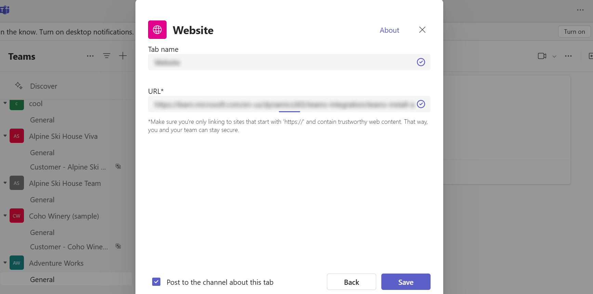

# Install and set up Microsoft Teams integration 

By default, the Basic and Enhanced Microsoft Teams Integration is disabled for customer engagement apps in Dynamics 365 (Dynamics 365 Sales, Dynamics 365 Customer Service, Dynamics 365 Field Service, Dynamics 365 Marketing, and Dynamics 365 Project Service Automation). To turn on these features, follow the steps below. To learn more about what the difference, see [Difference between the Basic and Enhanced Collaboration Experience with Microsoft Teams](teams-basic-vs-enhanced-collaboration.md).

   > [!div class="mx-imgBorder"] 
   > 

   > [!NOTE]
   > - If Microsoft Teams integration is not enabled on the **System Settings** page, then Microsoft Teams users can still connect to record or view in customer engagement apps (such as Dynamics 365 Sales and Dynamics 365 Customer Service) to Microsoft Teams collaboration channel, but the connected Microsoft Teams channel and the file library do not appear in customer engagement apps in Dynamics 365.
   > - When the feature is enabled, the collaboration feature is [enabled only for a selected set of system entities](teams-collaboration#record-types-that-support-microsoft-teams-integration-in-model-driven-apps). If you want to enable Microsoft Teams integration for additional entities or custom entities, you can only do it programmatically using the **msdyn_SetTeamsDocumentStatus** Web API action. More information: [Enable or disable Microsoft Teams Integration using code](../customerengagement/on-premises/developer/integration-dev/teams-integration-using-code.md).
   > - If you run into any issues during configuration, see [Troubleshoot configuration issues with Teams Integration](./teams-troubleshoot.md#troubleshoot-configuration-issues-with-microsoft-teams-integration).

## Prerequisites

Microsoft Teams integration uses SharePoint integration at the backend. Make sure these prerequisites are met:

- If SharePoint integration is not configured, OneDrive integration must be disabled too. If this is not met, you will get error code 800503ca when you try to enable Teams Integration with customer engagement apps in Dynamics 365.

- If SharePoint Integration is not configured, there should not be any active SharePoint site in your organization. Deactivated SharePoint sites should not cause a problem. If this is not met, you will get error code 800503ca when you try to enable Teams Integration with customer engagement apps in Dynamics 365. 

- If SharePoint Integration is not configured, there should not be any SharePoint document locations created with an absolute URL in your organization. The locations with absolute URL must be deleted. If this is not met, you will get error code 800503ca when you try to enable Teams Integration with customer engagement apps in Dynamics 365

- If you are currently configured to use SharePoint on-premises for document management, you need to set up document management for a customer engagement app to use SharePoint Online. For more information, see [Set up apps in Dynamics 365 to use SharePoint Online](/power-platform/admin/set-up-dynamics-365-online-to-use-sharepoint-online).

- If SharePoint Online admin has enabled control access from unmanaged devices (conditional access policy) to allow/block SharePoint sites from unmanaged devices, then the same restrictions will be applied for Microsoft Teams integration because Microsoft Teams uses SharePoint sites for document management. This might block a user when they try to access a connected team channel file library on a customer engagement app page. For more information, see [Control access from unmanaged devices](/sharepoint/control-access-from-unmanaged-devices). 

If you get an error while configuring Microsoft Teams Integration from Dynamics 365, it might be because of the above prerequisites are not met. For more information, see [Troubleshoot Microsoft Teams integration](./teams-troubleshoot.md#troubleshoot-configuration-issues-with-microsoft-teams-integration).

## For admins: enable Microsoft Teams integration feature 

1. Sign in as a system administrator to your customer engagement app in Dynamics 365 
2. Go to **Settings** > **Administration** > **System Settings** > **General** tab.
3. To enable [basic collaboration experience](teams-collaboration.md), select **Yes** for **Enable Basic Microsoft Teams Integration**. When Basic Microsoft Teams Integration is enabled, the **Collaborate** button appears on in customer engagement app records so you can see the connected team channel or set up a new connection in Microsoft Teams. In addition, in the **Documents** tab on the record page, the connected team channel file library will appear. 
   > [!NOTE]
   >  You can only set **Enable Enhanced Microsoft Teams Integration** to, **Yes** if **Enable Basic Microsoft Teams Integration** is set to, **Yes**. If you don't enable Basic Microsoft Teams Integration then the option **Enable Enhanced Microsoft Teams Integration** is grayed out.  
   >  > [!div class="mx-imgBorder"] 
   >  > 

   

4. To enable [enhanced collaboration experience](teams-collaboration-enhanced-experience.md), select **Yes** for **Enable Enhanced Microsoft Teams Integration**. To turn this option on, you need Microsoft 365 tenant admin permissions. When Enhanced Microsoft Teams Integration is enabled, the **Collaborate** button appears on the record and view page in customer engagement apps. You can set up a connection with any Microsoft Teams collaboration channel within an app.

    1. When you select **Yes** to **Enable Enhanced Microsoft Teams Integration**, there is two consent permission popup boxes that will display. If you have a pop-up blocker and you don't see the second consent dialog, then you need to disable the pop-up blocker in your browser.
  
        > [!div class="mx-imgBorder"] 
        > 

    2. On the second consent dialog box, select the checkbox for **Consent on behalf of organization** and then select **Accept**. 
    
       > [!NOTE]
        > If you don't select **Consent on behalf of organization** option, then when another user tries to pin an entity record or view to Microsoft Teams and shares the tab with another user, they will get this error message, **The admin has not consented to use user sync feature, you can add them manually**. If you see this error message, see [Error when you pin a record or view to teams channel](teams-troubleshoot#error-when-you-pin-a-record-or-view-of-any-model-driven-app-to-a-team-channel-if-your-user-role-permission-is-not-configured-correctly-by-your-common-data-service-system-admin).  

    
        > [!div class="mx-imgBorder"] 
        > 
    
          
5. After the second consent is accepted select, **Finish** and then select **OK** on the **System Settings** screen. If you don't select **OK** on the **System Settings** screen then you will lose your changes. 

    > [!div class="mx-imgBorder"] 
    > 
   
### FAQs (for admins)

1. Does the tenant admin need to do anything to set up Microsoft Teams Integration?
The tenant admin must provide consent for the enterprise application to be created in Azure AD and add delegate permissions for Teams. This happens automatically when the Enhanced Collaboration Experience is enabled in the system settings of your customer engagement app.

2. The documentation refers to **Microsoft 365 tenant admin permissions**, what does this mean?
   This means the directory admin or a tenant admin.
   
3. Is the activation for Dynamics 365 for all environments or per environment?
Consent is given at tenant level. This applies to all Dynamics 365 Instance within a tenant.

4. What active directory privileges are given to the customer engagement apps?

  - Delegated permissions: Group.ReadWrite.All and User.Read.All
  - Dynamics 365 Microsoft Teams Collaboration Integration (Enterprise application), permissions: Group.ReadWrite.All and User.Read.All

5. Is it enough to have only Microsoft Teams admin privileges to activate this Microsoft Teams Integration? 
Enabling Microsoft Teams Integration has nothing to with Teams admin privileges. You need to have tenant admin permission to enable Microsoft Teams Integration 

6. Which Service Principle (App ID?) will receive this permission?
The App used in for this integration, which is customer engagement app and Microsoft Teams Integration.

7. What happens when the consent is provided?
Apart from consent, a flag is set internally in your customer engagement app that indicates the feature is enabled. The flag is also used to control the user interface behavior such as showing a user the collaborate command.

## In Microsoft Teams: Install the Dynamics 365 app and set up the Microsoft Teams collaboration channel tab

1. In Microsoft Teams, select **Store**. 

   > [!div class="mx-imgBorder"]
   > 

2. Search for **dynamics**, and then select the **Dynamics 365** tile.

   > [!div class="mx-imgBorder"]
   > 

3. Verify that **Add for you** and **Add to a team** are both set to **Yes**.

   You can use Dynamics 365 app for your own use or use on a Microsoft Teams channel to collaborate with others. If you have an existing Microsoft Teams channel, select both options. Otherwise, you can start installing for your personal use and install the app for your Microsoft Teams later.

   > [!div class="mx-imgBorder"] 
   > 

4. For **Add to a team**, choose a team and then select **Install**. 

   > [!div class="mx-imgBorder"] 
   > 

5. Pick a channel in Microsoft Teams to connect to an app record and then select **Set up**.

   > [!div class="mx-imgBorder"] 
   > 

6. Select a version 9.x environment and a Unified Interface app to connect, and then choose **Save**.

   > [!div class="mx-imgBorder"] 
   > 

   > [!NOTE]
   > - Only environments that contain customer engagement apps (such as Dynamics 365 Sales and Dynamics 365 Customer Service)  appear in the list. Also, only active environments (those that are not disabled or provisioning) are displayed. 
   > - Only Unified Interface apps are listed.
   > - Only app modules licensed for the selected environment are listed. 

7. Select **Entity Selection** or **View Selection**.

    1. **Entity Selection**: Select an entity to connect. You can pick a recently viewed record or use search to find records. You can     use **Filter by** to narrow the search to an entity type. Once you've picked a record, select **Save**.

   > [!div class="mx-imgBorder"] 
   > 

    2. **View Selection**: Select an entity to see the list of available views. Once you've picked a view, select **Save**.
    
   > [!div class="mx-imgBorder"] 
   > 
   
      > [!NOTE]
   > If you select a personal view (**My Views**) instead of **System Views**, it’s recommended that you share the view with other users before you add the view to the Microsoft Teams channel. Otherwise, other team members will not have access to the view tab content.

8. After completing the above steps, you will see a new Dynamics 365 tab in the selected team channel. 
 
 
See [Collaborate with Microsoft Teams](teams-collaboration.md#have-a-conversation) for information on how you can use the tab feature to collaborate with Dynamics 365 apps.

## In Microsoft Teams: Set up the personal dashboard
Set up the personal dashboard (My Dashboard) to interact with customer engagement apps in Dynamics 365 without involving other team members.

1. Open the Dynamics 365 app.

   > [!div class="mx-imgBorder"] 
   > 

2. Select an environment and a Unified Interface app to connect with customer engagement apps in Dynamics 365, and then choose **Save Changes**.

   > [!div class="mx-imgBorder"] 
   > 

   > [!NOTE]
   > - Only environments that have customer engagement apps (such as Dynamics 365 Sales and Dynamics 365 Customer Service) appear in the list. Also, only active environments (those that are not disabled or provisioning) are displayed. 
   > - Only Unified Interface apps are listed.
   > - Only app modules licensed for the selected environments are listed. 

3. Select the **My Dashboard** tab.

See [Use the personal dashboard](teams-personal-use.md) for information on how you can use **My Dashboard**.

## Government GCC environment 

Teams integration with Dynamics 365 isn't available for Government GCC environment. However, there's a workaround to view records using the Website app in Teams and then adding it as a tab.

1. Open a Teams channel and select **Add a tab**.

  > [!div class="mx-imgBorder"] 
  > 

2. Search for the **Website** app and add it.

  > [!div class="mx-imgBorder"] 
  > 
  
> [!NOTE]
> If you don't see the **Website** app in Teams, ask your administrator to enable this option through [Microsoft 365 admin center](/microsoft-365/admin/admin-overview/about-the-admin-center).

3. Enter a name for the tab and the URL for your web address for the Dynamics 365 app and then select **Save**.

  > [!div class="mx-imgBorder"] 
  > 

### See also  
 [Troubleshoot Microsoft Teams integration](teams-troubleshoot.md)

[!INCLUDE[footer-include](../includes/footer-banner.md)]
