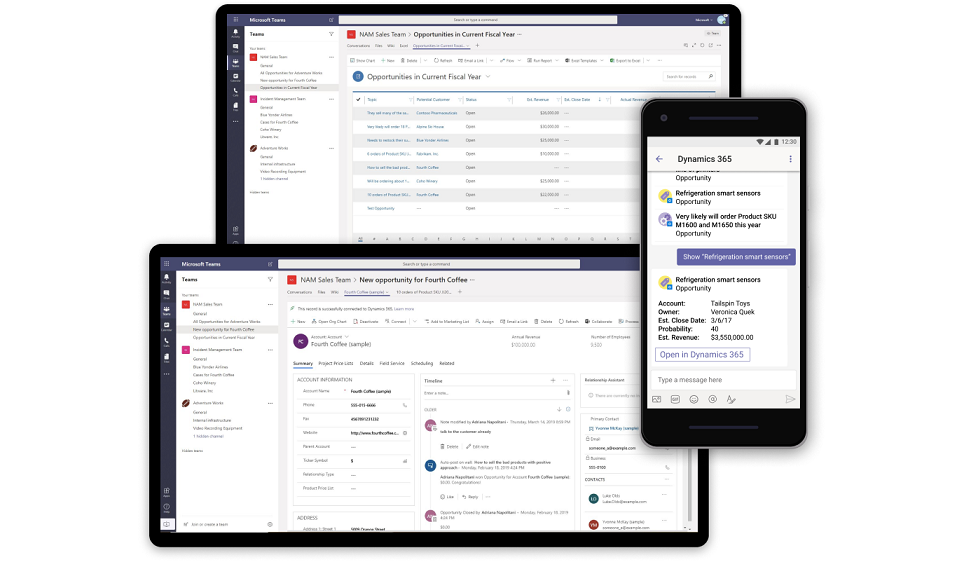

# Microsoft Teams integration with customer engagement apps in Dynamics 365 

If you're familiar with [Microsoft Teams](https://products.office.com/microsoft-teams/group-chat-software), you know it's the place to manage all your conversations, files, and tools in one team workspace. Create and edit documents right in the app and enjoy instant access to SharePoint, OneNote, Power BI, and now, customer engagement apps in Dynamics 365 (Dynamics 365 Sales, Dynamics 365 Customer Service, Dynamics 365 Field Service, Dynamics 365 Marketing, and Dynamics 365 Project Service Automation).

   > [!NOTE]
   > Microsoft Teams integration is not supported on the following: 
   >  - Dynamics 365 Customer Engagement (on-premises)
   >  - Microsoft Dataverse environment
   >  - Legacy web client or legacy apps
   >  - If Dynamics 365 and Microsoft Teams are in different tenants

Dynamics 365 for Microsoft Teams integration enables users to easily work with customer information in customer engagement apps (such as Dynamics 365 Sales and Dynamics 365 Customer Service) and share files directly from Microsoft Teams. This helps them to be more productive and get work done more effectively. 

- **Collaboration hub**: Access a shared workspace for Office apps that most of us already use to work sales opportunities.  
- **File integration**: Co-author documents using Microsoft 365 and automatically sync with customer engagement apps in Dynamics 365. Files uploaded to a channel are available for the record that is pinned to the channel. Files are saved to Sharepoint are accessible in Microsoft Teams and  in your customer engagement app. For more information: [Document management in Microsoft Teams integration](teams-doc-management.md)
 
 
> [!div class="mx-imgBorder"] 
> 

With the Dynamics 365 for Microsoft Teams integration, add app features that you rely on, to the Microsoft Teams app you collaborate with. This lets you easily work with your customer information and share files directly from Microsoft Teams.

- Access customer engagement app records by adding a Dynamics 365 tab into the Microsoft Teams channel. Collaborate at a large scale not only on a single app record (like a sales opportunity) but also on multiple records.
- Use Microsoft Teams integration to seamlessly collaborate on documents between customer engagement apps and Microsoft Teams. 
- Collaborate on a set of records, such as *active opportunity* using Microsoft Teams conversation and easily access records on the go using the Dynamics 365 bot for Microsoft Teams mobile app. 

> [!VIDEO https://www.youtube.com/embed/u0DaRzZDAPc]
> 

## Questions and feedback

 If you have additional feedback or questions regarding this feature, contact [D365forTeams@microsoft.com](mailto:D365forTeams@microsoft.com).

## Privacy notice

While using customer engagement apps in Dynamics 365 bot in Microsoft Teams, the user’s text inputs are analyzed for understanding the underlying query/intent. The user’s input such as “Search account Contoso” is routed to one of Microsoft’s Cognitive Service called Language Understanding Intelligent Service (LUIS). Read more about LUIS [here](https://www.luis.ai/). The LUIS service disambiguates or understands the intent of user input (in this case, the intent is to find information) and the target entity (in this case, the intended entity is an account named Contoso). This information is then passed on to Microsoft’s [Azure bot framework](https://azure.microsoft.com/services/bot-service/) which interacts with Dynamics 365 data and retrieves the desired information for the user query.

By installing and allowing access to use of the bot, you agree to allow the LUIS service and Azure bot framework to process the intent behind the input – which results in an enhanced conversational user experience. The LUIS service and Azure bot framework may have varying levels of compliance compared to Dynamics 365 Sales apps. While the LUIS service has access to only the user queries and is not designed to be connected to the user’s Dynamics data or account, a user of the Dynamics 365 Sales bot could voluntarily enter a query containing Customer Data, Personal Data or other data and such query content could get sent to the LUIS service and the Azure bot framework. 

The content of user’s queries and messages is retained in LUIS system for a maximum of 30 days, encrypted at rest and is not used for training or service improvement. Read more about Cognitive Services [here](https://azure.microsoft.com/services/cognitive-services/language-understanding-intelligent-service/). 

To manage admin settings for apps in Microsoft Teams, go to the Microsoft 365 admin center and open **Settings** > **Services & add-ins**, then choose Microsoft Teams. If you're signed in as a Microsoft 365 admin, you can access these controls [here](https://admin.microsoft.com/adminportal/home#/Settings/ServicesAndAddIns), including the ability to uninstall.

### See also
 [Download and install Microsoft Teams](https://support.office.com/article/download-and-install-microsoft-teams-422bf3aa-9ae8-46f1-83a2-e65720e1a34d) 
 [Microsoft Teams help center](https://support.office.com/teams)

[!INCLUDE[footer-include](../includes/footer-banner.md)]
