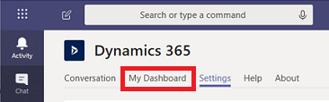

# Use the personal dashboard 

You can use the Dynamics 365 app for Microsoft Teams for your own use. If you want to work with other team members, consider the [team app](teams-collaboration.md).

## Navigate to your personal dashboard

1. From the Teams app > **More added apps** > **Dynamics 365** app.

   > [!div class="mx-imgBorder"] 
   > 

2. Select the **My Dashboard** tab.

 > [!div class="mx-imgBorder"] 
 > 

## My Dashboard tab

Select the **My Dashboard** tab to view your  app dashboard in Microsoft Teams. The dashboard displayed is based on who is signed in and their user role.

> [!div class="mx-imgBorder"]

## Settings tab

If you have more than one environment or app, you can use the **Settings** tab to select a different environment or app to appear as a dashboard.

> [!div class="mx-imgBorder"]

> [!NOTE]
> - Only environments (version 9.x or later) with customer engagement apps in Dynamics 365 (Dynamics 365 Sales, Dynamics 365 Customer Service, Dynamics 365 Field Service, Dynamics 365 Marketing, and Dynamics 365 Project Service Automation) that are active, appear in the list (those that are not disabled).
> - Only Unified Interface apps are listed.
> - Only app modules licensed for the selected environment are listed. 

[!INCLUDE[footer-include](../includes/footer-banner.md)]