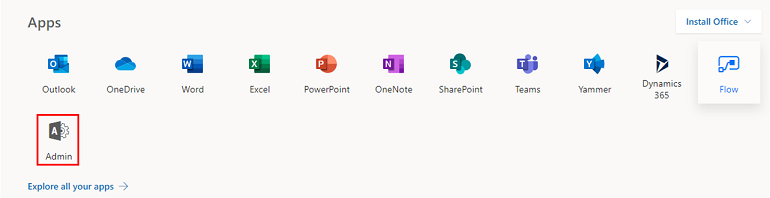
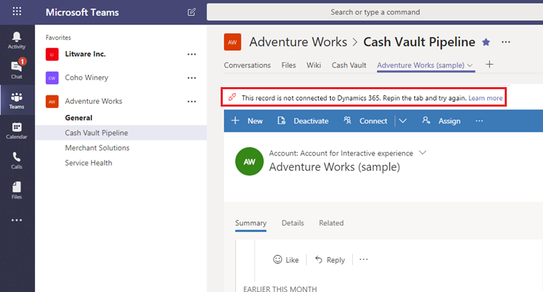
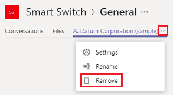
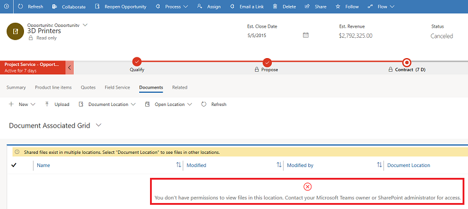
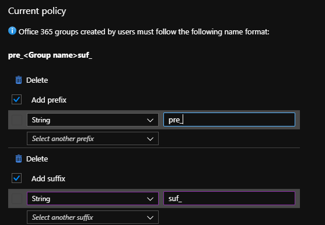

# Troubleshoot Microsoft Teams integration with customer engagement apps in Dynamics 365

This topic provides information about the error messages you might face with possible resolutions and some known issues.

## Troubleshoot configuration issues with Microsoft Teams integration

Microsoft Teams integration uses SharePoint integration at the backend, so if there is a failure with SharePoint integration or OneDrive configuration, it will also fail when you enable Microsoft Teams integration.

If you get an error while configuring Microsoft Teams Integration from Dynamics 365, it might be because of the following pre-requisites are not met.

- SharePoint Integration is not configured, and OneDrive Integration is enabled. To Fix the issue, disable OneDrive.

- SharePoint Integration is not configured, but there is an active SharePoint site in your organization. To fix the issue, deactivate the SharePoint site.

- SharePoint Integration is not configured, but there is SharePoint document locations created with an absolute URL in your organization. To fix the issue, delete locations with an absolute URL.

- If SharePoint Online admin has enabled control access from unmanaged devices (conditional access policy) to allow/block SharePoint sites from unmanaged devices, then the same restrictions will be applied for Microsoft Teams integration because Microsoft Teams uses SharePoint sites for document management. This might block a user when they try to access a connected team channel file library on an app page. For more information, see [Control access from unmanaged devices](https://docs.microsoft.com/sharepoint/control-access-from-unmanaged-devices). 

- If you get this error: **You cannot enable Microsoft Teams integration since the environment is integrated with SharePoint on-premises**, this means that you are currently configured to use SharePoint on-premises for document management. You need to set up document management for customer engagement apps to use SharePoint Online. For more information, see [Set up apps to use SharePoint Online](https://docs.microsoft.com/power-platform/admin/set-up-dynamics-365-online-to-use-sharepoint-online).

### Error when you pin a record or view of any app to a team channel if the enhanced experience is not configured correctly by your customer engagement apps admin.

Error: **The admin has not consented to use user sync feature, you can add them manually**.

When you turn on enhanced Microsoft Teams Integration, there are two dialog boxes that you need to accept. On the second dialog box, when you don't check the **Consent on behalf of organization** check box, then users will get this error when they try to pin an entity record or view to Microsoft Teams and share the tab with another user.

   > [!div class="mx-imgBorder"] 
  > 

To fix the issue, disable the Enhanced Microsoft Teams integration feature.

1. Go to, [https://portal.azure.com](https://portal.azure.com).
2. Select **Azure Active Directory** > **Enterprise**.
3. In the list of apps go to, **Dynamics 365 Microsoft Teams collaboration integration**.
    > [!div class="mx-imgBorder"] 
    > !Go to [Dynamics 365 Microsoft Teams collaboration integration ](media/error2.png "Go toDynamics 365 Microsoft Teams collaboration integration")
4. Delete the app.
    > [!div class="mx-imgBorder"] 
    > 
5. Wait for about five minutes and then enable the [Enhanced Microsoft Teams Integration](teams-install-app.md) feature again. This time make sure that you to check the **Consent on behalf of organization** checkbox.

### Error when you pin a record or view of any app to a team channel if your user role permission is not configured correctly by your customer engagement apps system admin.

Error: **User does not have permissions to create SharePoint Site or Document Location. This record is not connected to Dynamics 365**.

This means the user that is getting this error does not have sufficient permissions such as Create, Read, Write, Append, AppendTo and Delete for the user role to pin an entity to a Microsoft Teams channel; however, changes made to the record in Microsoft Teams will update in customer engagement apps in Dynamics 365.

When the user tries to pin an entity to a Microsoft Teams channel, this error will display in the notification bar:

   > [!div class="mx-imgBorder"]
   > 

To fix the issue, do the following:

1. In Microsoft Teams, select the channel with this error.
2. Select the tab with this error.
3. Select the down arrow next to the tab, then select **Remove**.
4. In your app, identify the role which is assigned to this user:
     1. Sign in as an admin to your customer engagement app.
     2. Navigate to **Settings** > **Security** > **Users**. 
     3. Find and select the user account that got the error message to open it.
     4. Select **Manage Roles**.
     5. Identify the security role assigned to this user.
     6. Select **Close**.
5. Navigate to **Settings** > **Security** > **Security Roles**.
6. Open the security role identified above.
7. Go to the **Core Records** tab.
8. Give Create, Read, Write, Append, AppendTo and Delete permissions to **SharePoint Site** and **Document Location**.
9. Select **Save and Close**.

Now, when the user tries to pin the entity to the required Microsoft Teams channel, it should work.

## Troubleshoot errors in Microsoft Teams

### Error: I can't find the Dynamics 365 app in the Microsoft Teams app store.

This happens when the external app for Microsoft Teams service is not enabled by your Microsoft 365 admin. To fix the issue, do the following:

1. Sign in to [https://portal.office.com](https://portal.office.com).
2. From the list of apps, select **Admin**.

   > [!div class="mx-imgBorder"] 
   > 
   
3. From the menu select **Settings** > **Services & add-ins**.

   > [!div class="mx-imgBorder"] 
   > 
   
4. Find Microsoft Teams and then enable **External Apps**. 

   > [!div class="mx-imgBorder"] 
   > 
   
5. Set **Allow external app in Microsoft Teams** to **On**.
   > [!div class="mx-imgBorder"] 
   > 

6. Restart Microsoft Teams and then try searching for **Dynamics 365** again in the Microsoft Teams app store.

### Error: Sorry, the environment you selected is not up-to-date or is not supported. Please select another environment.

> [!div class="mx-imgBorder"] 
> 

Or, you may get this error:

### Error: Sorry! Your Dynamics 365 environment is not the latest version and is not supported for this feature. Please select a different environment or contact your Dynamics 365 admin to do an update.

> [!div class="mx-imgBorder"] 
> 

The customer engagement app environment that you are trying to connect does not support Microsoft Teams integration. You can wait for the environment to be updated or pick a different environment that has been updated to support Microsoft Teams integration.

### Error: This record is not connected to Dynamics 365. Repin the tab and try again.

A failed connection means file synchronization is not set up between Microsoft Teams and customer engagement apps in Dynamics 365; however, changes made to the record in Microsoft Teams will update in the customer engagement app.

This is how the error will display on the notification bar:

> [!div class="mx-imgBorder"] 
> 

> [!IMPORTANT]
> When you first create a new team and channel in Microsoft Teams, you might see this error because it takes some time for Microsoft Teams to provision a new SharePoint file library for the channel. Wait a few minutes, and then refresh your browser to retry the connection.

Try repinning the Dynamics 365 tab. To repin, remove the tab, and then re-add, as follows:

1. In Microsoft Teams, select the channel with the error.
2. Select the Dynamics 365 tab with the error.
3. Select the down arrow next to the tab, and then select **Remove**.

   > [!div class="mx-imgBorder"] 
   > 

4. On the same channel, select the **Add** button ().

   > [!div class="mx-imgBorder"] 
   > 

5. Continue through the steps as in [Collaborate with Microsoft Teams](teams-collaboration.md).

## Error messages in customer engagement apps in Dynamics 365 

### Error: File sharing is not set up. Go to [URL] to connect a Microsoft Teams channel to this record.

> [!div class="mx-imgBorder"] 
> 

This record has not been connected to a Microsoft Teams channel. Select the URL to go to the Dynamics 365 Microsoft Teams app and pin the record to a channel as documented in [Collaborate with Microsoft Teams](teams-collaboration.md).

### Error: You don't have permissions to view files in this location. Contact your Microsoft Teams owner or SharePoint administrator for access.

> [!div class="mx-imgBorder"] 
> 

You need to be a member of the connected team channel to view files. Contact the owner of the connected team channel, and request to be added as a member. You need to determine the location of the document to which you need permission.

1. In your app, open the record with the permissions error message.
2. Select **Related** > **Documents**.  
  
   > [!div class="mx-imgBorder"] 
   > 

3. Select **Document Location**. The first item in the list shows the team for which you need membership. Request access from the team channel owner.
  
   > [!div class="mx-imgBorder"] 
   > 

## Known issues

### Embedded Power Apps canvas apps don't work 

You can [embed a canvas app](https://docs.microsoft.com/powerapps/maker/model-driven-apps/embed-canvas-app-in-form) in customer engagement apps (such as Dynamics 365 Sales and Dynamics 365 Customer Service) as they have the same design and underlying architecture of a [model-driven app](https://docs.microsoft.com/powerapps/maker/model-driven-apps/model-driven-app-overview). However, when you embed a customer engagement app in Microsoft Teams, the embedded canvas app won't work. 

### Authentication issue in Teams when you have embedded apps within Dynamics 365

You may get an authentication failure when you open a pinned Dynamics 365 tab in Teams desktop client that has apps, such as Power BI, LinkedIn Navigation widget, or KnowledgeBase Control enabled. 

To work around this issue, open Teams on the web and close the desktop version. 

### Error while creating a team or channel. The property is missing a required prefix/suffix per your organization's Group naming requirements. 

A user may get this error when they try to connect a record or a view to a team channel using the **Collaborate** button in a customer engagement app in Dynamics 365. This happens if your tenant admin has configured group level naming policy from Azure portal with a prefix and suffix condition 

   > [!div class="mx-imgBorder"] 
   > 

To work around this issue, your tenant admin will need to remove this policy from Azure portal.

### Error while creating a team or channel. The displayName cannot contain the blocked word 'blocked' as per company policy.

A user may get this error when they try to connect a record or a view to a team channel using the **Collaborate** button in a customer engagement app in Dynamics 365. This happens when your tenant admin creates a custom blocked word list on Azure portal.

To work around this issue, your tenant admin will need to remove this policy from Azure portal.

### Error: Blocked a frame with origin from accessing a cross-origin frame

A few pages in customer engagement apps in Dynamics 365 can only be opened in a browser window as they make use of JavaScript functions trying to access DOM elements and properties through `window.top` which is not supported to load within Microsoft Teams. When this page is opened without any iframe then it works fine as top most window’s context is customer engagement app page and required attributes and properties are available. Whereas when this same page is opened within Microsoft Teams, it's actually loaded inside an iframe where `window.top` represents top most window context which is Microsoft Teams window and not the customer engagement app page. Hence it's not able to find relevant attributes and properties which lead to showing of error message **Blocked a frame with origin from accessing a cross-origin frame** in the browser console. For example, if you open the schedule board page for Dynamics 365 Project Service Automation within Microsoft Teams, you will get this error.

To work around this, open the page in your customer engagement app and not in Microsoft Teams.

If the page which is showing the error message, contains a custom resource (JavaScript, custom control etc.), please ensure `window` is not used in the JavaScript as it may cause the page to not load at all or not load properly. For more information, see [Avoid using window top](https://docs.microsoft.com/powerapps/developer/model-driven-apps/best-practices/business-logic/avoid-window-top).

### Documents can be accessed in your customer engagement app using the Documents tab in an entity record even after user has left the team.

Whenever a member leaves the team where an entity record was pinned, the **Files** tab in Microsoft Teams which shows the documents shared in the team won’t be visible anymore as the user would lose access to the team. However, the user can still go to the customer engagement app in Dynamics 365 and access the record that was pinned in the team and can access files in the **Documents** tab in the **Related** section.

To disable the user from accessing to the documents in the record from the customer engagement app, an admin can remove the access of the record to the user or control the permission using the SharePoint site permissions.

[!INCLUDE[footer-include](../includes/footer-banner.md)]