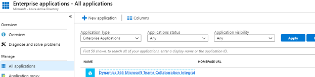

# Troubleshoot Teams integration 

The following are error messages with possible resolutions.

## Troubleshoot configuration issues with Microsoft Teams integration

Microsoft Teams integration uses SharePoint integration at the backend, so if there is a failure with SharePoint integration or OneDrive configuration, it will also fail when you enable Teams integration.

If you get an error while configuring Microsoft Teams Integration from Dynamics 365, it might be because of the following pre-requisites is not met.

- SharePoint Integration is not configured, and OneDrive Integration is enabled. To Fix the issue, disable OneDrive.

- SharePoint Integration is not configured but there is an active SharePoint Site in your organization. To fix the issue, deactivate the SharePoint site.

- SharePoint Integration is not configured but there is SharePoint document locations created with an absolute URL in your organization. To fix the issue, delete locations with an absolute URL.

- If SharePoint Online admin has enabled Control access from unmanaged devices (conditional access policy) to allow/block SharePoint sites from unmanaged devices, then same restrictions will be applied for Microsoft Teams integration, because Microsoft teams uses SharePoint sites for document management. This might block a user when they try to access a connected team channel file library on a model-driven app page. For more information, see [Control access from unmanaged devices](https://docs.microsoft.com/en-us/sharepoint/control-access-from-unmanaged-devices). 

- If you get this error: **You cannot enable Microsoft Teams integration since the environment is integrated with SharePoint on-premises**. This means are currently configured to use SharePoint on-premises for document management. You need to set up document management for model-driven apps in Dynamics 365 to use SharePoint Online. For more information, see [Set up model-driven apps in Dynamics 365 to use SharePoint Online](https://docs.microsoft.com/en-us/power-platform/admin/set-up-dynamics-365-online-to-use-sharepoint-online).

### Error when you pin a record or view of any model-driven app to a team channel if the enhanced experience is not configured correctly by your Common Data Service admin.

Error: **The admin has not consented to use user sync feature, you can add them manually**.

When you turn on enhanced Microsoft Teams Integration, there is two dialog boxes that you need to accept. On the second dialog box, when you don't check the **Consent on behalf of organization** check box, then users will get this error when they try to pin an entity record or view to Teams and share the tab with another user.

   > [!div class="mx-imgBorder"] 
  > 

To fix the issue, disable the Enhanced Microsoft Teams integration feature.

1. Go to, [https://portal.azure.com](https://portal.azure.com).
2. Select **Azure Active Directory** > **Enterprise**.
3. In the list of apps go to, **Dynamics 365 Microsoft Teams collaboration integration**.
    > [!div class="mx-imgBorder"] 
    > 
4. Delete the app.
    > [!div class="mx-imgBorder"] 
    > 
5. Wait for about five minutes and then enable the [Enhanced Microsoft Teams Integration](teams-install-app.md) feature again. This time make sure that you to check the **Consent on behalf of organization** checkbox.

### Error when you pin a record or view of any model-driven app to a team channel if your user role permission is not configured correctly by your Common Data Service system admin.

Error: **User does not have permissions to create SharePointSite or DocumentLocation. This record is not connected to Dynamics 365**.

This means the user that is getting this error does not have sufficient permissions that is required for the  user role to pin an entity to a Teams channel. However, changes made to the record in Teams will update in model-driven apps in Dynamics 365.

When the user tries to pin an entity to a Teams channel, this error will display in the notification bar:

   > [!div class="mx-imgBorder"]
   > 

To fix the issue, do the following:

1. In Microsoft Teams, select the channel with this error.
2. Select the tab with this error.
3. Select the down arrow next to the tab, then select **Remove**.
4. In your app, identify the Common Data Service role which is assigned to this user:
     1. Sign in as a admin to your Common Data service app.
     2. Navigate to **Settings** > **Security** > **Users**. 
     3. Find and select the user account that got the error message to open it.
     4. Select **Manage Roles**.
     5. Identify the security role assigned to this user.
     6. Select **Close**.
5. Navigate to **Settings** > **Security** > **Security Roles**.
6. Open the security role identified above.
7. Go to the **Core Records** tab.
8. Give **Create** permissions to **SharePoint Site** and **Document Location**.
9. Select **Save and Close**.

Now when the user tries to pin the Common Data Service entity to the required Teams channel, it should work.

## Troubleshoot errors in Microsoft Teams

### Error: I can't find the Dynamics 365 app in the Teams app store.

This happens when the external app for Microsoft Teams service is not enabled by your Office 365 admin. To fix the issue, do the following:

1. Sign in to [http://portal.office.com](http://portal.office.com).
2. From the list of apps, select **Admin**.

   > [!div class="mx-imgBorder"] 
   > 
   
3. From the menu select **Settings** > **Services & add-ins**.

   > [!div class="mx-imgBorder"] 
   > 
   
4. Find Microsoft Teams and then enable **External Apps**. 

   > [!div class="mx-imgBorder"] 
   > 
   
5. Set **Allow external app in Microsoft Teams** to **On**.
   > [!div class="mx-imgBorder"] 
   > 

6. Restart Microsoft Teams and then try seaching for **Dynamics 365** again in the Teams app store.

### Error: Sorry, the environment you selected is not up-to-date or is not supported. Please select another environment.

> [!div class="mx-imgBorder"] 
> 

Or, you may get this error:

### Error: Sorry! Your Dynamics 365 environment is not the latest version and is not supported for this feature. Please select a different environment or contact your Dynamics 365 admin to do an update.

> [!div class="mx-imgBorder"] 
> 

The Common Data Service environment that you are trying to connect does not support Microsoft Teams integration. You can wait for the environment to be updated or pick a different environment that has been updated to support Teams integration.

### Error: This record is not connected to Dynamics 365. Repin the tab and try again.

A failed connection means file synchronization is not set up between Microsoft Teams and Dynamics 365 apps. However, changes made to the record in Teams will update in the model-driven apps in Dynamics 365.

This is how the error will display on the notification bar:

> [!div class="mx-imgBorder"] 
> 

> [!IMPORTANT]
> When you first create a new team and channel in Microsoft Teams, you might see this error because it takes some time for Microsoft Teams to provision a new SharePoint file library for the channel. Wait a few minutes and then refresh your browser to retry the connection.

Try repinning the Dynamics 365 tab. To repin, remove the tab and then re-add, as follows:

1. In Microsoft Teams, select the channel with the error.
2. Select the Dynamics 365 tab with the error.
3. Select the down arrow next to the tab, and then select **Remove**.

   > [!div class="mx-imgBorder"] 
   > 

4. On the same channel, select the **Add** button ().

   > [!div class="mx-imgBorder"] 
   > 

5. Continue through the steps as in [Collaborate with Teams](teams-collaboration.md).

## Error messages in model-driven apps in Dynamics 365 

### Error: File sharing is not set up. Go to [URL] to connect a Microsoft Teams channel to this record.

> [!div class="mx-imgBorder"] 
> 

This record has not been connected to a Teams channel. Select the URL to go to the Dynamics 365 Teams app and pin the record to a channel as documented in [Collaborate with Teams](teams-collaboration.md).

### Error: You don't have permissions to view files in this location. Contact your Microsoft Teams owner or SharePoint administrator for access.

> [!div class="mx-imgBorder"] 
> 

You need to be a member of the connected channel team to view files. Contact the connected channel team owner and request to be added as a member. You need to determine the document location for which to request membership.

1. In your app, open the record with the permissions error message.
2. Select **Related** > **Documents**.  
  
   > [!div class="mx-imgBorder"] 
   > 

3. Select **Document Location**. The first item in the list shows the team for which you need membership. Request access from the channel team owner.
  
   > [!div class="mx-imgBorder"] 
   > 

