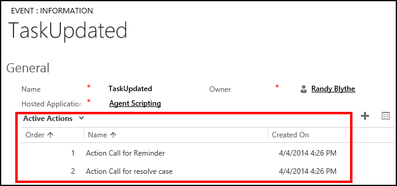

# Add action calls to an event
You can add multiple action calls to an event, and the action calls will be executed in the order that is defined in the **Order** field of the event definition. To do so:  
  
1. Sign in to the Common Data Service platform.  
  
2. [!INCLUDE[proc_settings_usd](../includes/proc-settings-usd.md)]  
  
3. Click **Events**.  
  
4. On the events list page, click the name of the event in the **Name** column that you want to add the action call to. This opens the event page.  
  
5. On the event page, under the **Active Actions** area, click **+** to add action calls.  
  
     
  
6. A search box appears where you can search for the action call that you want to add to the event, if you want to create a new action call. After you search and select the required action call, it appears under the **Active Actions** area.  
  
7. Perform steps 5 and 6 for each action call you want to add.  
  
8. If you have added multiple action calls, double-click on each of the added action call record, specify the **Order** value, and then save the action call record. The order values are updated in the **Active Actions** area.  
  
     
  
9. Click **Save**.  
  
### See also  
 [Action calls](../unified-service-desk/action-calls.md)   
 [Events](../unified-service-desk/events.md)   
 [Manage hosted controls, actions, and events](../unified-service-desk/manage-hosted-controls-actions-events.md)
