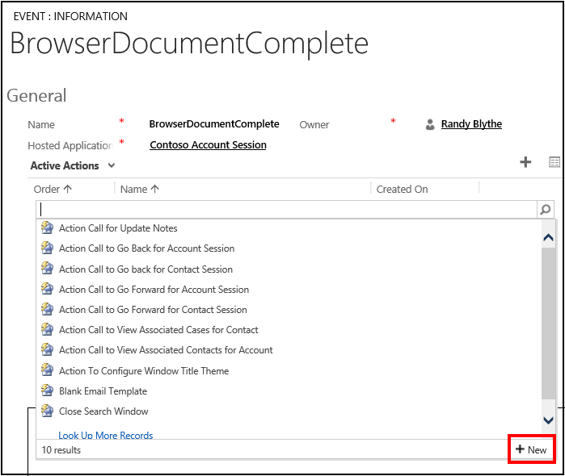

# Add action calls to an event
You can add multiple action calls to an event, and the action calls will be executed in the order that is defined in the **Order** field of the event definition. To do so:  
  
1. Sign in to Unified Service Desk Administrator.  
  
2. Select **Events** under **Basic Settings**.  
  
3. Select an event from the list for which you want to add the action call. This opens the event page.

4. Select the **Related** tab and select **Action Calls**.

5. Select **Add Existing Action Call**. The **Lookup Records** pane is displayed.

6. Type the name of the action call in the search box, and then select the action call that you want to add from the list. You can select as many action calls from the **Look Records** pane. After selecting the action calls, choose **Add**. 
  
    
  
7. If you have added multiple action calls, double-click on each of the added action call record, specify the **Order** value, and then save the action call record. The order values are updated in the **Active Actions** area.   
  
8. Select **Save**.  
  
### See also  
 [Action calls](../unified-service-desk/action-calls.md)   
 [Events](../unified-service-desk/events.md)   
 [Manage hosted controls, actions, and events](../unified-service-desk/manage-hosted-controls-actions-events.md)

[!INCLUDE[footer-include](../includes/footer-banner.md)]