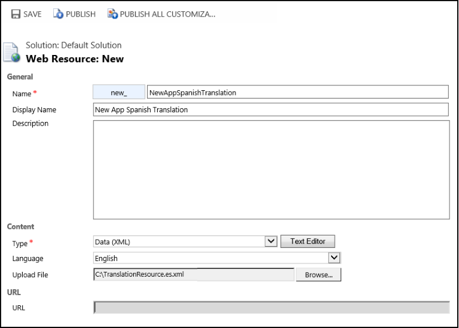

# Add and manage multi-language support (localized resources) for your agent applications

[!INCLUDE[cc-data-platform-banner](../includes/cc-data-platform-banner.md)]

[!INCLUDE[pn_unified_service_desk](../includes/pn-unified-service-desk.md)] enables you to bundle in localized strings for your controls interface so that they appear in the language based on the locale settings of the user’s computer. The multi-language support is available for all the components except for those that are surfaced through [!INCLUDE[pn_customer_care_accelerator](../includes/pn-customer-care-accelerator.md)], which doesn’t support multi-language scenarios. This includes the hosted control tab names.  

If you use web resource to link the button text to strings, then the web resource chooses the language based on your Dynamics 365 model-driven app environment settings. In addition, the app pages are rendered in the language set on the app environment settings. 

Rest of the strings that is rendered by default on Unified Service Desk client application are rendered in the language set on your operating system.
  
 To provide localized resources for your component:  
  
1. Start by creating an XML file using the [!INCLUDE[pn_ASP.NET_short](../includes/pn-asp-net-short.md)]resx formatting. Here’s an example of this format.  
  
   ```xml  
   <root>  
     <data name="Welcome">  
       <value>My Translated Welcome</value>   
     </data>  
   </root>  
   ```  
  
    Each term that you want to provide a translation for must be included in a data element with a name and a value child with the translation.  
  
2. Save the file with the language identifier in the file name. For example, if you have Spanish resources, you can save the file with the name “TranslationResource.es.xml.”  
  
3. Upload the file as a web resource to Microsoft Dataverse. Name the web resource so that you can identify the language of the string resources in it.  
  
   1. Sign in to the Dynamics 365 instance.  
  
   2. Go to **Settings** > **Customizations** ([How do I get there?](https://go.microsoft.com/fwlink/p/?LinkId=525636))  
  
   3. Click **Customize the System** to add the web resources to the default solution.  
  
   4. On the **Default Solution** page, click **Web Resources**, and then click **New**.  
  
   5. On the new web resource page, specify the name of the web resource, select **Data (XML)** as the type, **English** as the language, and then select your .xml file.  
  
     
  
   6.  Save and publish the web resource.  
  
4. After publishing the web resource for your language resource file, add the web resource to your **Global Manager** hosted control.  
  
   1. Sign in to Unified Service Desk Administrator.

   2. Select **Hosted Controls** under **Basic Settings**.  
  
   2. Select **CRM Global Manager** from the list.  
  
      > [!NOTE]
      > **CRM apps Global Manager** is the name of the default **Global Manager** hosted control type in [!INCLUDE[pn_unified_service_desk](../includes/pn-unified-service-desk.md)]. If you have a Global Manager hosted control with different name, select it instead.  
  
   3. On the **CRM Global Manager** page, select the **Language Services** tab, select **+ New Language Module** to add a language module record.  

   4.  On the **New Language Module** page, specify the name, LCID, and the name of the web resource that contains the translation file.  
  
        The LCID should be populated with a value that represents the language that this resource represents. [View the list of locale IDs](https://msdn.microsoft.com/library/ms912047\(WinEmbedded.10\).aspx).  
  
     
  
   > [!IMPORTANT]
   >  If you use language services, you should always configure language services for your base Dataverse language. In this example, add an English language service as well. The base language translation file is always used if someone uses a language pack in Dataverse that doesn’t have a translation file in [!INCLUDE[pn_unified_service_desk](../includes/pn-unified-service-desk.md)] language services.  
  
5. Select **Save**.  
  
## Use the translated text  
 To use the translated text, refer to the entry using a replacement parameter as shown here.  
  
```xml  
[[$Resources.Welcome]]  
```  
  
 This can be used anywhere that you use a replacement parameter and the translation file may contain other replacement parameter as well. The language translation will be substituted first and then the other replacement parameters will be applied. These can be used for names of buttons, text of agent scripts, or wherever you can use replacement parameters.  
  
### See also  
 [Global Manager (Hosted Control)](../unified-service-desk/global-manager-hosted-control.md)


[!INCLUDE[footer-include](../includes/footer-banner.md)]