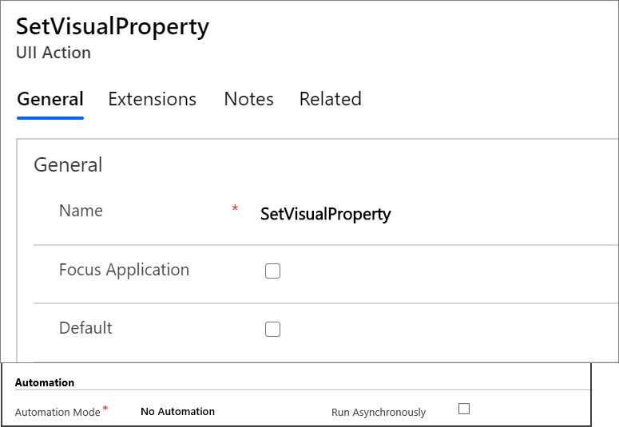

# Add a UII action to a hosted control
As new versions of [!INCLUDE[pn_unified_service_desk](../includes/pn-unified-service-desk.md)] are developed, new [!INCLUDE[pn_user_inteface_integration_uii](../includes/pn-user-interface-integration-uii.md)] actions might get added to a hosted control type to provide new functionality. However, the new [!INCLUDE[pn_uii_acronym](../includes/pn-uii-acronym.md)] actions for a hosted control type will only be available out-of-box for the new instances of the hosted control type. If you have existing instances of a hosted control type in your configuration, the new [!INCLUDE[pn_uii_acronym](../includes/pn-uii-acronym.md)] actions won’t become available by default. You will have to manually add the [!INCLUDE[pn_uii_acronym](../includes/pn-uii-acronym.md)] action to the hosted control record (instance) to be able to use the action in your action calls.  
  
> [!NOTE]
>  You must manually add the [!INCLUDE[pn_uii_acronym](../includes/pn-uii-acronym.md)] action to a hosted control instance only if it is supported for the type of hosted control instance. Otherwise, the action won’t work for the hosted control instance.  
  
 To add a [!INCLUDE[pn_uii_acronym](../includes/pn-uii-acronym.md)] action to an existing hosted control instance:  
  
1. Sign in to Unified Service Desk Administrator.
  
2. Select **Hosted Controls** under **Basic Settings**.  
  
3. Select an existing hosted control record for which you want to add a [!INCLUDE[pn_uii_acronym](../includes/pn-uii-acronym.md)] action.

4. Select the **Related** tab and then select **UII Actions**. 
  
5. Select **+ New UII Action**.
  
6. On the **New UII Action** page, specify the name of the [!INCLUDE[pn_uii_acronym](../includes/pn-uii-acronym.md)] action in the **Name** field, and then select **Save and Close**. You don’t have to specify any other value on this page.  
  
     
  
    The new [!INCLUDE[pn_uii_acronym](../includes/pn-uii-acronym.md)] action gets added to the hosted control instance, and can be used in your action calls.  
  
### See also  
 [Create an action call for a UII action](../unified-service-desk/create-action-call-uii-action.md)
 
 [Manage hosted controls, actions, and events](../unified-service-desk/manage-hosted-controls-actions-events.md)

[!INCLUDE[footer-include](../includes/footer-banner.md)]