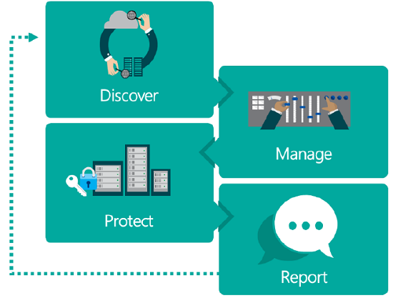

# Comply with privacy laws and regulations

## Introduction

[!INCLUDE [gdpr-intro](~/../shared-content/shared/privacy-includes/gdpr-intro.md)]

## Shared responsibility model
Your compliance with the privacy laws and regulations is an ongoing process and involves your role as a **controller** and, in some cases, Microsoft as a **processor**. 
Depending on which model-driven app your organization uses, you may find that you are both controller and processor or that you have a shared responsibility with Microsoft.

[!INCLUDE[pn_unified_service_desk](../../includes/pn-unified-service-desk.md)] client application runs on-premises, so you hold both the controller and processor roles:

- **Controller.** The natural or legal person, public authority, agency, or other body which, alone or jointly with others, determines the purposes and means of the processing of personal data. A controller doesn't have to be located within the EU for the privacy laws and regulations to apply.

- **Processor.** The natural or legal person, public authority, agency, or other body which processes personal data on behalf of the controller.

## Data definitions

 Any information related to an identified or identifiable natural person is considered as personal data. This includes both direct identification (such as your legal name) and indirect identification (such as specific information that makes it clear that it's you the data references).
Personal data also includes online identifiers (such as IP addresses and mobile device IDs) and location data.

## Stages of privacy laws and regulations

|Stages | Description|
|------|------|
|Discover|Identify what data under your control is subject to the privacy laws and regulations. This analysis includes understanding what data you have and where it exists.|
|Manage|The privacy laws provide more control over your data. You can manage access and control how data is used.|
|Protect|The privacy laws require you to establish security controls to prevent, detect, and respond to the vulnerabilities and data breaches.|
|Report|The privacy laws and regulations set new standards in transparency, accountability, execution, data requests, and report data breaches.|

## See also

[Unified Service Desk data compliance under privacy laws and regulations](comply-unified-service-desk-data-privacy-laws.md)

[!INCLUDE[footer-include](../../includes/footer-banner.md)]
