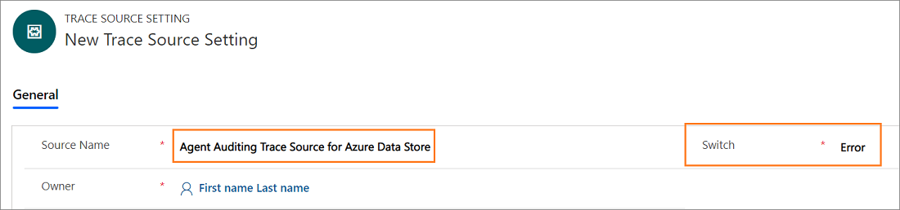
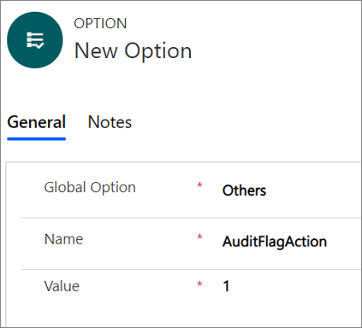

# Auditing and diagnostics overview

[!INCLUDE[cc-data-platform-banner](../../includes/cc-data-platform-banner.md)]

The **Audit & Diagnostics Settings** area provides centralized management for agent auditing and [!INCLUDE[pn_unified_service_desk](../../includes/pn-unified-service-desk.md)] application diagnostic logging.

 Agent auditing helps organizations analyze agent productivity, identify gaps in process, and provide coaching and training that can all be used to further improve the customer service experience. Audit data in [!INCLUDE[pn_unified_service_desk](../../includes/pn-unified-service-desk.md)] is channeled to a listener that gives you control over where you channel audit logging, such as to a text file, windows event log, or data store.  

 Diagnostic logging helps you troubleshoot issues that may occur with the [!INCLUDE[pn_unified_service_desk](../../includes/pn-unified-service-desk.md)] application.  

 When you configure auditing and diagnostics in [!INCLUDE[pn_unified_service_desk](../../includes/pn-unified-service-desk.md)], keep in mind the following functionality:  

- How [!INCLUDE[pn_unified_service_desk](../../includes/pn-unified-service-desk.md)] auditing and diagnostics are configured and recorded is completely separate from the audit feature in Microsoft Dataverse.  

- [!INCLUDE[pn_unified_service_desk](../../includes/pn-unified-service-desk.md)] auditing requires a Listener Hosted Control to record and save audit activity. Similarly, you can channel diagnostic logging using a Listener Hosted Control, but it’s not required, and by default, diagnostic logging is recorded on the local computer.  

### Audit and diagnostics configuration overview

1. Developer writes the code used for the custom listener. Typically, the custom listener is an assembly. More information: [Create custom listeners for auditing, diagnostics and traces](../../unified-service-desk/create-custom-listeners-auditing-diagnostics-traces.md)  

2. Developer compresses the assembly into a .zip package file. More information: [Create custom listeners for auditing, diagnostics and traces](../../unified-service-desk/create-custom-listeners-auditing-diagnostics-traces.md)  

3. Developer creates the Listener Hosted Control, which includes information about the assembly created in step 1. More information: [Listener Hosted Control (Hosted Control)](../../unified-service-desk/listener-hosted-control-hosted-control.md)  

4. [!INCLUDE[pn_unified_service_desk](../../includes/pn-unified-service-desk.md)] administrator creates an Audit & Diagnostics Settings record that defines what is audited or diagnosed. Additionally, the Listener Hosted Control is associated with the Audit & Diagnostics Settings record. More information: [Auditing](../../unified-service-desk/admin/configure-auditing-diagnostics-unified-service-desk.md#BKMK_Auditing)  

5. [!INCLUDE[pn_unified_service_desk](../../includes/pn-unified-service-desk.md)] administrator creates a Customization Files record and attaches the .zip package file that was created by the developer in the previous step. More information: [Distribute custom hosted controls using Customization Files](../../unified-service-desk/admin/distribute-custom-hosted-controls-using-customization-files.md)  

6. [!INCLUDE[pn_unified_service_desk](../../includes/pn-unified-service-desk.md)] administrator associates the Customization Files record with the appropriate Configuration. More information: [Assign users to a Unified Service Desk configuration](../../unified-service-desk/admin/manage-access-using-unified-service-desk-configuration.md#Assign)  

   
## Auditing  
 You can configure auditing in [!INCLUDE[pn_unified_service_desk](../../includes/pn-unified-service-desk.md)] in one of two ways:  

-   Standard or custom auditing using an Audit & Diagnostics record. This audit feature is centrally managed, has several events to choose from, and allows you to add a custom listener that determines where audit data is sent.  

-   Standard auditing by adding an audit flag and setting its value to 1 in the Options area. This audit feature has limited events and logs audit data in the UII_auditBase table in the organization database.  

> [!NOTE]
>  If you enable both an Audit & Diagnostics record and an audit flag option record, the audit flag option record will be ignored and will not record audit data.  

### Create an Audit & Diagnostics record to use for auditing

> [!Note]
> The procedure guides you to configure both auditing and diagnostics in a single record. Although you can configure individual records for auditing and diagnostics in the Audit & Diagnostics Settings record.

1. Sign in to the Dynamics 365 instance.

2. Select the down arrow next to Dynamics 365.

3. Select **Unified Service Desk Administrator**.

4. Select **Audit & Diagnostics Settings** under **Advanced Settings** in the site map.

5. Select **+ New** in the **Active Audit & Diagnostics Settings** page.

6. Type a name in the **Name** field. The name describes the purpose of the Audit & Diagnostics record, such as *All events auditing and Diagnostics information-level logging*.  

7. Select **Audit Settings** tab and select the **Activity Tracking Enabled** check box.
 
    This example is for tracking all events, so when you select **Activity Tracking Enabled**, all the check boxes are selected. Alternatively, you can clear the check box for any events you don’t want to audit for this record.

    You can also include diagnostics logging in this record. For more information see step 9.

8. Select **Save** to select the record. After saving the record, you can start updating the diagnostics settings.

   > [!NOTE]
   >  Audit and diagnostics settings records are activated when they are created.

9. Select **Diagnostics Settings** and specify the following.

    | Field | Value |
    |-----------------------------------|-----------------------------------------------------------------|
    | Enable Exit Monitoring | By default, exit monitoring is enabled and both diagnostics logs and exit logs are collected in the event of an exception in the [!INCLUDE[pn_unified_service_desk](../../includes/pn-unified-service-desk.md)] client. |
    | Diagnostics Logs Directory | Specifies the full path to the folder where diagnostics files for exceptions are kept. If the path is invalid or inaccessible, [!INCLUDE[pn_unified_service_desk](../../includes/pn-unified-service-desk.md)] will use the default folder. By default, the folder is `%APPDATA%\Roaming\Microsoft\Microsoft Dynamics 365 Unified Service Desk\<version>\Diagnostics\`. |
    | On-Demand Diagnostics Shortcut | Specifies the shortcut key used to invoke the manual creation of a  dump file. The default key combination is CTRL+ALT+A. To change the default, use the form *key1*+*key2*+*key3*.    **Note:** You can start the manual creation of a dump file using the **On-Demand Diagnostics Shortcut** key only when **Enable Exit Monitoring** or **Enable Crash Dump Generation**, or both options are enabled. |
    | Diagnostics Verbosity Level | Determines the type of events that will be recorded during diagnostics. The default value is error level.    <ul> <li>**Error:** Reports only error events. </li> <li>**Warning:**  Reports errors and warning events.</li> <li>**Information:** Reports errors, warnings, and information events.</li> <li>**Verbose:** Reports errors, warnings, information, and verbose events.</li> |
    | Enable Crash Dump Generation | The default is enabled and dump files are collected during a fatal exception of the [!INCLUDE[pn_unified_service_desk](../../includes/pn-unified-service-desk.md)] client. If the options is not set dump files will not be collected during a [!INCLUDE[pn_unified_service_desk](../../includes/pn-unified-service-desk.md)] client exception. If this options is disabled and Enable Exit Monitoring is enabled, both diagnostics logs and exit logs are collected, but dump files aren’t. |
    | Max Diagnostics Logs Size (MB) | Specifies the maximum size of the folder in megabytes where diagnostics files are kept. The default size is 5 GB (5000 MB). When the specified value is exceeded, the oldest log folders will be deleted until the folder size no longer exceeds the value. Notice that, the most recent log folder is not deleted even if it exceeds the value specified. |

11. Retain the values for the **On-Demand Begin Shortcut** and **On-Demand End Shortcut**. To learn more, see [Generate performance data logs (Performance data collection)](../admin/performance-data-collection-using-keyboard-shortcut.md).

12. Add a Trace Source Setting record in the Trace Source Settings section. The Trace Source Setting includes the Listener Hosted Control that is used to channel the audit and diagnostic activity to a data store, event log, or text file. To create a Trace Source Setting record, follow these steps.  

   > [!IMPORTANT]
   >  You must provide a Trace Source Setting record that contains a valid Listener Hosted Control that will be used to record the audit activity, or the audit activity will not be saved. For information about how to create a Listener Hosted Control, see [Create custom listeners for auditing, diagnostics and traces](../../unified-service-desk/create-custom-listeners-auditing-diagnostics-traces.md).  

  1. Select **Add Existing Trace Setting** in the Trace Source Settings section. The **Lookup Records** pane appears.
    

  2. Type the name to search for the Trace Source Settings record. If the record is not available, you must select **+ New** to create a new trace source setting page. When you select **+ New**, a confirmation dialog appears. Ensure that you've saved the record before leave the page. Now, when you select **OK**, the **New Trace Source Setting** page appears.

  

  3. Type the source name such as *Agent Auditing Trace Source for Azure Data Store*.

     

  4. Select **Save**. After you save the trace source setting record, the **Listener Hosted Controls** section appears.

  5. Retain the value of Switch as **Error**. Error is the default value.

  6. Select **Add Existing Hosted Control** in the Listener Hosted Controls section. The **Lookup Records** pane appears.

  7. Type the name of the hosted control that will be used for agent auditing, and choose the hosted control from the list, and then select **Add**.

  8. Select **Save**.

13. After you create the trace source setting, select **Auditing & Diagnostics Settings** in the site map and select the auditing and diagnostics record.

14. Select **Diagnostics Settings** tab and select **Add Existing Trace Setting** in the Trace Source Settings section. The **Lookup Records** pane appears. Type the name of trace source setting record you created in the search box, and select **Add**.

     

15. Select the **User Schema Settings** tab.

16. Select the user entities and select the **>** to add.

     

17. Select **Save** to save the Audit & Diagnostics record.

18. Next, to begin audit logging, associate the audit & diagnostic record with a configuration. To do this, create a configuration or use an existing configuration. Select **configuration** in the site map and then select the a record from the list of the configuration.

19. Type the name of the audit and diagnostic record in the **Audit & Diagnostics Settings** field, and then Select **Save** to save the configuration record. To learn more, see [Manage access using Unified Service Desk configuration](../../unified-service-desk/admin/manage-access-using-unified-service-desk-configuration.md)

### Standard auditing by adding an audit flag  

1. Sign in to the Dynamics 365 instance.

2. Select the down arrow next to Dynamics 365.

3. Select **Unified Service Desk Administrator**. 

4. Select **Options** under **Advance Settings** in the sitemap.

5. Select **New** in the **Active UII Options** page.  

6. Type an audit flag name in the **Name** field and an appropriate value in the **Value** field.  

     

   You can use the audit flags listed in this table.

   |         Audit flag         |    Description    |
   |----------------------------|--------------------------------------------------------------------------------------------------------------------------------------------------------------------------------------------|
   |     AuditCacheMaxSize      | When this flag value is set to **1**, the number of audit records cached before saving to the server is 1 record.   This option works only if the **AuditNoCache** is **False**. |
   |      AuditFlagAction       |  When this flag value is set to **1**, audit records are created when an action is fired. |
   |    AuditFlagAgentState     | When this flag value is set to **1**, audit files are created when the status of the agent changes. |
   | AuditFlagHostedApplication | When this flag value is set to **1**, audit files are created when a hosted application is started or gets focus. |
   |       AuditFlagLogin       | When this flag value is set to **1**, audit records are created when an agent logs in. |
   |      AuditFlagSession      | When this flag value is set to **1**, audit records are created when a session is created or there is a session switch. |
   |     AuditFlagWorkflow      | When this flag value is set to **1**, audit records are created when a UII workflow is started or closed. |
   |        AuditNoCache        | If this is set to **True**, audit records are saved dynamically to the server without any caching. |

7. Select **Save**.  

8. To view audit logging, sign in to the Dynamics 365 instance, and then from a productivity area select **Advanced Find**. In the **Look for** list, select `UII Audit`, and then select **Results** to see all audit logging details.
  

   
## Deactivate or activate an Audit & Diagnostics Settings record

### Deactivate a record

1. Sign in to the Dynamics 365 instance.

2. Select the down arrow next to Dynamics 365.

3. Select **Unified Service Desk Administrator**.

4. Select **Audit & Diagnostics Settings** under **Advanced Settings** in the site map.

5. Select the record you want to deactivate from the **Active Audit & Diagnostics Settings** view.  

6. Select **Deactivate** on the toolbar.

7. Select **Deactivate** in the **Confirm Deactivation** dialog.

The audit and diagnostics record is deactivated.

### Activate a record

1. Sign in to the Dynamics 365 instance.

2. Select the down arrow next to Dynamics 365.

3. Select **Unified Service Desk Administrator**.

4. Select **Audit & Diagnostics Settings** under **Advanced Settings** in the site map.

5. Select the **v** down arrow next to **Active Audit & Diagnostics Settings** and choose **Inactive Audit & Diagnostics Settings**.

6. Select the record you want to deactivate from the **Inactive Audit & Diagnostics Settings** view.

7. Select **Activate** on the toolbar.

8. Select **Activate** in the **Confirm Audit & Diagnostics Setting Activation** dialog.

The audit and diagnostics record is activated.

## See also  
 [Manage Options for Unified Service Desk](../../unified-service-desk/admin/manage-options-unified-service-desk.md)   
 [Global Manager (Hosted Control)](../../unified-service-desk/global-manager-hosted-control.md)   
 [Administer and manage overview](../../unified-service-desk/admin/administer-manage-unified-service-desk.md)
 [Performance data collection using keyboard shortcut](../../unified-service-desk/admin/performance-data-collection-using-keyboard-shortcut.md)

[!INCLUDE[footer-include](../../includes/footer-banner.md)]