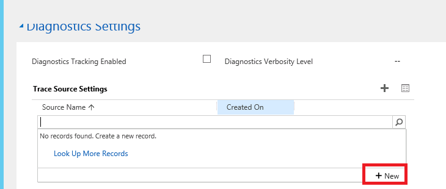
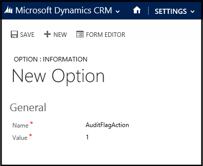

# Auditing and diagnostics overview
The **Audit & Diagnostics Settings** area provides centralized management for agent auditing and [!INCLUDE[pn_unified_service_desk](../../includes/pn-unified-service-desk.md)] application diagnostic logging.  
  
 Agent auditing helps organizations analyze agent productivity, identify gaps in process, and provide coaching and training that can all be used to further improve the customer service experience. Audit data in [!INCLUDE[pn_unified_service_desk](../../includes/pn-unified-service-desk.md)] is channeled to a listener that gives you control over where you channel audit logging, such as to a text file, windows event log, or data store.  
  
 Diagnostic logging helps you troubleshoot issues that may occur with the [!INCLUDE[pn_unified_service_desk](../../includes/pn-unified-service-desk.md)] application.  
  
 When you configure auditing and diagnostics in [!INCLUDE[pn_unified_service_desk](../../includes/pn-unified-service-desk.md)], keep in mind the following functionality:  
  
-   How [!INCLUDE[pn_unified_service_desk](../../includes/pn-unified-service-desk.md)] auditing and diagnostics are configured and recorded is completely separate from the audit feature in [!INCLUDE[pn_microsoftcrm](../../includes/pn-microsoftcrm.md)].  
  
- [!INCLUDE[pn_unified_service_desk](../../includes/pn-unified-service-desk.md)] auditing requires a Listener Hosted Control to record and save audit activity. Similarly, you can channel diagnostic logging using a Listener Hosted Control, but it’s not required, and by default, diagnostic logging is recorded on the local computer.  
  
### Audit and diagnostics configuration overview  
  
1.  Developer writes the code used for the custom listener. Typically, the custom listener is an assembly. More information: [Create custom listeners for auditing, diagnostics and traces](../../unified-service-desk/create-custom-listeners-auditing-diagnostics-traces.md)  
  
2.  Developer compresses the assembly into a .zip package file. More information: [Create custom listeners for auditing, diagnostics and traces](../../unified-service-desk/create-custom-listeners-auditing-diagnostics-traces.md)  
  
3.  Developer creates the Listener Hosted Control, which includes information about the assembly created in step 1. More information: [Listener Hosted Control (Hosted Control)](../../unified-service-desk/listener-hosted-control-hosted-control.md)  
  
4. [!INCLUDE[pn_unified_service_desk](../../includes/pn-unified-service-desk.md)] administrator creates an Audit & Diagnostics Settings record that defines what is audited or diagnosed. Additionally, the Listener Hosted Control is associated with the Audit & Diagnostics Settings record. More information: [Auditing](../../unified-service-desk/admin/configure-auditing-diagnostics-unified-service-desk.md#BKMK_Auditing)  
  
5. [!INCLUDE[pn_unified_service_desk](../../includes/pn-unified-service-desk.md)] administrator creates a Customization Files record and attaches the .zip package file that was created by the developer in the previous step. More information: [Distribute custom hosted controls using Customization Files](../../unified-service-desk/admin/distribute-custom-hosted-controls-using-customization-files.md)  
  
6. [!INCLUDE[pn_unified_service_desk](../../includes/pn-unified-service-desk.md)] administrator associates the Customization Files record with the appropriate Configuration. More information: [Assign users to a Unified Service Desk configuration](../../unified-service-desk/admin/manage-access-using-unified-service-desk-configuration.md#Assign)  
  
   
## Auditing  
 You can configure auditing in [!INCLUDE[pn_unified_service_desk](../../includes/pn-unified-service-desk.md)] in one of two ways:  
  
-   Standard or custom auditing using an Audit & Diagnostics record. This audit feature is centrally managed, has several events to choose from, and allows you to add a custom listener that determines where audit data is sent.  
  
-   Standard auditing by adding an audit flag and setting its value to 1 in the Options area. This audit feature has limited events and logs audit data in the UII_auditBase table in the organization database.  
  
> [!NOTE]
>  If you enable both an Audit & Diagnostics record and an audit flag option record, the audit flag option record will be ignored and will not record audit data.  
  
#### Create an Audit & Diagnostics record to use for auditing  
  
1.  Go to **Settings** > **Unified Service Desk** > **Audit & Diagnostics Settings**.  
  
2.  Click **New**.  
  
3.  In the Name box, type a name that describes the purpose of the Audit & Diagnostics record, such as *All events auditing*.  
  
4.  Choose Activity Tracking Enabled.  
  
5.  Because this example is for tracking all events, leave all check boxes selected. Alternatively, you can clear the check box for any events you don’t want to audit for this record.  
  
     You can also include diagnostics logging in this record. For more information see the [Diagnostics](../../unified-service-desk/admin/configure-auditing-diagnostics-unified-service-desk.md#BKMK_Diagnostics) section.  
  
6.  In the Trace Source Settings area, add a Trace Source Setting record. The Trace Source Setting includes the Listener Hosted Control that is used to channel the audit and diagnostic activity to a data store, event log, or text file. To create a Trace Source Setting record, follow these steps.  
  
    > [!IMPORTANT]
    >  You must provide a Trace Source Setting record that contains a valid Listener Hosted Control that will be used to record the audit activity, or the audit activity will not be saved. For information about how to create a Listener Hosted Control, see [Create custom listeners for auditing, diagnostics and traces](../../unified-service-desk/create-custom-listeners-auditing-diagnostics-traces.md).  
  
    1.  In the Trace Source Settings area of the Audit & Diagnostics Settings record, click **+**, click the search magnifying glass, and then click **+New**.  
  
   
  
    2.  Type a name for the Trace Source Settings record, such as *USD Agent Auditing Trace Source for Azure Data Store*, and then click **Save**.  
  
    3.  Next to Listener Hosted Controls, click **+**, type the name of the Listener Hosted Control that will be used for agent auditing, and then press ENTER. Choose the Listener Hosted Control in the list.  
  
    4.  Click **Save**.  
  
7.  Click **Save & Close**.  
  
    > [!NOTE]
    >  Audit and diagnostics settings records are activated when they are created.  
  
8.  Next, to begin audit logging, associate the audit & diagnostic record with a configuration. To do this, create a configuration or use an existing configuration, and then select the audit record in the **Audit & Diagnostics Settings** attribute on the Configuration form. [!INCLUDE[proc_more_information](../../includes/proc-more-information.md)] [Manage access using Unified Service Desk configuration](../../unified-service-desk/admin/manage-access-using-unified-service-desk-configuration.md)  
  
#### Standard auditing by adding an audit flag  
  
1.  Sign in to [!INCLUDE[pn_microsoftcrm](../../includes/pn-microsoftcrm.md)].  
  
2. [!INCLUDE[proc_settings_usd](../../includes/proc-settings-usd.md)]  
  
3.  Click **Options**.  
  
4.  On the Options page, click **New**.  
  
5.  On the **New Option** page, type an audit flag name in the **Name** field and an appropriate value in the **Value** field.  
  
   
  
     You can use the audit flags listed in this table.  
  
    |Audit flag|Description|  
    |----------------|-----------------|  
    |AuditCacheMaxSize|When this flag value is set to **1**, the number of audit records cached before saving to the server is 1 record.   This option works only if the **AuditNoCache** is **False**.|  
    |AuditFlagAction|When this flag value is set to **1**, audit records are created when an action is fired.|  
    |AuditFlagAgentState|When this flag value is set to **1**, audit files are created when the status of the agent changes.|  
    |AuditFlagHostedApplication|When this flag value is set to **1**, audit files are created when a hosted application is started or gets focus.|  
    |AuditFlagLogin|When this flag value is set to **1**, audit records are created when an agent logs in.|  
    |AuditFlagSession|When this flag value is set to **1**, audit records are created when a session is created or there is a session switch.|  
    |AuditFlagWorkflow|When this flag value is set to **1**, audit records are created when a UII workflow is started or closed.|  
    |AuditNoCache|If this is set to **True**, audit records are saved dynamically to the server without any caching.|  
  
6.  Click **Save**.  
  
7.  To view audit logging, sign in to [!INCLUDE[pn_microsoftcrm](../../includes/pn-microsoftcrm.md)], and then from a productivity area click **Advanced Find**. In the Look for list, select `UII Audit`, and then click **Results** to see all audit logging details.  
  
   
## Diagnostics  
 UTF-8 encoded text files that are named **UnifiedServiceDesk-\<date>.log** are maintained at the following location on the client computer: `c:\Users\\*\<UserName>*\AppData\Roaming\Microsoft\Microsoft Dynamics 365 Unified Service Desk\\*\<Version>*`. The log files record operational events and errors in the client application, and are created or appended to when you first start the [!INCLUDE[pn_unified_service_desk](../../includes/pn-unified-service-desk.md)] client application. By default, diagnostic logging is enabled at the error level for the [!INCLUDE[pn_unified_service_desk](../../includes/pn-unified-service-desk.md)] client application. This topic describes how you can view and change the client diagnostic logging characteristics.  
  
#### Create an Audit & Diagnostics record to use for diagnostics  
  
1.  Go to **Settings** > **Unified Service Desk** > **Audit & Diagnostics Settings**.  
  
2.  Click **New**.  
  
3.  In the Name box, type a name that describes the purpose of the auditing and diagnostics record, such as *Diagnostics information-level logging*.  
  
4.  Scroll down to the Diagnostics Settings area and click **Diagnostics Tracking Enabled**.  
  
     Although you can configure both auditing and diagnostics in a single record, the procedure here configures only diagnostics in the Audit & Diagnostics Settings record. See [Auditing](../../unified-service-desk/admin/configure-auditing-diagnostics-unified-service-desk.md#BKMK_Auditing) for the procedure to configure auditing.  
  
5.  Select from the available diagnostics options described here.  
  
    - **Enable Exit Monitoring.** By default, exit monitoring is enabled and both diagnostics logs and exit logs are collected in the event of an exception in the [!INCLUDE[pn_unified_service_desk](../../includes/pn-unified-service-desk.md)] client.  
  
    - **Diagnostics Logs Directory.** Specifies the full path to the folder where diagnostics files for exceptions are kept. If the path is invalid or inaccessible, [!INCLUDE[pn_unified_service_desk](../../includes/pn-unified-service-desk.md)] will use the default folder. By default, the folder is `%APPDATA%\Roaming\Microsoft\Microsoft Dynamics 365 Unified Service Desk\\<version\>\Diagnostics\\`.  
  
    - **On-Demand Diagnostics Shortcut.** Specifies the shortcut key used to invoke the manual creation of a  dump file. The default key combination is CTRL+ALT+A. To change the default, use the form *key1*+*key2*+*key3*.

        > [!Note]
        > You can start the manual creation of a dump file using the **On-Demand Diagnostics Shortcut** key only when **Enable Exit Monitoring** or **Enable Crash Dump Generation**, or both options are enabled.
  
    - **Diagnostics Verbosity Level.** Determines the type of events that will be recorded during diagnostics. The default value is error level.  
  
        |Log Level|Description|  
        |---------------|-----------------|  
        |Error|Reports only error events.|  
        |Warning|Reports errors and warning events.|  
        |Information|Reports errors, warnings, and information events.|  
        |Verbose|Reports errors, warnings, information, and verbose events.|  
  
    - **Enable Crash Dump Generation.** The default is enabled and dump files are collected during a fatal exception of the [!INCLUDE[pn_unified_service_desk](../../includes/pn-unified-service-desk.md)] client. If the options is not set dump files will not be collected during a [!INCLUDE[pn_unified_service_desk](../../includes/pn-unified-service-desk.md)] client exception. If this options is disabled and Enable Exit Monitoring is enabled, both diagnostics logs and exit logs are collected, but dump files aren’t.  
  
    - **Max Diagnostics Logs Size (MB)**. Specifies the maximum size of the folder in megabytes where diagnostics files are kept. The default size is 5 GB (5000 MB). When the specified value is exceeded, the oldest log folders will be deleted until the folder size no longer exceeds the value. Notice that, the most recent log folder is not deleted even if it exceeds the value specified.  
  
6.  Click **Save & Close**.  
  
    > [!NOTE]
    >  Note that audit & diagnostics records are activated when they are created.  
  
7.  Next, to begin diagnostic logging, associate the audit & diagnostic settings record with a configuration. To do this, create a configuration or use an existing configuration, and then select the audit record in the **Audit & Diagnostics Settings** attribute on the Configuration form. [!INCLUDE[proc_more_information](../../includes/proc-more-information.md)] [Manage access using Unified Service Desk configuration](../../unified-service-desk/admin/manage-access-using-unified-service-desk-configuration.md)  
  
   
## Add user information to Audit & Diagnostics Settings logging  
 The User Schema Settings area provides a list of User entity attributes that can be added to an audit and diagnostics record. The values you select in the Audit & Diagnostics Settings record are included in the audit and diagnostics data that is recorded. Instead of identifying users by first and last name alone, there are many attributes you can use to uniquely identify each user in the audit and diagnostic logs, such as Active Directory Guid, Home Phone, or Primary Email. If a user schema value is null or empty an entry is not recorded in the audit logs.  
  
> [!CAUTION]
>  Audit and diagnostics logs can contain personally identifiable information and should only be stored in a secure location.  
  
   
## Deactivate or activate an Audit & Diagnostics Settings record  
  
1.  In the **Active Audit & Diagnostics Settings** view, choose the record you want to deactivate.  
  
2.  On the actions toolbar, click **DEACTIVATE**.  
  
     From the **Inactive Audit & Diagnostics Settings** view, use similar steps to activate records that are deactivated.  
  
## See also  
 [Manage Options for Unified Service Desk](../../unified-service-desk/admin/manage-options-unified-service-desk.md)   
 [Global Manager (Hosted Control)](../../unified-service-desk/global-manager-hosted-control.md)   
 [Administer and manage Unified Service Desk](../../unified-service-desk/admin/administer-manage-unified-service-desk.md)
 [Performance data collection using keyboard shortcut](../../unified-service-desk/admin/performance-data-collection-using-keyboard-shortcut.md)
