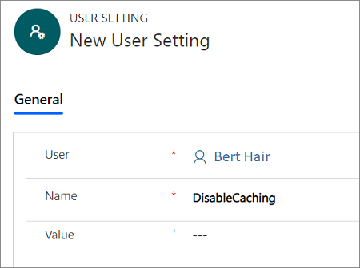
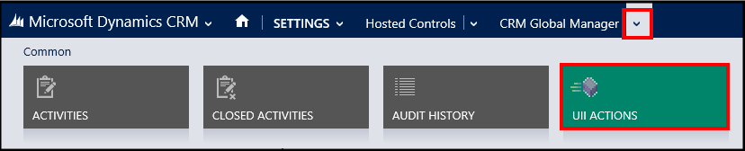
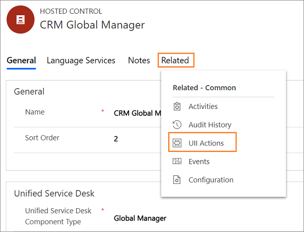

# Client caching overview

[!INCLUDE[cc-data-platform-banner](../../includes/cc-data-platform-banner.md)]

Client caching enables you to reduce the amount of bandwidth required at the startup of the [!INCLUDE[pn_unified_service_desk](../../includes/pn-unified-service-desk.md)] client on the call center agent’s computers, and over the life cycle of the client application. Client caching provides a means to cache the majority of [!INCLUDE[pn_unified_service_desk](../../includes/pn-unified-service-desk.md)] configuration data locally on the call center agent’s computer, thereby reducing the need for common data to be retrieved from the server. This capability provides a noticeable increase in the startup performance of [!INCLUDE[pn_unified_service_desk](../../includes/pn-unified-service-desk.md)].  
  
> [!IMPORTANT]
>  This feature has privacy impact because enabling client caching in [!INCLUDE[pn_unified_service_desk](../../includes/pn-unified-service-desk.md)] leads to some of your data being stored locally on the user’s computer, which is outside the model-driven apps services boundary.  
  
   
## When should you use client caching?  
 Client caching can provide a significant improvement in startup times, a reduction in overall bandwidth, and a significant reduction in queries to Microsoft Dataverse server for common [!INCLUDE[pn_unified_service_desk](../../includes/pn-unified-service-desk.md)] data.
  
 Client caching is best employed in performance testing, training, and production environments. It isn’t recommended for development environments because changes are only replicated when the control cache key is updated.  
  
   
## How client caching works  
 When you enable client caching, the following process is executed when you log on using the [!INCLUDE[pn_unified_service_desk](../../includes/pn-unified-service-desk.md)] client application:  
  
1.  The **Options** and **User Settings** entities are queried for the startup keys to determine if client caching is enabled.  
  
2.  If it is enabled, resolve client cache version number and any cache modifications.  
  
3.  If client caching is enabled and a version number is available, locate the local cache store and determine the cache version key.  
  
    1.  If cache version number is current, decrypt and load the cache store into memory.  
  
    2.  If the cache version number is incorrect, delete the cache object.  
  
   
## Enable client caching  
  
1. Sign in to the Unified Service Desk Administrator app.  
  
2. [!INCLUDE[proc_settings_usd](../../includes/proc-settings-usd.md)]  
  
3. Select **Options** under the **Advanced Settings** in the sitemap.
  
4. Select **New** on the **Active UII Options** page. 
  
5. Type **ClientCacheVersionNumber** in the **Name** box, and an alphanumeric number in the **Value** box. The alphanumeric value is used as the cache key for [!INCLUDE[pn_unified_service_desk](../../includes/pn-unified-service-desk.md)].  
  
6. Select **Save**.  
  
   When the option is present and populated, [!INCLUDE[pn_unified_service_desk](../../includes/pn-unified-service-desk.md)] will activate the client caching.  
  
   
## Client caching store location  
 When enabled, client caching stores its files in a compressed and encrypted format in the users roaming directory: `%appData%\Roaming\Microsoft\USD`  
  
 For example, for a user called agent1 running the client application on [!INCLUDE[pn_windows8](../../includes/pn-windows8.md)], the client caching files will be available at `c:\Users\agent1\AppData\Roaming\Microsoft\USD`.  
  
 Information in this directory can only be accessed by the user account that created it.  
  
   
## Push an update to clients  
 To push an update to all the [!INCLUDE[pn_unified_service_desk](../../includes/pn-unified-service-desk.md)] clients, you must edit the value of the **ClientCacheVersionNumber** that you created earlier to a different alphanumeric value. Next time when a call center agent logs in using the [!INCLUDE[pn_unified_service_desk](../../includes/pn-unified-service-desk.md)] client, it will detect the different value for the **ClientCacheVersionNumber** option key, and read all settings from the server before starting up.  
  
   
## Disable client caching for a specific user  
 At times it may be necessary to exclude some users from client caching such as limited testing of new configurations in production, production, or troubleshooting where a cache problem is suspected, or the need to do rapid updates to a configuration where you want to revert your changes back to the currently cached objects.  
  
1. Sign in to the Unified Service Desk Administrator app.  
  
2. Select **User Settings** under **Advanced Settings**.  
  
3. Select **+ New** in the **Active User Settings** page.  
  
4. Specify the following in the **New User Setting** page.  
  
   1.  In the **User** field, type or select the name of the user for which you want to disable client caching.  
  
   2.  In the **Name** field, type **DisableCaching**. Leave the **Value** field empty.  
  
        
  
5. Select **Save**.  
  
   When the user next signs in using the [!INCLUDE[pn_unified_service_desk](../../includes/pn-unified-service-desk.md)] client, client caching isn’t used. However, it doesn’t delete or refresh the client cache store for the user. When the **DisableCaching** key is removed for the user, the user will return to using the previously stored client cache store.  
  
   
## Force a cache reset for a specific user  
 At times, it may be necessary to force a cache reset for a specific user to clear and reset the cache store. You can do this in two ways: From Dataverse server or by using the [!INCLUDE[pn_unified_service_desk](../../includes/pn-unified-service-desk.md)] client application on the user’s computer.  
  
  
### Using Dataverse server  
  
1. Sign in to the Unified Service Desk Administrator app.  
  
2. Select **User Settings** under **Advanced Settings**.  
  
3. Select **+ New** in the **Active User Settings** page.  
  
4. Specify the following in the **New User Setting** page.   
  
5. On the **New User Setting** page:  
  
   1.  In the **User** field, type or select the name of the user that you want to disable client caching for.  
  
   2.  In the **Name** field, type **ResetDesktopCache**. Leave the **Value** field empty.  
  
6. Select **Save**.  
  
   The ResetDesktopCache setting causes the [!INCLUDE[pn_unified_service_desk](../../includes/pn-unified-service-desk.md)] client application to delete its local cache store and rebuild it from the server.  
  
   To complete the cache reset process, two restarts of the [!INCLUDE[pn_unified_service_desk](../../includes/pn-unified-service-desk.md)] client are required.  
  
7. After the first [!INCLUDE[pn_unified_service_desk](../../includes/pn-unified-service-desk.md)] client application restart, the [!INCLUDE[pn_unified_service_desk](../../includes/pn-unified-service-desk.md)] client loads data from the existing cache. Afterwards, the existing cache is deleted and the ResetDesktopCache setting is disabled.  
  
8. After the second [!INCLUDE[pn_unified_service_desk](../../includes/pn-unified-service-desk.md)] client application restart, the [!INCLUDE[pn_unified_service_desk](../../includes/pn-unified-service-desk.md)] client loads the configuration directly from the server and re-creates the cache.  Notice that the time it takes for the [!INCLUDE[pn_unified_service_desk](../../includes/pn-unified-service-desk.md)] client to load during this time can increase significantly.  
  
### Using the Unified Service Desk client  
 You can invoke a reset from the client application using a hidden UII action called **ResetLocalCache** on the **Global Manager** hosted control type. You’ll need to create the UII action on the Global Manager hosted control type before you can use it.  
  
1. Sign in to the Unified Service Desk Administrator app.  
  
2. Select **Hosted Controls** under **Advanced Settings**.
  
3. Locate the **CRM Global Manager** hosted control, and select its name in the **Name** column to open it for editing.  
  
   > [!NOTE]
   > **CRM Global Manager** is the name of the hosted control in the sample [!INCLUDE[pn_unified_service_desk](../../includes/pn-unified-service-desk.md)] applications. If you have named your Global Manager hosted control something else, select it instead. [!INCLUDE[proc_more_information](../../includes/proc-more-information.md)] [Global Manager (Hosted Control)](../../unified-service-desk/global-manager-hosted-control.md)  
  
4. On the nav bar, seclect the down arrow next to the **CRM Global Manager** hosted control, and then select **UII Actions**.  
  
     
  
5. Select the **CRM Global Manager** hosted control.
  
   > [!NOTE]
   > **CRM Global Manager** is the name of the hosted control in the sample [!INCLUDE[pn_unified_service_desk](../../includes/pn-unified-service-desk.md)] applications. If you have named your Global Manager hosted control something else, select it instead. [!INCLUDE[proc_more_information](../../includes/proc-more-information.md)] [Global Manager (Hosted Control)](../../unified-service-desk/global-manager-hosted-control.md)  
  
6. Select the **Related** tab, and then select **UII Actions**.  
  
     
  
. Select **+ Add New UII Action**.  
  
8. Type **ResetLocalCache** in the **Name** field, and then select **Save** on the **New UII Action** page. Close the UII Action and the hosted control.  
  
    Next, we will add an action call to call the UII action that we just created.  
  
9. Select **Action Calls** under **Basic Settings** in the site map.  
  
10. Select **+ New** on the **Active Actions** page.  
  
11. Specify the following on the **New Action Call** page.

    | Field | Value |
    |--------------------------------------|-----------------------------------------------|
    | Name | Type **ResetClientCache** |
    | Hosted Control | Specify **CRM Global Manager** |
    | Action | Specify **ResetLocalCache** |
  
       > [!NOTE]
       > **CRM Global Manager** is the name of the hosted control in the sample [!INCLUDE[pn_unified_service_desk](../../includes/pn-unified-service-desk.md)] applications. If you have named your Global Manager hosted control something else, select it instead. [!INCLUDE[proc_more_information](../../includes/proc-more-information.md)] [Global Manager (Hosted Control)](../../unified-service-desk/global-manager-hosted-control.md)
  
12. Select **Save** and then close the action call.  
  
    After you have set up the UII action and the action call, you can add a toolbar button, event, or code to directly invoke the action call from the client application. This creates a **RestDesktopCache** setting in the **User Settings** area, which triggers the reset behavior as described earlier in [Using Dataverse server](#using-dataverse-server).  
  
## See also  
 [Sample Unified Service Desk applications](../../unified-service-desk/admin/sample-unified-service-desk-applications.md)

 [Administer and manage overview](../../unified-service-desk/admin/administer-manage-unified-service-desk.md)
 
 [Add a UII action to a hosted control](../../unified-service-desk/add-uii-action-hosted-control.md)

[!INCLUDE[footer-include](../../includes/footer-banner.md)]