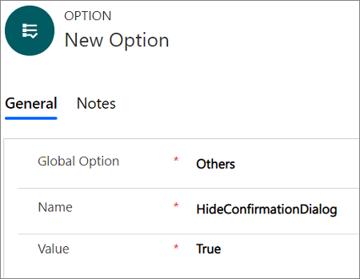

# How to configure close confirmation window to prevent accidental closure of Unified Service Desk

[!INCLUDE[cc-data-platform-banner](../../includes/cc-data-platform-banner.md)]

## Accidental closure of Unified Service Desk 

A key measure at contact centers is customer satisfaction (CSAT). Here, agents strive to increase their CSAT scores by solving customer problems. If you are an agent working on an important case or attending to a customer call and you accidentally close [!INCLUDE[pn_unified_service_desk](../../includes/pn-unified-service-desk.md)], you could lose your unsaved work as well as the customer call. The sudden closure of [!INCLUDE[pn_unified_service_desk](../../includes/pn-unified-service-desk.md)] can impact your productivity and also lead to a low CSAT score. Preventing accidental closures of [!INCLUDE[pn_unified_service_desk](../../includes/pn-unified-service-desk.md)] is key for your business and customers. That's why we introduced the close confirmation window feature. 

## How to prevent accidental closure of Unified Service Desk

To avoid the accidental closure of [!INCLUDE[pn_unified_service_desk](../../includes/pn-unified-service-desk.md)], the close confirmation window displays a message asking you to confirm the closure before continuing.  
  
  

> [!NOTE]
> By default, the close confirmation window is enabled. To disable the close confirmation window, [!INCLUDE[pn_unified_service_desk](../../includes/pn-unified-service-desk.md)] administrator must configure the **HideConfirmationDialog** option on the **Options** page and set it to **true**.

## Enable/disable close confirmation window

1. Sign in to the Dynamics 365 instance.

2. Select the down arrow next to Dynamics 365.

3. Select **Unified Service Desk Administrator**. 

4. Select **Options** under **Advance Settings** in the sitemap.

5. Select **+ New** in the **Active UII Options** page.

6. Choose **Others** for the **Global Option** field.

7. Type **HideConfirmationDialog** for the **Name** field.

8. Specify the value in the **Value** field. Specify **false** to enable and **true** to disable.

9. Select **Save**.

   

## Test the configuration of close confirmation window

1. Start the [!INCLUDE[pn_unified_service_desk](../../includes/pn-unified-service-desk.md)] client by double-clicking the application shortcut on your desktop. More information: [Sign in to Unified Service Desk](../admin/connect-dynamics-365-instance-using-unified-service-desk-client.md#sign-in-to-unified-service-desk)

2. Select the **X** button to close [!INCLUDE[pn_unified_service_desk](../../includes/pn-unified-service-desk.md)].
 The close confirmation window appears, asking you to confirm the closure.

3. Choose **Yes** to close [!INCLUDE[pn_unified_service_desk](../../includes/pn-unified-service-desk.md)] or **No** to stay, save the changes, and continue working.

## See also

[Manage Options for Unified Service Desk](../../unified-service-desk/admin/manage-options-unified-service-desk.md) 

[!INCLUDE[footer-include](../../includes/footer-banner.md)]