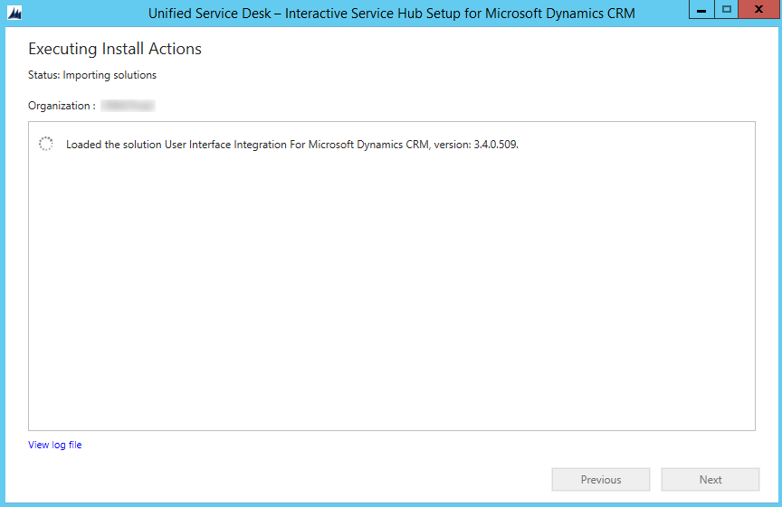

# Overview of Package Deployer and the sample applications

[!INCLUDE[cc-data-platform-banner](../../includes/cc-data-platform-banner.md)]

[!INCLUDE[pn_unified_service_desk_for_crm](../../includes/pn-unified-service-desk-for-crm.md)] comes with  sample applications that you can use as the base for starting with your configuration of your agent application.

 These sample applications are bundled as packages that need to be deployed on a Microsoft Dataverse instance before you can start working. After deployment, which is done by using [!INCLUDE[pn_package_deployer_long](../../includes/pn-package-deployer-long.md)], the entities and custom code specific to [!INCLUDE[pn_unified_service_desk](../../includes/pn-unified-service-desk.md)] become available in the Dataverse instance.  

> [!IMPORTANT]
> - The sample applications are not supported for production use.  
>   - Only one [!INCLUDE[pn_unified_service_desk](../../includes/pn-unified-service-desk.md)] package can be deployed in the Dataverse instance to avoid any loss or overlap of functionality. If you want to install another [!INCLUDE[pn_unified_service_desk](../../includes/pn-unified-service-desk.md)] package, remove the existing one, and then install the other package. For information about removing an existing [!INCLUDE[pn_unified_service_desk](../../includes/pn-unified-service-desk.md)] package, see [Remove a sample Unified Service Desk package](../../unified-service-desk/admin/deploy-sample-unified-service-desk-applications-using-package-deployer.md#Remove).  
>   - Before deploying a [!INCLUDE[pn_unified_service_desk](../../includes/pn-unified-service-desk.md)] package on a Production instance, ensure that you test the package on a pre-Production instance, preferably a mirror image of the Production instance. Also, be sure to back up the Production instance before deploying the package.  
>   - You can also use [!INCLUDE[pn_PowerShell_short](../../includes/pn-powershell-short.md)] cmdlets for [!INCLUDE[pn_package_deployer_short](../../includes/pn-package-deployer-short.md)] to deploy packages. [!INCLUDE[proc_more_information](../../includes/proc-more-information.md)] [Deploy packages using CRM Package Deployer and Windows PowerShell](/dynamics365/customer-engagement/admin/deploy-packages-using-package-deployer-windows-powershell)  

## Unified Service Desk sample applications
 [!INCLUDE[pn_unified_service_desk](../../includes/pn-unified-service-desk.md)] comes with these sample application packages.

|                                                                          Sample application                                                                           |                                                                                                                                                                                                                                                                                                                                                                                                                                                                                                                                                                                                                    Description                                                                                                                                                                                                                                                                                                                                                                                                                                                                                                                                                                                                                     |
|-----------------------------------------------------------------------------------------------------------------------------------------------------------------------|----------------------------------------------------------------------------------------------------------------------------------------------------------------------------------------------------------------------------------------------------------------------------------------------------------------------------------------------------------------------------------------------------------------------------------------------------------------------------------------------------------------------------------------------------------------------------------------------------------------------------------------------------------------------------------------------------------------------------------------------------------------------------------------------------------------------------------------------------------------------------------------------------------------------------------------------------------------------------------------------------------------------------------------------------------------------------------------------------------------------------------------------------------------------------------------------------------------------------------------------------|
|                                       [!INCLUDE[pn_unified_service_desk](../../includes/pn-unified-service-desk.md)] - Upgrade                                        | This sample application package will upgrade an existing [!INCLUDE[pn_unified_service_desk](../../includes/pn-unified-service-desk.md)] solution where:.   -   You want to upgrade an existing [!INCLUDE[pn_unified_service_desk](../../includes/pn-unified-service-desk.md)] solution without affecting the existing configuration data. -   You want to install a new [!INCLUDE[pn_unified_service_desk](../../includes/pn-unified-service-desk.md)] solution that doesn't include a sample configuration in an environment where no [!INCLUDE[pn_unified_service_desk](../../includes/pn-unified-service-desk.md)] solution is currently installed. **Note:**  Because there are no sample configurations included with the Upgrade sample application, when you install this sample application in an environment that does not already have a [!INCLUDE[pn_unified_service_desk](../../includes/pn-unified-service-desk.md)] solution configured, you must  provide a configuration to make it useful. [!INCLUDE[proc_more_information](../../includes/proc-more-information.md)] [Components of Unified Service Desk](../../unified-service-desk/core-concepts-for-configuring-unified-service-desk.md) |
|                                   [!INCLUDE[pn_unified_service_desk](../../includes/pn-unified-service-desk.md)] - New Environment                                    |                                                                                                                                                                                                                                                                 This sample application package can be used to help accelerate setting up the new development environment for [!INCLUDE[pn_unified_service_desk](../../includes/pn-unified-service-desk.md)]. Install this package in a Dataverse non-production organization that does not have an existing [!INCLUDE[pn_unified_service_desk](../../includes/pn-unified-service-desk.md)] solution configured or sample application installed. For more information about the scenarios supported in this sample application, see [Unified Service Desk New Environment sample package](../../unified-service-desk/admin/unified-service-desk-new-environment-package.md).                                                                                                                                                                                                                                                                  |
|                               [!INCLUDE[pn_unified_service_desk](../../includes/pn-unified-service-desk.md)] - Interactive Service Hub                                |                                                                                                                                Interactive Service Hub provides an intuitive interface to simplify the day-to-day job for customer support agents. Interactive Service Hub displays all the vital information related to customers in one place and lets customer support agents focus on things that require attention. Interactive Service Hub is available with Dataverse and [!INCLUDE[pn_crm_2016](../../includes/pn-crm-2016.md)] (on-premises) or later.      For more information about the scenarios supported in this sample application, see [Unified Service Desk Interactive Service Hub package](../../unified-service-desk/admin/unified-service-desk-interactive-service-hub-package.md ).   This sample application package contains the solutions and sample configuration data, which demonstrates how you can integrate Interactive Service Hub with [!INCLUDE[pn_unified_service_desk](../../includes/pn-unified-service-desk.md)].                                                                                                                                |
|                                      [!INCLUDE[pn_unified_service_desk](../../includes/pn-unified-service-desk.md)] - Web Client                                      |                                                                                                                                                                                                                                                                                                         The sample application package demonstrates customer service scenarios that can be delivered using [!INCLUDE[pn_unified_service_desk](../../includes/pn-unified-service-desk.md)] and Microsoft Dynamics CRM 2013 or later. This sample helps administrators and system customizers understand the configurability of [!INCLUDE[pn_unified_service_desk](../../includes/pn-unified-service-desk.md)]. For more information about the scenarios supported in this sample application, see [Unified Service Desk 365 Web Client package](../../unified-service-desk/admin/unified-service-desk-dynamics-365-web-client-package.md).                                                                                                                                                                                                                                                                                                          |
|                                  [!INCLUDE[pn_unified_service_desk](../../includes/pn-unified-service-desk.md)] - Unified Interface                                   |                                                                                                                                                                                                                                                                                                                                                                        This sample package contains the core User Interface Integration (UII) and [!INCLUDE[pn_unified_service_desk](../../includes/pn-unified-service-desk.md)] solutions. It helps you to integrate Unified Interface apps with [!INCLUDE[pn_unified_service_desk](../../includes/pn-unified-service-desk.md)] environment. For more information about the scenarios supported in this sample application, see [Unified Service Desk 365 Unified Interface package](../../unified-service-desk/admin/unified-service-desk-dynamics-365-unified-interface-package.md)   **Note:** The Unified Interface sample application is available for use from [!INCLUDE[pn-unified-service-desk-3-3](../../includes/pn-unified-service-desk-3-3.md)].                                                                                                                                                                                                                                                                                                                                                                         |
| [!INCLUDE[pn_unified_service_desk](../../includes/pn-unified-service-desk.md)] - [!INCLUDE[pn-best-practices-analyzer](../../includes/pn-best-practices-analyzer.md)] |                                                                                                          This sample package contains the core User Interface Integration (UII) and [!INCLUDE[pn_unified_service_desk](../../includes/pn-unified-service-desk.md)] - [!INCLUDE[pn-best-practices-analyzer](../../includes/pn-best-practices-analyzer.md)] solutions. [!INCLUDE[pn-best-practices-analyzer](../../includes/pn-best-practices-analyzer.md)] analyzes the compliance of [!INCLUDE[pn_unified_service_desk](../../includes/pn-unified-service-desk.md)] with best practice rules in certain categories. The [!INCLUDE[pn-best-practices-analyzer](../../includes/pn-best-practices-analyzer.md)] displays the results of analysis in the form of a report with severity levels, description of the parameter, and mitigation for the non-compliant rules.   **Note:** This package is available separately for [!INCLUDE [pn-unified-service-desk-3-2](../../includes/pn-unified-service-desk-4-0.md)] or lower versions until [!INCLUDE [pn-unified-service-desk-2-2](../../includes/pn-unified-service-desk-2-2.md)]. |

## Deploy a sample Unified Service Desk package using Package Deployer

1. [Download](https://go.microsoft.com/fwlink/p/?LinkID=2086721) the [!INCLUDE[pn_unified_service_desk](../../includes/pn-unified-service-desk.md)] package file from the [!INCLUDE[pn_Microsoft_Download_Center](../../includes/pn-microsoft-download-center.md)], and save it on your computer.

2. Run the downloaded file to extract the contents into a folder.

3. After the files are extracted, the [!INCLUDE[pn_package_deployer_tool](../../includes/pn-package-deployer-tool.md)] starts automatically. If it doesn’t, navigate to the \<*ExtractedFolder*>\USDPackageDeployer folder, and double-click the PackageDeployer.exe file to run the [!INCLUDE[pn_package_deployer_tool](../../includes/pn-package-deployer-tool.md)].

4. In the introduction screen of the [!INCLUDE[pn_package_deployer_tool](../../includes/pn-package-deployer-tool.md)], choose **Continue**.

5. In the connect screen, provide authentication details to connect to the Dataverse instance where you want to deploy the package. If you have multiple organizations, and want to select the organization where you want to deploy the [!INCLUDE[pn_unified_service_desk](../../includes/pn-unified-service-desk.md)] package, select the **Display list of available organizations** check box. Choose **Login**.  

     

6. If you have multiple organizations and chose to select the organization that you want to connect to in the previous step, the next screen displays the list of organizations. Select Dataverse organization to connect to, and proceed.  

7. On successful authentication, the next screen displays the packages available for deployment. Read the description to determine the package that you want to deploy, select the package, and then choose **Next**.

8. The next screen displays detailed information about the selected package and the things that will be installed on your Dataverse instance. Review the information, and choose **Next**.  

9. The **Ready to Install** screen displays the package selected for deployment and name of Dataverse organization where it will be deployed to. Review the information, and choose **Next**.

   

10. The next screen displays the validation status of the package selected to be deployed. After the validation completes successfully, choose **Next**.

11. The next page displays the package deployment status. You can choose the log link at the bottom-left corner of the screen to view the package deployment log file, PackageDeployer.log. For more information about logging, see [Troubleshoot package deployment issues using log files](../../unified-service-desk/admin/deploy-sample-unified-service-desk-applications-using-package-deployer.md#Logfiles) later in this topic. A confirmation message is displayed on successful deployment of the package. Click **Next**.

    

12. The next screen displays the name and information about the package that you just deployed. Review the information, and choose **Finish** to exit the [!INCLUDE[pn_package_deployer_tool](../../includes/pn-package-deployer-tool.md)].

   
## Remove a sample Unified Service Desk package  
 When you deploy a sample [!INCLUDE[pn_unified_service_desk](../../includes/pn-unified-service-desk.md)] package in Dataverse organization, the following three managed solutions are created:

- UiiforMicrosoftDynamicsCRM

- DynamicsUnifiedServiceDesk

- "dynamics-365-customerservice"<em>\<PackageName></em>Customization, where *\<PackageName>* is the name of the package that you deployed.

  If you want to deploy another sample [!INCLUDE[pn_unified_service_desk](../../includes/pn-unified-service-desk.md)] package, you must first remove these three solutions. To do this:

1. Sign in to the Dynamics 365 instance.  

2. On the nav bar, choose **Dynamics 365**, and then choose **Settings**.  

3. Choose **Settings** > **Solutions**.

4. On the Solutions page, select one of the solutions by choosing it, and then choose **Delete**. You are prompted to confirm uninstalling a managed solution. Choose **OK** to proceed.

   > [!NOTE]
   >  You can’t remove the UiiforMicrosoftDynamicsCRM solution before you remove the DynamicsUnifiedServiceDesk solution because some of the components in the DynamicsUnifiedServiceDesk solution depend on the components in the UiiforMicrosoftDynamicsCRM solution.

5. After the solution is removed, repeat the steps for the other two solutions to delete them.

   
## Troubleshoot package deployment issues using log files  
 The [!INCLUDE[pn_package_deployer_tool](../../includes/pn-package-deployer-tool.md)] provides logging support to record detailed information about errors that can occur while signing in to the Dynamics 365 instance using the tool and deploying packages. There are three log files generated by the tool that are available at the following location on the computer where you run the tool: `c:\Users\<UserName>\AppData\Roaming\Microsoft\Microsoft Dynamics 365 Package Deployer\<Version>`.  

- **Login_ErrorLog.log**: This provides information about the issues that occurred while signing in to the Dynamics apps instance using the tool. If there are any issues while signing in, a message appears on the sign-in screen of the tool with a link to this log file stating that an error occurred while processing the sign-in request and the user can view the error log. You can choose the link in the message to view this log file. The log file is created the first time you encounter any sign-in issues in the tool. Thereafter, the log file records information about any sign-in issues.  

- **PackageDeployer.log**: This provides detailed information about each task performed in the tool during the deployment of the packages. You can view the log file from the tool by choosing the **View Log File** link at the bottom of the screen.

- **ComplexImportDetail.log**: This provides detailed information about the data imported in the last deployment using the tool. Each time you deploy a package using this tool, the existing details from the log file are moved to a file called CompelxImportDetail._old.log in the same directory, and the ComplexImportDetail.log file displays information about the latest import done using the tool.

## Post-deployment step for the package
 If you have deployed the **Customer Service Hub** package, you must manually activate the following records in the **Service Management** area (**Settings** > **Service Management**) that are created by the package:

|Entity|Records to be activated|
|------------|-----------------------------|
|Service Level Agreements|-   Premium Customer SLA -   Woodgrove Default SLA   Set **Woodgrove Default SLA** as the default.|
|Entitlements|-   Premium Entitlement -   Standard Entitlement   Activate each entitlement one at a time.|
|Routing Rule Sets|Routing Rule|
|Automatic Case Creation Rules|Email to Case Rule|

 The **Customer Service Hub** package also creates sample queue, customer service schedule, and holiday schedule records.

## See also  
 [Deploy packages using Package deployer and Windows PowerShell](/dynamics365/customer-engagement/admin/deploy-packages-using-package-deployer-windows-powershell)   
 [Install and Deploy Unified Service Desk](../../unified-service-desk/admin/install-upgrade-deploy-unified-service-desk.md)   

[!INCLUDE[footer-include](../../includes/footer-banner.md)]