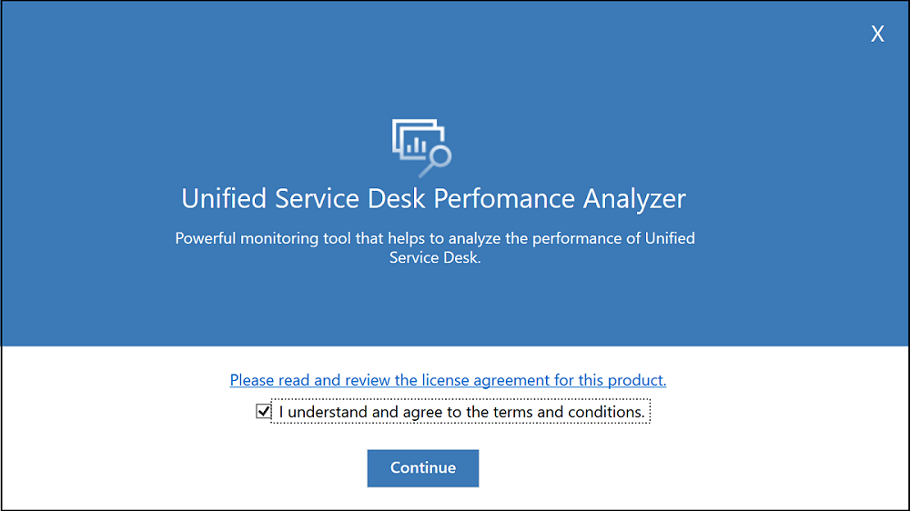

# Public Preview: Generate Unified Service Desk performance report 

[!INCLUDE[cc-beta-prerelease-disclaimer](../../includes/cc-beta-prerelease-disclaimer.md)]

1. Go to location where you have downloaded the **Unified Service Desk Performance Analyzer**.

2. Double-click to run the tool.   Unified Service Desk Performance Analyzer appears.

3. Select the check box after reading and understanding the license terms and conditions and select **Continue**. 

4. In the **Import performance log files** window, browse and select the folder where you have saved the performance data log files and select **Import**. 

 
> [!NOTE]
> The folder you select must have at least one performance data log file.

5. In the **File Import status** window, you can see the performance data log files that the tool imports. 

6. Select **Launch report** to see the HTML report in a web browser. 

> [!div class="nextstepaction"]
> [Overview of performance report user interface](overview-performance-report-user-interface.md)

## See also

[Overview of Unified Service Desk Performance Analyzer](overview-performance-analyzer.md)

[Download Unified Service Desk Performance Analyzer](download-performance-analyzer.md)

[Generate (collect) performance data log](performance-data-collection-using-keyboard-shortcut.md)

[!INCLUDE[footer-include](../../includes/footer-banner.md)]