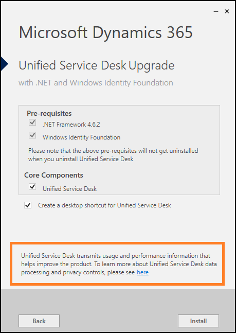

# Improve Unified Service Desk
Improvement program data lets [!INCLUDE[pn_unified_service_desk](../../includes/pn-unified-service-desk.md)] send  application-specific information like product usage, health, and performance data to [!INCLUDE[cc_Microsoft](../../includes/cc-microsoft.md)]. We use the information that we collect from the program to analyze and improve the service and product experience for our customers.
  
 The kinds of information that [!INCLUDE[pn_unified_service_desk](../../includes/pn-unified-service-desk.md)] sends anonymously includes:  
  
- Operating system version and bit type.  
  
- Web browser application and version.  
  
- [!INCLUDE[pn_unified_service_desk](../../includes/pn-unified-service-desk.md)] version.  
  
- Number of monitors used and screen resolution of the primary monitor.  
  
- Device processor class and random-access memory (RAM) details.

- [!INCLUDE[pn_unified_service_desk](../../includes/pn-unified-service-desk.md)] application-specific information. [!INCLUDE[proc_more_information](../../includes/proc-more-information.md)] [Telemetry data](../admin/comply-unified-service-desk-data-gdpr.md#telemetry-data)

## Help Improve Unified Service Desk enabled by default

With the release of [!INCLUDE[pn-unified-service-desk-3-3](../../includes/pn-unified-service-desk-3-3.md)], by default, the Help Improve [!INCLUDE[pn_unified_service_desk](../../includes/pn-unified-service-desk.md)] feature is enabled for the Common Data Service platform instance and [!INCLUDE[pn_unified_service_desk](../../includes/pn-unified-service-desk.md)] sends information to [!INCLUDE[cc_Microsoft](../../includes/cc-microsoft.md)].

> [!Note]
> If you are using [!INCLUDE[pn-unified-service-desk-3-2](../../includes/pn-unified-service-desk-3-2.md)] and lower with the Common Data Service platform instance, you must enable the Help improve [!INCLUDE[pn_unified_service_desk](../../includes/pn-unified-service-desk.md)] by configuring the **HelpImproveUSD** global option and setting the option to **True**. [!INCLUDE[proc_more_information](../../includes/proc-more-information.md)] [Enable sending improvement program information to Microsoft anonymously](#enable-sending-improvement-program-information-to-microsoft-anonymously)

During new installation or upgrade scenario, the information about the transmitting the product usage and performance information to [!INCLUDE[cc_Microsoft](../../includes/cc-microsoft.md)] appears as shown in the below image. This informaiton helps us to improve the product experience.

Configuring and setting the value of the Global Option: `HelpImproveUSD` to `FALSE` disables data collection and [!INCLUDE[pn_unified_service_desk](../../includes/pn-unified-service-desk.md)] does not send information to [!INCLUDE[cc_Microsoft](../../includes/cc-microsoft.md)].

> [!Note]
>  The checkbox in the Help Improve [!INCLUDE[pn_unified_service_desk](../../includes/pn-unified-service-desk.md)] section on **About** page reflects whether or not [!INCLUDE[pn_unified_service_desk](../../includes/pn-unified-service-desk.md)] sends data to [!INCLUDE[cc_Microsoft](../../includes/cc-microsoft.md)], and agent cannot select or clear the checkbox. However, [!INCLUDE[pn_unified_service_desk](../../includes/pn-unified-service-desk.md)] Administrators can control whether or not send data to [!INCLUDE[cc_Microsoft](../../includes/cc-microsoft.md)].

   
## Disable sending improvement program information to Microsoft anonymously
  
1. Sign in to the Unified Service Desk Administrator app.

2. Select **Options** under **Advance Settings** in the site map.

3. Select **New** on the **Active UII Options** page.  
  
4. Select **HelpImproveUSD** in the **Global Options** list on the New Option page. 
  
5. Enter `FALSE` in the **Value** box.
  
6. Select **Save**.
  
   
## Enable sending improvement program information to Microsoft anonymously

1. Sign in to the Unified Service Desk Administrator app. 

2. Select **Options** under **Advance Settings** in the site map.

3. Select **New** on the **Active UII Options** page.  
  
4. Select **HelpImproveUSD** in the **Global Options** list on the New Option page.
  
5. Enter `TRUE` in the **Value** box.
  
6. Select **Save**.

> [!NOTE]
> Alternatively, you can enable the global option for sending improvement program information to [!INCLUDE[cc_Microsoft](../../includes/cc-microsoft.md)] by performing the following.
> 1. Go to **Settings** > **[!INCLUDE[pn_unified_service_desk](../../includes/pn-unified-service-desk.md)]** > **Options**.
> 2. Select **HelpImproveUSD** checkbox.
> 3. Click **Deactivate** in the toolbar.
> 
> [!Note]
> If you delete the **HelpImproveUSD** global option from the UII options page, the data collection is enabled and [!INCLUDE[pn_unified_service_desk](../../includes/pn-unified-service-desk.md)] sends information to [!INCLUDE[cc_Microsoft](../../includes/cc-microsoft.md)]
  
## Privacy notice  
[!INCLUDE[cc_privacy_usd_telemetry](../../includes/cc-privacy-usd-telemetry.md)]
  
## See also
[Manage Options for Unified Service Desk](../../unified-service-desk/admin/manage-options-unified-service-desk.md)

[Provide feedback about Unified Service Desk](../admin/provide-feedback.md)
