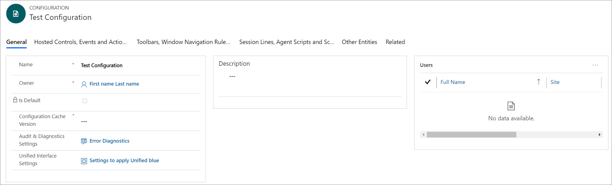
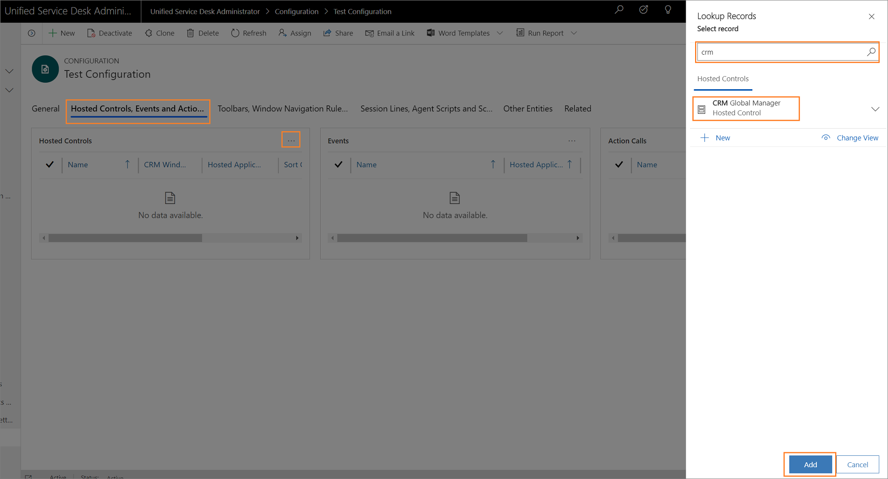
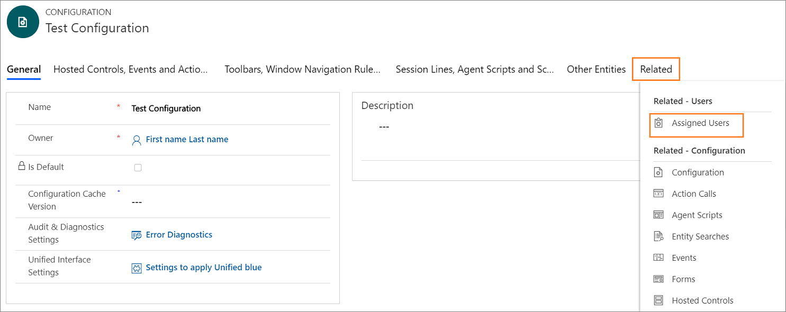

# Use Unified Service Desk configuration to manage access

[!INCLUDE[cc-data-platform-banner](../../includes/cc-data-platform-banner.md)]

[!INCLUDE[pn_unified_service_desk](../../includes/pn-unified-service-desk.md)] configuration is a great way to filter things that you want your agents to see without having to manage their security roles. Agents can see only those [!INCLUDE[pn_unified_service_desk](../../includes/pn-unified-service-desk.md)] components in the [!INCLUDE[pn_unified_service_desk](../../includes/pn-unified-service-desk.md)] client application that are added in a configuration assigned to them.
  
 You can add the following [!INCLUDE[pn_unified_service_desk](../../includes/pn-unified-service-desk.md)] components in a configuration:  
  
-   Action calls  
  
-   Agent scripts  
  
-   Entity searches  
  
-   Events  
  
-   Forms  
  
-   Hosted controls  
  
-   Options  
  
-   Scriptlets  
  
-   Session information  
  
-   Toolbar  
  
-   Window navigation rule  
  
   
## Create a Unified Service Desk configuration  
  
1. Sign in to the Dynamics 365 instance.

2. Select the down arrow next to Dynamics 365.

3. Select **Unified Service Desk Administrator**.

4. Select **Configuration** under **Advanced Settings** in the site map. 
  
5. Select **+ New** on the **Active Configuration** page.  
  
6. Type the name of the configuration in the **New Configuration** page.

7. Enter an alphanumeric value as the cache key in the text box of the **Configuration Cache Version** field, and then select **Save**.  For example, the alphanumeric value can be updated as **XY12**. To learn more about Configuration Cache Version, see [Cache specific configuration for agents](set-configuration-cache-version.md).
  
     
  
8. Select a component to add it. Each tab has certain components in it. The table provides the components available in different tabs.

    | Tab | Available components to add |
    |---------------------------------------|--------------------------------------------------|
    | Hosted Controls, Events and Actions | <ul> <li>Hosted Controls</li> <li>Events</li> <li>Actions</li> </ul> |
    | Toolbars, Window Navigation Rules and Entity Searches | <ul> <li>Toolbars</li> <li>Window Navigation Rules</li> <li>Entity Searches</li> </ul> |
    | Session Lines, Agent Scripts and Scriplets | <ul> <li>Session Lines</li> <li>Agent Scripts</li> <li>Scriplets</li> </ul> |
    | Other Entities | <ul> <li>Customization Files</li> <li>Forms</li> <li>Options</li> </ul> |
  
9. Select a tab. For example, **Hosted Controls, Events and Actions**.

10. Select  the more commands (...) in the component section, and then select **Add Existing <component name>**. The **Lookup Records** pane appears. Type the name of the component in the search box and then select **Add**. If a record doesn’t exist, select **+ New** to create an instance of the component you want to add.  When you select **+ New**, a confirmation dialog appears. Ensure that you've saved the record before leave the page. Now, when you select **OK**, the component page appears.
  
     
  
11. After you create the component, select **Configuration** in the site map and select the for record for which you wanted to add the component.

12. Select the tab and select  the more commands (...) in the component section, and then select **Add Existing <component name>**. The **Lookup Records** pane appears. Type the name of the component in the search box and then select **Add**.
  
13. Select the **Save** button  to save the configuration.

14. Repeat steps 9 to 13 to add other components to the configuration.
  
    > [!IMPORTANT]
    >  If no hosted controls are added to a configuration, or if certain hosted controls are not added, such as the Panel Layout, Global Manager, and Connection Manager hosted controls, assigned users may see a blank [!INCLUDE[pn_unified_service_desk](../../includes/pn-unified-service-desk.md)] client application window. For more information about how to create a sample configuration, see [Walkthrough 1: Build a simple agent application](../../unified-service-desk/walkthrough-1-build-a-simple-agent-application.md).  
  
   
## Set a configuration as the default  
 You can set a Configuration as the default configuration by using the Is Default attribute of the Configuration record. Then, any user not assigned to a Configuration will have only the Unified Service Desk components associated with the default configuration cached when they sign in to the [!INCLUDE[pn_unified_service_desk](../../includes/pn-unified-service-desk.md)] client.  
  
### Set a configuration as the default  
  
1. Sign in to the Dynamics 365 instance.

2. Select the down arrow next to Dynamics 365.

3. Select **Unified Service Desk Administrator**.

4. Select **Configuration** under **Advanced Settings** in the site map.
  
5. Select the configuration record you want to make the default in the **Active Configuration** list.
  
6. Choose **Set As Default** from the actions menu.  
  
   
## Associate auditing and diagnostics with a configuration  
 When you associate an Audit & Diagnostics record with a configuration, only the auditing and diagnostics events specified in the Audit & Diagnostics record are logged, and only for users who are assigned to the configuration. The following procedure describes how to associate an existing Audit & Diagnostics record with a configuration. For information about how to create an Audit & Diagnostics record, see [Configure auditing and diagnostics in Unified Service Desk](../../unified-service-desk/admin/configure-auditing-diagnostics-unified-service-desk.md).  
  
1. Sign in to the Dynamics 365 instance.

2. Select the down arrow next to Dynamics 365.

3. Select **Unified Service Desk Administrator**.

4. Select **Configuration** under **Advanced Settings** in the site map.
  
5. Select the configuration record you want to add an Audit & Diagnostic record.
  
6. Type the name of the Audit & Diagnostic record in the search box, and then select the record.  
  
7. After you add the Audit & Diagnostics record, select the **Save** button  to save the configuration.  
  
   
## Assign users to a Unified Service Desk configuration  
 After you create a [!INCLUDE[pn_unified_service_desk](../../includes/pn-unified-service-desk.md)] configuration, you can assign users to it. The users assigned to a configuration can only access components in the [!INCLUDE[pn_unified_service_desk](../../includes/pn-unified-service-desk.md)] client application that are added to the configuration.  
  
1. Sign in to the Dynamics 365 instance.

2. Select the down arrow next to Dynamics 365.

3. Select **Unified Service Desk Administrator**.

4. Select **Configuration** under **Advanced Settings** in the site map.  
  
5. Select the required configuration record in the **Active Configuration** page. To open a configuration definition, either select the configuration name, or select the record, and then select **Edit**. This opens the configuration definition.
  
6. Select the **Related** tab, and then select **Assigned Users**. Now, you can either assign the configuration to an existing user, or create a new user and assign the configuration to it.
  
     
  
7. Select **Add Existing User**. The **Lookup Records** pane appears.
  
8. Type the name of the required user in the search box and select search. Now, select the user from the list, and then select **Add**.
  
9. Select the **Save** button  to save your changes.  
  
     If you select the user name under the **Name** column, the user record opens, and you can see that the [!INCLUDE[pn_unified_service_desk](../../includes/pn-unified-service-desk.md)] configuration is assigned to the user in the **USD Configuration** field.
  
   A user can only be assigned to one Configuration. To assign a user to a different Configuration, you must first remove the existing Configuration. 
  
### Remove a user from a Configuration  
  
1.  Open the User form for the agent who you want to remove from a Configuration. One way you can do this is through **Settings** > **Security** > **Users**.  
  
2.  On the user form, select the **USD Configuration**.  
  
3.  Press the Delete key to remove the Configuration, and then save the form.  
  
   
## Clone a Configuration  
 You can copy a Configuration by cloning it. This lets you quickly copy an existing configuration and corresponding relationships to use for a different Configuration. Because a user can only belong to a single configuration, any users associated with configuration will not be associated with the cloned configuration.  
  
### Clone a configuration  
  
1. Sign in to the Dynamics 365 instance.

2. Select the down arrow next to Dynamics 365.

3. Select **Unified Service Desk Administrator**.

4. Select **Configuration** under **Advanced Settings** in the site map.  
  
5. Select the configuration record you want to clone in the **Active Configuration** page.  
  
6. Choose **Clone** on the actions menu.

7. Select **Clone** in the **Clone Existing Configuration** dialog.  
  
## See also  
 [Manage access using custom security roles](../../unified-service-desk/admin/manage-access-using-unified-service-desk-security-roles.md)

 [Access management in Unified Service Desk](../../unified-service-desk/admin/security-unified-service-desk.md)

 [Unified Service Desk Configuration Walkthroughs](../../unified-service-desk/unified-service-desk-configuration-walkthroughs.md)

 [Cache specific configuration for agents](set-configuration-cache-version.md)

[!INCLUDE[footer-include](../../includes/footer-banner.md)]