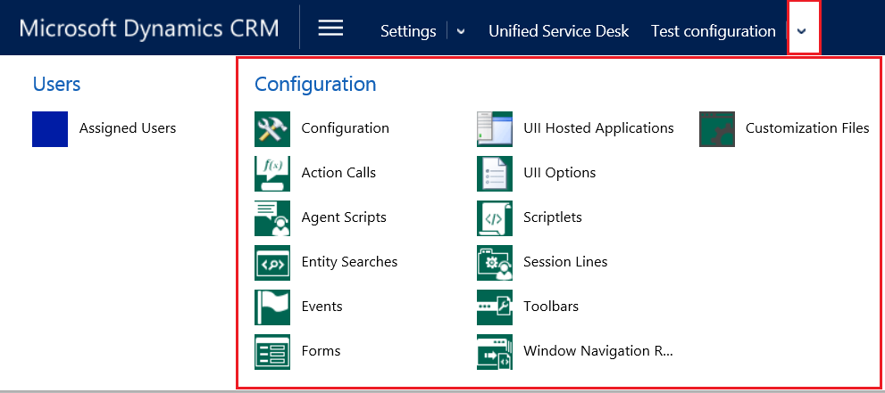
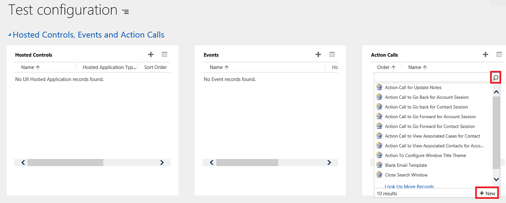
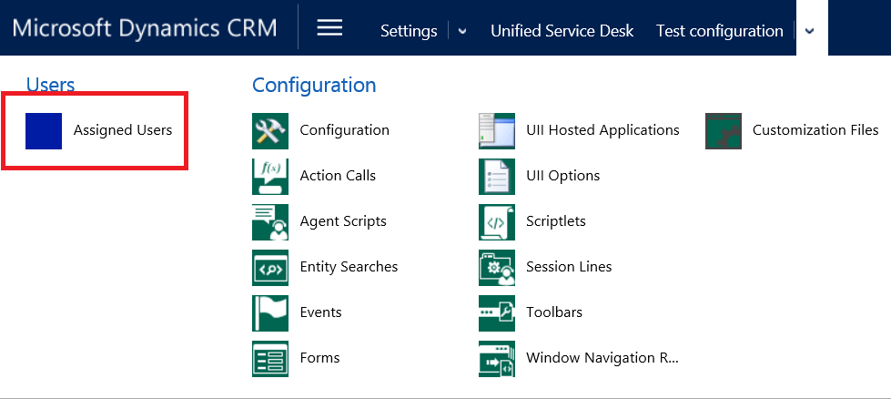

# Use Unified Service Desk configuration to manage access
[!INCLUDE[pn_unified_service_desk](../../includes/pn-unified-service-desk.md)] configuration is a great way to filter things that you want your agents to see without having to manage their security roles. Agents can see only those [!INCLUDE[pn_unified_service_desk](../../includes/pn-unified-service-desk.md)] components in the [!INCLUDE[pn_unified_service_desk](../../includes/pn-unified-service-desk.md)] client application that are added in a configuration assigned to them.  
  
 You can add the following [!INCLUDE[pn_unified_service_desk](../../includes/pn-unified-service-desk.md)] components in a configuration:  
  
-   Action calls  
  
-   Agent scripts  
  
-   Entity searches  
  
-   Events  
  
-   Forms  
  
-   Hosted controls  
  
-   Options  
  
-   Scriptlets  
  
-   Session information  
  
-   Toolbar  
  
-   Window navigation rule  
  
   
## Create a Unified Service Desk configuration  
  
1.  Sign in to [!INCLUDE[pn_microsoftcrm](../../includes/pn-microsoftcrm.md)].  
  
2.  On the nav bar, click **Microsoft Dynamics 365**, and then select **Settings**.  
  
3.  Click **Settings** > **Unified Service Desk** > **Configuration**.  
  
4.  On the configuration page, click **New**.  
  
5.  On the **New Configuration** page, type the name of the configuration, and then click **Save**.  
  
6.  After the new configuration is saved, on the nav bar, click the down arrow next to the configuration name. This shows the components that can be added to a configuration.  
  
   
  
7.  Click a component to add it. The entity search page for the corresponding component appears. Click **Add Existing > \<Component Name>** to search for the existing records. For example, if you selected **Action Calls**, click **Add Existing Action Call** on the entity search page.  
  
8.  Type the name of the component in the search box, and then press ENTER or click the search button. If a record doesn’t exist, click **New** in the search results box to create an instance of the component you want to add.  
  
   
  
9. Repeat this with other components you want to add to the configuration.  
  
10. After you have added the components, click the **Save** button  to save the configuration.  
  
    > [!IMPORTANT]
    >  If no hosted controls are added to a configuration, or if certain hosted controls are not added, such as the Panel Layout, Global Manager, and Connection Manager hosted controls, assigned users may see a blank [!INCLUDE[pn_unified_service_desk](../../includes/pn-unified-service-desk.md)] client application window. For more information about how to create a sample configuration, see [Walkthrough 1: Build a simple agent application](../../unified-service-desk/walkthrough-1-build-a-simple-agent-application.md).  
  
   
## Set a configuration as the default  
 You can set a Configuration as the default configuration by using the Is Default attribute of the Configuration record. Then, any user not assigned to a Configuration will have only the Unified Service Desk components associated with the default configuration cached when they sign in to the [!INCLUDE[pn_unified_service_desk](../../includes/pn-unified-service-desk.md)] client.  
  
### Set a configuration as the default  
  
1.  Sign in to [!INCLUDE[pn_microsoftcrm](../../includes/pn-microsoftcrm.md)].  
  
2.  On the nav bar, click **Main** > **Settings** > **Unified Service Desk**.  
  
3.  Click **Configuration**.  
  
4.  In the Active Configuration list, select for the configuration record you want to make the default.  
  
5.  Choose **Set As Default** from the actions menu.  
  
   
## Associate auditing and diagnostics with a configuration  
 When you associate an Audit & Diagnostics record with a configuration, only the auditing and diagnostics events specified in the Audit & Diagnostics record are logged, and only for users who are assigned to the configuration. The following procedure describes how to associate an existing Audit & Diagnostics record with a configuration. For information about how to create an Audit & Diagnostics record, see [Configure auditing and diagnostics in Unified Service Desk](../../unified-service-desk/admin/configure-auditing-diagnostics-unified-service-desk.md).  
  
1.  Sign in to [!INCLUDE[pn_microsoftcrm](../../includes/pn-microsoftcrm.md)].  
  
2.  On the nav bar, click **Main** > **Settings** > **Unified Service Desk**.  
  
3.  Click **Configuration**.  
  
4.  In the configuration list, select the configuration record you want to add an Audit & Diagnostic record for.  
  
5.  Next to **Audit & Diagnostic Settings**, type the name of the Audit & Diagnostic record in the search box, and then press ENTER or click the search button.  
  
6.  After you add the Audit & Diagnostics record, click the **Save** button  to save the configuration.  
  
   
## Assign users to a Unified Service Desk configuration  
 After you create a [!INCLUDE[pn_unified_service_desk](../../includes/pn-unified-service-desk.md)] configuration, you can assign users to it. The users assigned to a configuration can only access components in the [!INCLUDE[pn_unified_service_desk](../../includes/pn-unified-service-desk.md)] client application that are added to the configuration.  
  
1.  Sign in to [!INCLUDE[pn_microsoftcrm](../../includes/pn-microsoftcrm.md)].  
  
2.  On the nav bar, click **Microsoft Dynamics 365**, and then select **Settings**.  
  
3.  Click **Settings** > **Unified Service Desk** > **Configuration**.  
  
4.  On the configuration page, search for the required configuration record.  
  
5.  To open a configuration definition, either click the configuration name, or select the record, and then click **Edit**. This opens the configuration definition.  
  
6.  On the nav bar, click the down arrow next to the configuration name, and then click **Assigned Users**.  
  
   
  
7.  On the next page, you can either assign the configuration to an existing user, or create a new user and assign the configuration to it.  
  
8.  Type the name of the required user in the search box, and then press ENTER or click the search button.  
  
9. Click the names of the required users to add them to the configuration. Click the **Save** button  to save your changes.  
  
     If you click the user name under the **Name** column, the user record opens, and you can see that the [!INCLUDE[pn_unified_service_desk](../../includes/pn-unified-service-desk.md)] configuration is assigned to the user in the **USD Configuration** field.  
  
   
  
 A user can only be assigned to one Configuration. To assign a user to a different Configuration, you must first remove the existing Configuration.  
  
### Remove a user from a Configuration  
  
1.  Open the User form for the agent who you want to remove from a Configuration. One way you can do this is through **Settings** > **Security** > **Users**.  
  
2.  On the user form, click the **USD Configuration**.  
  
3.  Press the Delete key to remove the Configuration, and then save the form.  
  
   
## Clone a Configuration  
 You can copy a Configuration by cloning it. This lets you quickly copy an existing configuration and corresponding relationships to use for a different Configuration. Because a user can only belong to a single configuration, any users associated with configuration will not be associated with the cloned configuration.  
  
### Clone a configuration  
  
1.  Sign in to [!INCLUDE[pn_microsoftcrm](../../includes/pn-microsoftcrm.md)].  
  
2.  On the nav bar, click **Microsoft Dynamics 365**, and then select **Settings**.  
  
3.  Click **Settings** > **Unified Service Desk** > **Configuration**.  
  
4.  In the configuration list, select for the configuration record you want to clone.  
  
5.  Choose **Clone** on the actions menu, and when prompted, click **Clone**.  
  
## See also  
 [Manage access using custom security roles](../../unified-service-desk/admin/manage-access-using-unified-service-desk-security-roles.md)   
 [Access management in Unified Service Desk](../../unified-service-desk/admin/security-unified-service-desk.md)   
 [Unified Service Desk Configuration Walkthroughs](../../unified-service-desk/unified-service-desk-configuration-walkthroughs.md)
