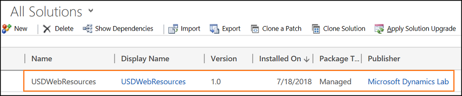

# How to migrate Unified Service Desk configurations from Web Client to Unified Interface

[!INCLUDE[cc-data-platform-banner](../../includes/cc-data-platform-banner.md)]

The migration of the [!INCLUDE[pn_unified_service_desk](../../includes/pn-unified-service-desk.md)] configurations from Web Client to  Unified Interface is a three-step process.

- **Step 1:** Fetch and migrate the configuration elements to a **USD_UI_Configurations** folder using the Web Client - Unified Interface Migration Assistant.

- **Step 2:** Import the **USDWebResources** folder, which is in the **USD_UI_Configurations** folder, using the **Solutions** option in Microsoft Dataverse.

- **Step 3:** Import the **Data** zip folder from the **USD_UI_Configurations** folder to the Unified Interface App using the Configuration Migration Tool (DataMigrationUtility.exe).

This diagram illustrates the flow of the migration:
> [!div class="mx-imgBorder"]
>  

1. **Web Client**    The Web Client is the instance from where you want to migrate your [!INCLUDE[pn_unified_service_desk](../../includes/pn-unified-service-desk.md)] configurations. 

2. **Web Client - Unified Interface Migration Assistant**    The tool to fetch and migrate the Web Client configurations to **USD_UI_Configurations** folder, which contains the **Data** and **WebResources** zip folders. If you have **RunXrmCommand** actions in Web Client configurations, the migration assistant migrates the **RunXRMCommand** actions as a web resource and you can find them in the **USDWebResources** folder under the **USD_UI_Configurations** folder.

3. **USD_UI_Configurations**    The configurations are migrated to the **USD_UI_Configurations** zip folder that contains the **Data** and/or **WebResources** zip folder.

4. **Configuration Migration Tool**    The Configuration Migration Tool lets you to import the **Data** zip folder and deploy it to the target Unified Interface App.

5. **Unified Interface apps** The target instance to which you want to deploy the configurations.

## Step 1: Use migration assistant to fetch and migrate the Web Client configurations

1. Run **UCMigrationTool.exe**.

2. In the introduction screen, select **Continue**.

3. In the **Login** screen, provide authentication details to connect to the instance from where you want to fetch and migrate the configurations. If you have multiple organizations, and want to select the organization where you want to fetch and migrate the configurations, select the **Display list of available organizations** check box, and select **Login**. 

4. In the **Export Configurations** screen, select **Export**. 
**Data file location** is the location where the migration assistant stores the **Data.zip** folder, which contains the configurations that you export from the Web Client. 
When the export is successfully completed, select **Next**. 

5. In the **Select Configurations** screen, select the configuration elements (hosted controls) you want to migrate, and select **Next**. This is a multi-select list, and you can select several configuration elements to migrate.
 The migration assistant displays only the hosted controls to select. If you select a hosted control, the migration assistant exports all the actions, action calls, events, and other elements associated with the particular hosted control. 

6. In the **Confirm Selection** screen, review the configurations you selected for migration, and select **Next**. If you want to change the selection, select **Previous** and repeat step 5.

7. In the **Migrate Configurations** screen, choose **Migrate**. After the migration is completed, select **Next**. 

8. In the **File Download** screen, the migration assistant provides a default location to download the **USD_UI_Configurations.zip** folder. To change the default download location, select **Browse** and choose a location, and select **Download File**. 
The migration assistant displays the **Download Completed**. 

9. Select **Exit** to close and exit the tool.

## Step 2: Import the USDWebResources folder

The **USDWebResources** folder contains the migrated **RunXrmCommand** actions that were present in Web Client. To deploy the **USDWebResources** on the target Unified Interface App, import the web resources as a solution in Dataverse.

To import the **USDWebResources** zip folder, follow these steps:

1. Sign in to the Dynamics 365 instance.

2. Go to **Settings** > **Solutions**.

3. Select **Import** to import the web resource.

4. In the **Select Solution Package** window, browse and select the **USDWebResources** zip folder, and select **Next**.

5. In the **Solution Information** screen, review the solution information and select **Import**. 
You can see the success message after the solution is imported successfully.

6. In the **Importing Solution** screen, select **Close**.

You can see the **USDWebResources** in the solutions list. 

For more information, see [Import, update, and export solutions](/dynamics365/customer-engagement/customize/import-update-export-solutions)

## Step 3: Use Configuration Migration Tool to import and deploy the configurations on Unified Interface App

**Prerequesites:** Download the Configuration Migration tool (DataMigrationUtility.exe). To download the tool, see [Download the tools from NuGet](/dynamics365/customer-engagement/developer/download-tools-nuget).

1. Go to the location where you downloaded the Configuration Migration Tool (DataMigrationUtility.exe).

2. Open **ConfigurationMigration** and execute **DataMigrationUtility.exe**. 

3. In the next screen, select **Import data**, and select **Continue**. 

4. In the **Login** screen, provide authentication details to connect to the instance to which you want to deploy the migrated configurations. If you have multiple organizations, and want to select the organization to which you want to deploy the migrated configurations, select the **Display list of available organizations** check box, and select **Login**. 

5. In the next screen, browse the **USD_UI_Configurations** folder and select the **Data.zip** folder, and then select **Import Data**. 

6. After the import is complete, select **Exit**. 

> [!div class="nextstepaction"]
> [Post-requisites steps](test-migration.md)

## See also

[Migration of Unified Service Desk configurations from Web Client to Unified Interface apps](overview-migration-assistant.md)

[Download the Web Client - Unified Interface Migration Assistant](download-migration-assistant.md)

[Download the tools from NuGet](/dynamics365/customer-engagement/developer/download-tools-nuget)

[Import configuration data](/dynamics365/customer-engagement/admin/import-configuration-data)

[!INCLUDE[footer-include](../../includes/footer-banner.md)]