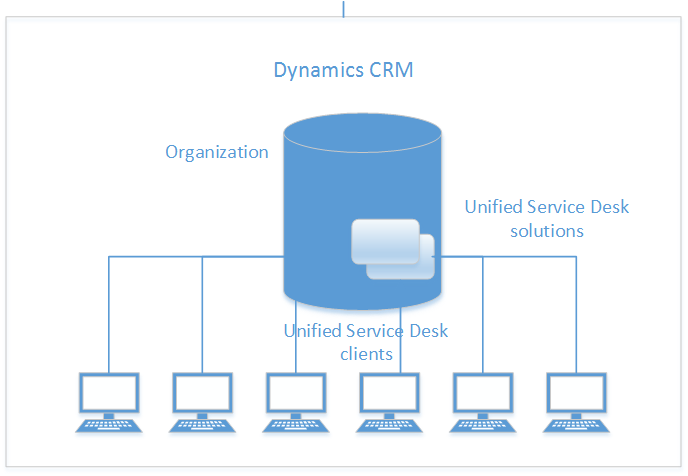

# Overview to Unified Service Desk

[!INCLUDE[cc-data-platform-banner](../../includes/cc-data-platform-banner.md)]

## What is Unified Service Desk?
[!INCLUDE[pn_unified_service_desk_for_crm](../../includes/pn-unified-service-desk-for-crm.md)] model-driven apps provides a configurable framework for quickly building applications for call centers so that agents can get a unified view of the customer data stored in Microsoft Dataverse. You can aggregate customer information from different areas in Dataverse into an integrated desktop that provides a 360° view of the customer interactions. This gives your customer service agents immediate access to business critical information so they can quickly engage with customers and address queries and issues.  
  
 [!INCLUDE[pn_unified_service_desk](../../includes/pn-unified-service-desk.md)], which is built using the [!INCLUDE[pn_user_inteface_integration_uii](../../includes/pn-user-interface-integration-uii.md)] framework, is designed as a series of adapters and modules that facilitate management of UI elements (such as pages and dialogs), automatic loading of related records, agent scripting, a configurable toolbar, and so on. [!INCLUDE[pn_unified_service_desk](../../includes/pn-unified-service-desk.md)] can be configured and administered using Dataverse or [!INCLUDE[pn_microsoft_dynamics_crm_for_outlook](../../includes/pn-microsoft-dynamics-crm-for-outlook.md)]. Using [!INCLUDE[pn_unified_service_desk](../../includes/pn-unified-service-desk.md)] to configure agent applications doesn’t require you to write code for the most part, and therefore reduces the lead time to design an agent application as per your business requirements. Also, with the [!INCLUDE[pn_computer_telephony_integration_cti](../../includes/pn-computer-telephony-integration-cti.md)] framework of [!INCLUDE[pn_uii_acronym](../../includes/pn-uii-acronym.md)], organizations can build adapters to connect [!INCLUDE[pn_unified_service_desk](../../includes/pn-unified-service-desk.md)] with their existing [!INCLUDE[pn_cti_acronym](../../includes/pn-cti-acronym.md)] infrastructure to support customer communication in agent desktops over various channels such as chat, email, or telephone.  
  
  [Video: Overview of Unified Service Desk (5:00)](https://go.microsoft.com/fwlink/p/?LinkId=506900)  
  
   
## What is User Interface Integration?  
 [!INCLUDE[pn_unified_service_desk](../../includes/pn-unified-service-desk.md)] leverages the power of the [!INCLUDE[pn_user_inteface_integration_uii](../../includes/pn-user-interface-integration-uii.md)] framework to help you quickly configure a customized agent application. The [!INCLUDE[pn_uii_acronym](../../includes/pn-uii-acronym.md)] framework lets you build and deploy composite agent applications that can provide unified access to customer information in Dataverse and external systems, and can aggregate different modes of customer interactions or channels. [!INCLUDE[pn_uii_acronym](../../includes/pn-uii-acronym.md)] provides a framework for non-intrusive integration of existing line-of-business (LOB) systems at the UI level. For more information about how you can use [!INCLUDE[pn_uii_acronym](../../includes/pn-uii-acronym.md)], see [Unified Service Desk and the UII framework](../../unified-service-desk/unified-service-desk-uii-framework.md).  
  
   
## What makes up Unified Service Desk?  
 [!INCLUDE[pn_unified_service_desk](../../includes/pn-unified-service-desk.md)] is a collection of solutions and data files that contain configuration entities and the underlying entities for the [!INCLUDE[pn_uii_acronym](../../includes/pn-uii-acronym.md)] framework. You configure the [!INCLUDE[pn_unified_service_desk](../../includes/pn-unified-service-desk.md)] entities to define the user experience in the client application, such as various controls, their layout, user flow, and so on. All configuration information is stored in the [!INCLUDE[pn_unified_service_desk](../../includes/pn-unified-service-desk.md)] entities, and you can bundle it along with the solutions and data files into a “package” that defines a [!INCLUDE[pn_unified_service_desk](../../includes/pn-unified-service-desk.md)] application. The package can then be deployed to any Dataverse instance, and users can connect to it using the [!INCLUDE[pn_unified_service_desk](../../includes/pn-unified-service-desk.md)] client application to experience the interface and functionality defined by the configuration data of the application.  
  
   
  
 The [!INCLUDE[pn_unified_service_desk](../../includes/pn-unified-service-desk.md)] feature is defined by the following two solution files:  
  
- **Dynamics Unified Service Desk**: This solution file contains the primary [!INCLUDE[pn_unified_service_desk](../../includes/pn-unified-service-desk.md)] entities that you configure to define the agent application experience.  
  
- **[!INCLUDE[pn_user_interface_integration](../../includes/pn-user-interface-integration.md)] for the Common Data Service platform**: This solution contains the underlying entities required by the [!INCLUDE[pn_unified_service_desk](../../includes/pn-unified-service-desk.md)] configuration entities.  
  
  [!INCLUDE[pn_unified_service_desk](../../includes/pn-unified-service-desk.md)] comes with four sample applications. [!INCLUDE[proc_more_information](../../includes/proc-more-information.md)] [Sample Unified Service Desk applications](../../unified-service-desk/admin/sample-unified-service-desk-applications.md)  
  
  For information about the core [!INCLUDE[pn_unified_service_desk](../../includes/pn-unified-service-desk.md)] concepts, see [Components of Unified Service Desk](../../unified-service-desk/core-concepts-for-configuring-unified-service-desk.md).

## See also
 [Call center challenges and how Unified Service Desk can help?](../../unified-service-desk/admin/call-center-challenges-how-unified-service-desk-can-help.md)

 [Sample Unified Service Desk applications](../../unified-service-desk/admin/sample-unified-service-desk-applications.md)

[!INCLUDE[footer-include](../../includes/footer-banner.md)]