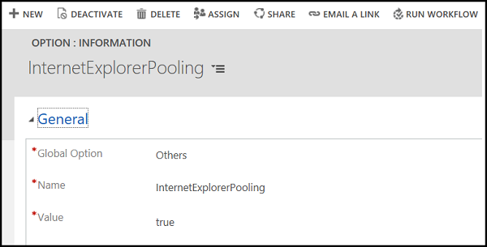

# Performance enhancement for CRM entity page loads
With this release of [!INCLUDE[pn-unified-service-desk-3-2](../../includes/pn-unified-service-desk-3-2.md)], you can experience enhanced performance of CRM entity page loading in [!INCLUDE[pn_unified_service_desk](../../includes/pn-unified-service-desk.md)] with the Internet Explorer Pooling feature. 
  
[!INCLUDE[pn_unified_service_desk](../../includes/pn-unified-service-desk.md)] always maintains a pool of Internet Explorer instances for hosted controls to use. Opening a hosted control using a pooled Internet Explorer instance enhances the performance of the [!INCLUDE[pn_unified_service_desk](../../includes/pn-unified-service-desk.md)].

> [!Note]
> - The Internet Explorer pooling feature supports only CRM entity pages hosted in CRM page hosted control.
> - When you enable the pooling feature and open a CRM page hosted control, you can see in Task Manager that [!INCLUDE[pn_unified_service_desk](../../includes/pn-unified-service-desk.md)] creates a number of Internet Explorer process instances for hosted controls to use. 
> - The performance of the Internet Explorer pooling feature is dependent on the resources available on the client computer.

## Enable Internet Explorer pooling

By default, Internet Explorer pooling is disabled. To enable pooling, a System Administrator must configure the option on the **Active UII Options** page and set it to **true**.

To enable Internet Explorer pooling:

1. Sign in to [!INCLUDE[pn_microsoftcrm](../../includes/pn-microsoftcrm.md)].

2. [!INCLUDE[proc_settings_usd](../../includes/proc-settings-usd.md)]

3. Choose **Options**.  

4. click **New** on the **Active UII Options** page.

5. Choose **Others** for the **Global Option** field.

6. Type **InternetExplorerPooling** for the **Name** field.

7. Set **true** for the **Value** field.

8. Click **Save**.

  

## See also

[Manage Options for Unified Service Desk](../../unified-service-desk/admin/manage-options-unified-service-desk.md)
 
