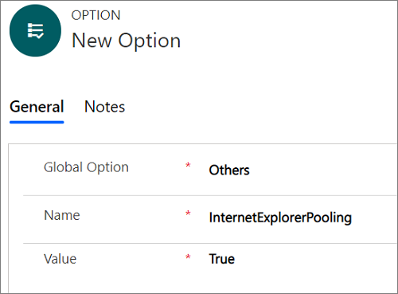

# Preview: Performance enhancement for loading the model-driven app pages

[!INCLUDE[cc-data-platform-banner](../../includes/cc-data-platform-banner.md)]

[!include[cc-beta-prerelease-disclaimer](../../includes/cc-beta-prerelease-disclaimer.md)]
> [!IMPORTANT]
>
> - A preview is a feature that is not complete, as it may employ reduced privacy, security, and/or compliance commitments, but is made available before it is officially released for general availability so customers can get early access and provide feedback. Previews are provided "as-is," "with all faults," "as available," and without warranty.
> - This preview feature does not come with technical support and Microsoft Dynamics 365 Technical Support won't be able to help you with issues or questions.  If Microsoft does elect to provide any type of support, such support is provided "as is," "with all faults," and without warranty, and may be discontinued at any time.
> - Previews are not meant for production use, especially to process Personal Data or other data that is subject to heightened compliance requirements, and any use of "live" or production data is at your sole risk. All previews are subject to separate [Terms and Conditions](../../legal/supp-dynamics365-preview.md).

> [!Note]
>
> Because support for Internet Explorer 11 is deprecated, support for IE Process has also been deprecated in Unified Service Desk. For information: [Deprecation announcement](../../customer-service/deprecations-customer-service.md#internetexplorer11).

::: moniker range="=dynamics-usd-4.2"

You can experience enhanced performance of entity page loading in [!INCLUDE[pn_unified_service_desk](../../includes/pn-unified-service-desk.md)] with the pooling feature.

The pooling feature is available for the following processes:

- Edge WebView2 Process

- Chrome Process
 
- IE Process

::: moniker-end

::: moniker range="=dynamics-usd-4.1"

You can experience enhanced performance of entity page loading in [!INCLUDE[pn_unified_service_desk](../../includes/pn-unified-service-desk.md)] with the pooling feature.

The pooling feature is available for the following processes:

- IE Process

- Chrome Process

::: moniker-end

::: moniker range="<=dynamics-usd-4"

You can experience enhanced performance of entity page loading in [!INCLUDE[pn_unified_service_desk](../../includes/pn-unified-service-desk.md)] with the Internet Explorer Pooling feature. 

::: moniker-end

## Pool process instances for IE Process

[!INCLUDE[pn_unified_service_desk](../../includes/pn-unified-service-desk.md)] always maintains a pool of Internet Explorer instances for hosted controls to use. Opening a hosted control using a pooled Internet Explorer instance enhances the performance of the [!INCLUDE[pn_unified_service_desk](../../includes/pn-unified-service-desk.md)].

> [!Note]
> - The Internet Explorer pooling feature supports only CRM entity pages hosted in CRM page hosted control.
> - When you enable the pooling feature and open a CRM page hosted control, you can see in Task Manager that [!INCLUDE[pn_unified_service_desk](../../includes/pn-unified-service-desk.md)] creates a number of Internet Explorer process instances for hosted controls to use. 
> - The performance of the Internet Explorer pooling feature is dependent on the resources available on the client computer.

### Enable pooling for IE Process

By default, Internet Explorer pooling is disabled. To enable pooling, a System Administrator must configure the option on the **Active UII Options** page and set it to **true**.

1. Sign in to the Dynamics 365 instance.

2. Select the down arrow next to Dynamics 365.

3. Select **Unified Service Desk Administrator**. 

4. Select **Options** under **Advance Settings** in the sitemap.

5. Select **+New** in the **Active UII Options** page.

6. Choose **Others** for the **Global Option** field.

7. Type **InternetExplorerPooling** for the **Name** field.

8. Set **False** for the **Value** field.

9. Select **Save**.

   

::: moniker range=">=dynamics-usd-4.1"

## Pool process instances for Chrome Process

[!INCLUDE[pn_unified_service_desk](../../includes/pn-unified-service-desk.md)] always maintains a pool of Chrome Process instances for hosted controls to use. Opening a hosted control using a pooled Chrome Process instance enhances the performance of the [!INCLUDE[pn_unified_service_desk](../../includes/pn-unified-service-desk.md)].

By default, the Chrome Process instance pooling is enabled.

With the Chrome Process instance pooling, every entity page navigation happens inline after the first entity page navigation.

#### Enable pooling for Chrome Process

By default, Chrome Process pooling is enabled. To disable the pooling, a System Administrator must configure the **ChromeProcessPooling** option on the **Active UII Options** page and set it to **False**.

To disable Chrome Process pooling:

1. Sign in to the Dynamics 365 instance.

2. Select the down arrow next to Dynamics 365.

3. Select **Unified Service Desk Administrator**.

4. Select **Options** under **Advance Settings** in the sitemap.

5. Select **+ New** in the **Active UII Options** page.

6. Choose **Others** for the **Global Option** field.

7. Type **ChromeProcessPooling** for the **Name** field.

8. Set **True** for the **Value** field.

9. Select **Save**.

### Skip inline entity navigation in Chrome Process pooling

If you want to skip the inline navigation for certain entities such as incident, account, and contact, then add the **BlockChromeProcessPooling** UII option and enter the entity names as the comma separated values (CSV). For example: **incident,account,contact**. To learn more, see [Add the BlockChromeProcessPooling UII option](#add-the-blockchromeprocesspooling-uii-option)

#### Add the BlockChromeProcessPooling UII option

To skip inline navigation for certain entities, a system Administrator must configure the option on the **Active UII Options** page and the entity names as the comma separated values (CSV).

1. Sign in to the Dynamics 365 instance.

2. Select the down arrow next to Dynamics 365.

3. Select **Unified Service Desk Administrator**.

4. Select **Options** under **Advance Settings** in the sitemap.

5. Select **+ New** in the **Active UII Options** page.

6. Choose **Others** for the **Global Option** field.

7. Type **BlockChromeProcessPooling** for the **Name** field.

8. Enter the entity names as comma separated values (CSV) for the **Value** field. For example, **incident,account,contact**.

9. Select **Save**.

### Hide command bar in Chrome Process

In Chrome Process, the command bar is always shown on the pooled Chrome Process instances. If you want to hide the command bar for a specific entity or for all the entities in the Chrome Process pooled instances, then you can add the following UII options.

- To hide a specific entity: **BlockChromeProcessPooling**
- To hide for all the entities: **HideCommandBar**

#### Hide command bar for a specific entity

Use the **BlockChromeProcessPooling** UII option if you want to hide the command bar for a specific entity in the Chrome Process pooled instances.

See [Add the BlockChromeProcessPooling UII option](#add-the-blockchromeprocesspooling-uii-option) to know how to add the UII option.

#### Hide command bar for all the entities

Use the **HideCommandBar** UII option if you want to hide the command bar for all the entities in the Chrome Process pooled instances.

1. Sign in to the Dynamics 365 instance.

2. Select the down arrow next to Dynamics 365.

3. Select **Unified Service Desk Administrator**.

4. Select **Options** under **Advance Settings** in the sitemap.

5. Select **New** in the **Active UII Options** page.

6. Choose **Others** for the **Global Option** field.

7. Type **HideCommandBar** for the **Name** field.

8. Type **True** for the **Value** field.

9. Select **Save**.

### Show nav bar in Chrome Process

In Chrome Process, the nav bar is always hidden on the pooled Chrome Process instances. If you want to show the nav bar for a specific entity or for all the entities in the Chrome Process pooled instances, then you can add the following UII options.

- To show a specific entity: **BlockChromeProcessPooling**
- To show for all the entities: **ShowNavBar**

#### Show nav bar for a specific entity

Use the **BlockChromeProcessPooling** UII option if you want to show the nav bar for a specific entity in the Chrome Process pooled instances.

See [Add the BlockChromeProcessPooling UII option](#add-the-blockchromeprocesspooling-uii-option) to know how to add the UII option.

#### Show nav bar for all the entities

Use the **ShowNavBar** UII option if you want to show the nav bar for all the entities in the Chrome Process pooled instances.

1. Sign in to the Dynamics 365 instance.

2. Select the down arrow next to Dynamics 365.

3. Select **Unified Service Desk Administrator**.

4. Select **Options** under **Advance Settings** in the sitemap.

5. Select **New** in the **Active UII Options** page.

6. Choose **Others** for the **Global Option** field.

7. Type **ShowNavBar** for the **Name** field.

8. Type **True** for the **Value** field.

9. Select **Save**.

### Block second navigation in Chrome Process pooling

When an application (hosted control) is initialized and you do an inline navigation to another entity page using the same application (hosted control), then the second navigation is also inline. If you've specific window navigation rule between the same entity type with the **Route Window** action and **In Place** type, then the window navigation rule triggers the rule in a loop causing Unified Service Desk to crash. 

For example, with Chrome Process pooling, if you've set window navigation rule to navigate from an account tab to another account tab, with the **Route Window** action and **In Place** type, then window navigation rule loops in a recursive manner causing Unified Service Desk to crash.

To avoid the crash of Unified Service Desk, you can perform the following:

- Remove or change the window navigation rule
- Add the **BlockChromeProcessSecondInlineNavigation** UII option

#### Remove or change the window navigation rule

Window navigation rule for same entity navigation, you can remove or delete the window navigation rule itself as with the Chrome Process instance pooling, every entity page navigation happens inline after the first entity page navigation.

Window navigation rule for different entity navigation, you can change the window navigation rule to be more specific from which entity you want the navigation to happen. For example, you can set the window navigation rule from Contact or a Case entity to the Account entity type with the **Route Window** action and **In Place** type.

#### Add the BlockChromeProcessSecondInlineNavigation UII option

By default, second inline navigation is blocked when using Chrome Process. That is, the option is enabled by default. However, if you want to allow the second inline navigation, that is, disable the option, create the **BlockChromeProcessSecondInlineNavigation** UII option and set the value as **False**. 

After the adding UII option, and if you set the value as **True**, then the option is enabled and blocks the second inline navigation.

1. Sign in to the Dynamics 365 instance.

2. Select the down arrow next to Dynamics 365.

3. Select **Unified Service Desk Administrator**.

4. Select **Options** under **Advance Settings** in the sitemap.

5. Select **New** in the **Active UII Options** page.

6. Choose **Others** for the **Global Option** field.

7. Type **BlockChromeProcessSecondInlineNavigation** for the **Name** field.

8. Set **True** for the **Value** field.

9. Select **Save**.

::: moniker-end

::: moniker range=">=dynamics-usd-4.2"

## Pool process instances for Edge WebView2 Process

[!INCLUDE[pn_unified_service_desk](../../includes/pn-unified-service-desk.md)] always maintains a pool of Edge WebView2 Process instances for hosted controls to use. Opening a hosted control using a pooled Edge WebView2 Process instance enhances the performance of the [!INCLUDE[pn_unified_service_desk](../../includes/pn-unified-service-desk.md)].

By default, the Edge WebView2 Process instance pooling is enabled.

With the Edge WebView2 Process instance pooling, every entity page navigation happens inline after the first entity page navigation.

#### Enable pooling for Edge WebView2 Process

By default, Edge Webview2 Process pooling is enabled. To disable the pooling, a System Administrator must configure the **EdgeWebView2Pooling** option on the **Active UII Options** page and set it to **False**.

To disable Edge WebView2 Process pooling:

1. Sign in to the Dynamics 365 instance.

2. Select the down arrow next to Dynamics 365.

3. Select **Unified Service Desk Administrator**.

4. Select **Options** under **Advance Settings** in the sitemap.

5. Select **New** in the **Active UII Options** page.

6. Choose **Others** for the **Global Option** field.

7. Type **EdgeWebView2Pooling** for the **Name** field.

8. Set **True** for the **Value** field.

9. Select **Save**.

### Skip inline entity navigation in Edge WebView2 Process pooling

If you want to skip the inline navigation for certain entities such as incident, account, and contact, then add the **BlockEdgeWebView2Pooling** UII option and enter the entity names as the comma separated values (CSV). For example: **incident,account,contact**. To learn more, see [Add the BlockEdgeWebView2Pooling UII option](#add-the-blockedgewebview2pooling-uii-option)

#### Add the BlockEdgeWebView2Pooling UII option

To skip inline navigation for certain entities, a system Administrator must configure the option on the **Active UII Options** page and the entity names as the comma separated values (CSV).

1. Sign in to the Dynamics 365 instance.

2. Select the down arrow next to Dynamics 365.

3. Select **Unified Service Desk Administrator**.

4. Select **Options** under **Advance Settings** in the sitemap.

5. Select **New** in the **Active UII Options** page.

6. Choose **Others** for the **Global Option** field.

7. Type **BlockEdgeWebView2Pooling** for the **Name** field.

8. Enter the entity names as comma separated values (CSV) for the **Value** field. For example, **incident,account,contact**.

9. Select **Save**.

### Hide command bar in Edge WebView2 Process

In Edge WebView2 Process, the command bar is always shown on the pooled Edge WebView2 process instances. If you want to hide the command bar for a specific entity or for all the entities in the Edge WebView2 Process pooled instances, then you can add the **HideCommandBarEdgeWebView2** UII option.

### Show nav bar in Edge WebView2 Process

In Edge WebView2 Process, the nav bar is always hidden on the pooled Edge WebView2 Process instances. If you want to show the nav bar for a specific entity or for all the entities in the Edge WebView2 Process pooled instances, then you can add the **ShowNavBarEdgeWebView2** UII option.

### Block second navigation in Edge WebView2 Process pooling

When an application (hosted control) is initialized and you do an inline navigation to another entity page using the same application (hosted control), then the second navigation is also inline. If you've specific window navigation rule between the same entity type with the **Route Window** action and **In Place** type, then the window navigation rule triggers the rule in a loop causing Unified Service Desk to crash. 

For example, with Edge WebView2 Process pooling, if you've set window navigation rule to navigate from an account tab to another account tab, with the **Route Window** action and **In Place** type, then window navigation rule loops in a recursive manner causing Unified Service Desk to crash.

To avoid the crash of Unified Service Desk, you can perform the following:

- Remove or change the window navigation rule
- Add the **BlockEdgeWebView2ProcessSecondInlineNavigation** UII option

#### Add the BlockEdgeWebView2ProcessSecondInlineNavigation UII option

By default, second inline navigation is blocked when using Edge WebView2 Process. That is, the option is enabled by default. However, if you want to allow the second inline navigation, that is, disable the option, create the **BlockEdgeWebView2ProcessSecondInlineNavigation** UII option and set the value as **False**. 

After the adding UII option, and if you set the value as **True**, then the option is enabled and blocks the second inline navigation.

1. Sign in to the Dynamics 365 instance.

2. Select the down arrow next to Dynamics 365.

3. Select **Unified Service Desk Administrator**.

4. Select **Options** under **Advance Settings** in the sitemap.

5. Select **New** in the **Active UII Options** page.

6. Choose **Others** for the **Global Option** field.

7. Type **BlockEdgeWebView2ProcessSecondInlineNavigation** for the **Name** field.

8. Set **True** for the **Value** field.

9. Select **Save**.

#### Remove or change the window navigation rule

Window navigation rule for same entity navigation, you can remove or delete the window navigation rule itself as with the Edge WebView2 Process instance pooling, every entity page navigation happens inline after the first entity page navigation.

Window navigation rule for different entity navigation, you can change the window navigation rule to be more specific from which entity you want the navigation to happen. For example, you can set the window navigation rule from Contact or a Case entity to the Account entity type with the **Route Window** action and **In Place** type.
 

::: moniker-end

## See also

[Manage Options for Unified Service Desk](../../unified-service-desk/admin/manage-options-unified-service-desk.md)

[!INCLUDE[footer-include](../../includes/footer-banner.md)]