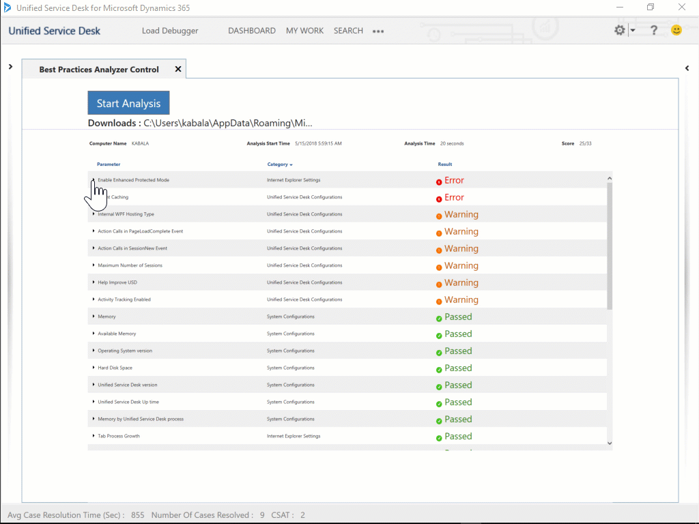
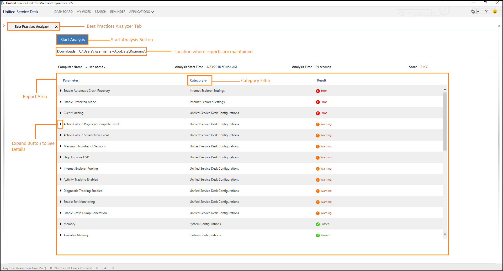

# Read Best Practices Analyzer report

This section describes the layout of the [!INCLUDE[pn-best-practices-analyzer](../../includes/pn-best-practices-analyzer.md)] report and provides information to help you understand the results of the analysis.

The report displays the following elements:

|       Element       |                                                                                                                        Description                                                                                                                         |
|---------------------|------------------------------------------------------------------------------------------------------------------------------------------------------------------------------------------------------------------------------------------------------------|
|      Downloads      |                                 This is the location where the generated report is maintained.  `C:\Users\<User>\AppData\Roaming\Microsoft\Microsoft Dynamics 365 Unified Service Desk\<Version>\BPA\BPALogs\`                                  |
|    Computer name    |                                                         Local computer name on which [!INCLUDE[pn-best-practices-analyzer](../../includes/pn-best-practices-analyzer.md)] performed the analysis.                                                          |
| Analysis Start Time |                                                       The time at which the you start analysis. The format of the Analysis Start Time appears as a timestamp in the format <MM-DD-YYYY> <HH:MM:SS>.                                                        |
|    Analysis Time    |                                                                                                    The time taken in seconds to complete the analysis.                                                                                                     |
|        Score        |                                                                                                 Number of parameters passed / Total number of parameters.                                                                                                  |
|      Parameter      |                                                          The parameter name against which [!INCLUDE[pn-best-practices-analyzer](../../includes/pn-best-practices-analyzer.md)] performs analysis.                                                          |
|      Category       | The category name under which the parameter is classified.   Clicking on the **Category** list, you can filter the categories to see information under those categories.    |
|       Result        |                                                                                                           The analysis result of the parameter.                                                                                                            |

## Expand parameter to see details

You must expand a parameter to see the details, which illustrate the following:

|      Element      |                                                                        Description                                                                        |
|-------------------|-----------------------------------------------------------------------------------------------------------------------------------------------------------|
|   Current Value   |                                                             This is the value you configure.                                                              |
| Recommended Value |            This is the value that [!INCLUDE[pn-best-practices-analyzer](../../includes/pn-best-practices-analyzer.md)] recommends configuring.            |
|    Description    |                                                       This is the description about the parameter.                                                        |
| Mitigation Steps  | These are the steps that you must perform to mitigate the issue.  **Note:** The mitigation steps appear when the report displays an error or warning. |

## See also

[Analyze best practices in Unified Service Desk](../admin/analyze-best-practices-unified-service-desk.md)

[Download and install Best Practices Analyzer](../admin/download-install-best-practices-analyzer.md)

[Walkthrough: Configure Best Practices Analyzer](../admin/walkthrough-configure-best-practices-analyzer.md)

[List of rule categories and parameters](../admin/compliance-categories-parameters-bpa.md)

[System configurations](../admin/system-configurations-bpa.md)

[Internet Explorer settings](../admin/internet-explorer-settings-bpa.md)

[Unified Service Desk configurations](../admin/unified-service-desk-configurations-bpa.md)

[!INCLUDE[footer-include](../../includes/footer-banner.md)]